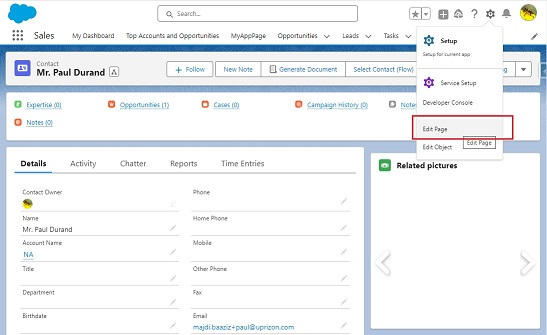
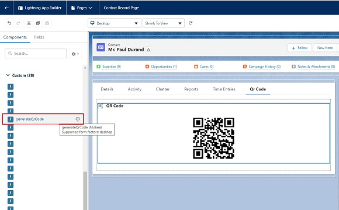

# QR Code Generator Setup

**Description**: The QR Code Generator component for Salesforce offers the ability to create QR codes from within the Salesforce interface. The generated QR code will contain the record ID of the object where the component is placed, streamlining data access and sharing.

## Installation:

Before leveraging the QR Code Generator component, ensure that the Mobee package is installed in your Salesforce environment.

## How to Add the QR Code Generator to an Object Page:

### Step-by-Step Instructions:

1. **Access the Object Page**: Navigate to the desired object page where you want the QR code generator.
2. **Enter Edit Mode**: Click on the 'Edit Page' option, usually found at the top right, to switch to the Lightning App Builder.
3. **Add the QR Code Generator Component**: 
   - In the Lightning App Builder, look for the lightning components section on the left pane.
   - Drag the 'generateQrCode' component and place it at your preferred location on the page layout.
4. **Configure Component Attributes**:
   - The component is designed to automatically fetch the record ID of the object where it's placed, and use it for the QR code generation. No manual input is required.
5. **Save & Activate**: Once configured, save your changes and activate the page to reflect the modifications in the Salesforce interface.

## Example Use Case: Generating QR Code for a Contact Record

1. **Navigate to a Contact**: Start by accessing a specific Contact in Salesforce where you'd like a QR code.
2. **Enter Edit Mode**: Click on 'Edit Page'.

    

3. **Insert QR Code Generator Component**: 
   - Locate the 'generateQrCode' component in the left menu section.
   - Drag and drop it to your desired position on the account page layout.

   

4. **QR Code Generation**:
   - Once placed and the page is saved, the component will automatically generate a QR code containing the Contact record ID. 

   

**Note**: Make sure you have the necessary permissions to add components to page layouts in Salesforce. 

Happy QR Code Generating!
