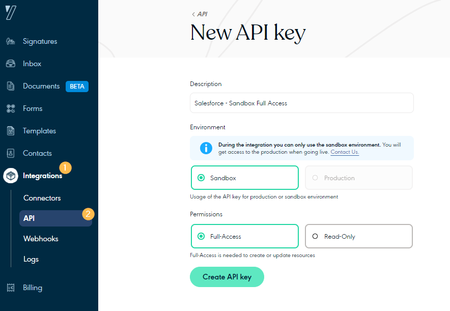
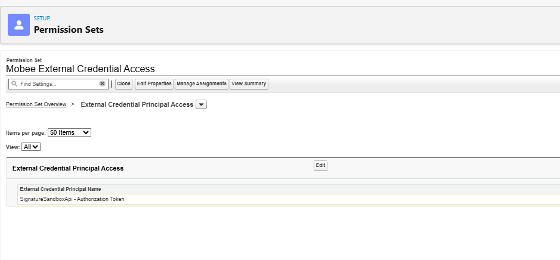
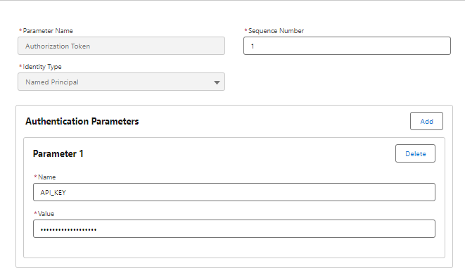
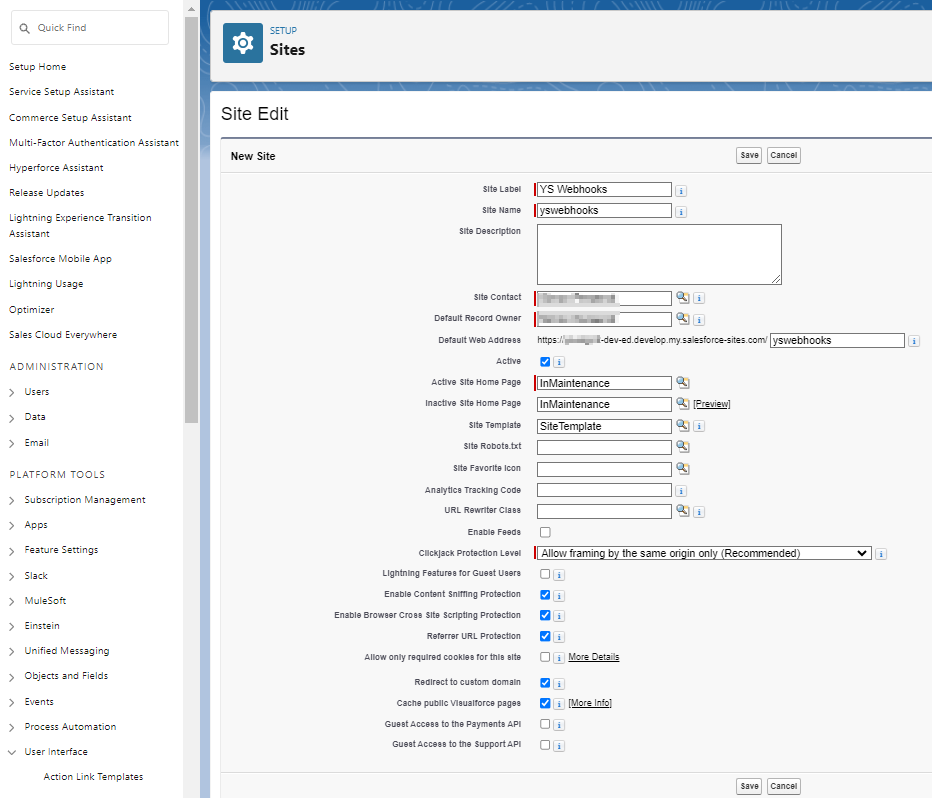
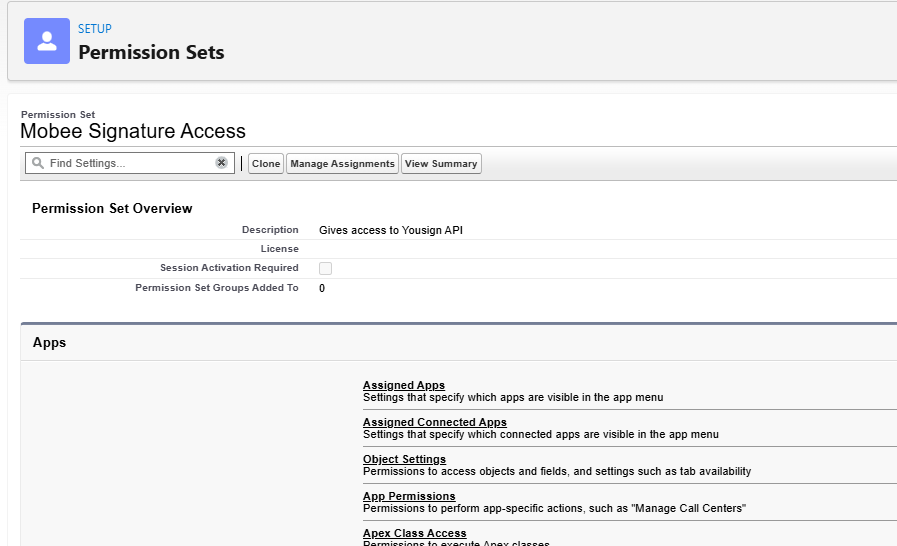
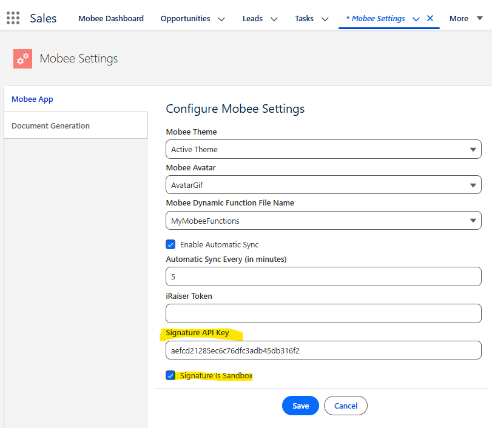

# Mobee E-Signature - Configuration Guide

> **Module:** E-Signature (Yousign API V3 Integration)
> **Package:** Mobee by Uprizon
> **Prerequisite:** Mobee package installed in your Salesforce org

---

## Overview

The Mobee E-Signature module provides a full end-to-end electronic signature lifecycle directly within Salesforce, powered by the **Yousign API V3**. The integration includes a guided wizard built on Screen Flows, custom Lightning Web Components, record-triggered automations, and Apex backend services.

This guide covers all the configuration steps required to activate the E-Signature feature after installing the Mobee package.

---

## Prerequisites

Before starting, make sure you have:

- The **Mobee package** installed in your Salesforce org
- A **Yousign account** (Sandbox for development, Production for go-live)
- Salesforce **System Administrator** access

> ⚠️ **Important — Sandbox vs Production:**
> Yousign uses **separate environments** for Sandbox and Production. You must create **two distinct API keys** and **two separate webhooks** — one for each environment. They are not interchangeable. Never use a Sandbox key in Production or vice versa.

---

## Configuration Steps

### Step 1 — Create the API Key in Yousign

The first step is to generate an API key in your Yousign account. This key will allow Salesforce to authenticate against the Yousign API.

1. Log into your **Yousign web application**
2. Navigate to **Integrations > API**
   - If you are on a trial version, start your **API trial** first
3. Click **Create API key** and fill in the following:

   | Field | Value |
   |---|---|
   | Description | `Salesforce - Sandbox Full Access` |
   | Environment | `Sandbox` *(use Production for go-live)* |
   | Permissions | `Full-Access` |

4. Click **Create API key**
5. **Copy the generated API key value** — you will need it in Step 3



> ⚠️ **Reminder:** Repeat this step to create a second API key for your **Production** environment when going live. Keep both keys stored securely.

---

### Step 2 — Create the Permission Set in Salesforce

A dedicated Permission Set must be created in Salesforce to grant users access to the external credential used by the Yousign integration.

1. Go to **Setup > Permission Sets**
2. Click **New** and create the Permission Set with:

   | Field | Value |
   |---|---|
   | Label | `Mobee External Credential Access` |
   | API Name | `MobeeExternalCredentialAccess` |

3. Once created, open it and configure the following:

#### Object Settings — User External Credentials

- Go to **Object Settings > User External Credentials**
- Enable **Read** access


#### External Credential Principal Access

- Go to **External Credential Principal Access**
- Click **Edit** and add the appropriate principal:
  - `SignatureSandboxApi - Authorization Token` → for **Sandbox**
  - `SignatureProductionApi - Authorization Token` → for **Production**



---

### Step 3 — Configure the External Credential in Salesforce

The Mobee package includes pre-configured External Credentials for both Sandbox and Production. You need to inject the Yousign API key obtained in Step 1 into the appropriate credential.

1. Go to **Setup** → search for **Named Credentials** in the Quick Find box
2. Click on the **External Credentials** tab
3. You will find two records pre-created by the Mobee package:
   - `Signature Sandbox API` → for Sandbox
   - `Signature Production API` → for Production
4. Click on the record matching your current environment
5. Find the Principal named **Authorization Token** and click **Edit**
6. Under **Authentication Parameters**, add a new parameter:

   | Field | Value |
   |---|---|
   | Name | `API_KEY` |
   | Value | *(Paste the API key copied from Yousign in Step 1)* |

7. Click **Save**



> ⚠️ **Reminder:** Repeat this step for the Production external credential when going live, using the Production API key.

---

### Step 4 — Assign Permission Sets to Users

Every user who needs to use the E-Signature feature must be assigned the following two permission sets:

| Permission Set | Purpose |
|---|---|
| `Mobee Signature User` | Grants access to the E-Signature features and objects |
| `Mobee External Credential Access` | Grants access to the Yousign external credential *(created in Step 2)* |

**How to assign:**

1. Go to **Setup > Permission Sets**
2. Select the permission set
3. Click **Manage Assignments > Add Assignments**
4. Select the users and confirm

> 💡 Both permission sets must be assigned — assigning only one will result in incomplete access.

---

### Step 5 — Create the Public Site for Webhook Reception

Yousign needs a publicly accessible endpoint in Salesforce to send event notifications (webhooks). This is done by creating a Salesforce public site.

> ⚠️ Small differences may appear depending on your Salesforce edition — the principle remains the same.

1. Go to **Setup > User Interface > Sites and Domains > Sites**
2. Choose a site name, check for availability, accept the *Sites Terms of Use*, and register it
3. Click **New** and fill in the following:

   | Field | Value |
   |---|---|
   | Site Label | `YS Webhooks` |
   | Site Name | `yswebhooks` |
   | Site Contact | *(System Administrator)* |
   | Default Record Owner | *(System Administrator)* |
   | Default Web Address suffix | `yswebhooks` |
   | Active | ✅ Checked |
   | Active Site Home Page | `InMaintenance` |

4. Click **Save**



---

### Step 6 — Configure Public Site Access Settings

The public site's guest user must be granted the **Mobee** license, the required Mobee permission sets, and access to the Sign Events platform event.

#### Assign the Mobee License to the Guest User

1. Go to **Setup > Installed Packages**
2. Find the **Mobee** package and click **Manage Licenses**
3. Click **Add Users**
4. Select the **YS Webhooks** site guest user and click **Add**

#### Open the Public Access Settings

1. From the **YS Webhooks** site detail page, click **Public Access Settings**
   > *(If the page was closed: Setup > User Interface > Sites and Domains > Sites → select **YS Webhooks**)*


#### Assign Permission Sets to the Guest User

1. From the **Public Access Settings** profile page, click the **View Users** button
2. Click on the **guest user** to open their user record
3. Scroll down to **Permission Set Assignments** and click **Edit Assignments**
4. Add the following two permission sets:
   - `Mobee External Credential Access` *(created in Step 2)*
   - `Mobee Signature Access`
5. Click **Save**




#### Grant Platform Event Permissions

1. From the top of the Profile page, click the **Edit** button *(next to View Users)*
2. Scroll down to **Platform Event Permissions**
3. On the **Sign Events** object, enable:
   - **Read** ✅
   - **Create** ✅
4. Click **Save**


---

### Step 7 — Configure the Yousign Webhook & Connect to Mobee Settings

Now that Salesforce has a public endpoint, you need to register it in Yousign so it knows where to send event notifications. You will then store the webhook secret key in Mobee Settings.

#### Part A — Copy Your Salesforce Site URL

1. Go to **Setup > User Interface > Sites and Domains > Sites**
2. Copy the **Site URL** displayed next to your **YS Webhooks** site

#### Part B — Create the Webhook in Yousign

3. Go to your **Yousign account > Integrations > Webhooks**
4. Click **Create Webhook** and fill in the following:

   | Field | Value |
   |---|---|
   | Endpoint | *(Site URL from above)* + `/services/apexrest/Mobee/ys/webhooks` |
   | Description | `Salesforce - Sandbox` *(or Production)* |
   | Environment | `Sandbox` or `Production` |
   | Scope | All scopes (current and future ones) |
   | Subscribed Events | All events |
   | Active | ✅ Checked |

   The endpoint URL should look like:
   ```
   https://XXXXXXX.my.salesforce-sites.com/yswebhooks/services/apexrest/Mobee/ys/webhooks
   ```

5. Click **Create Webhook**


#### Part C — Copy the Webhook Secret Key

6. On the Webhooks list, click the **⋯ (3 dots)** under **Actions** next to your newly created webhook
7. Select **Copy secret key**


#### Part D — Save the Secret Key in Mobee Settings

8. In Salesforce, open the **App Launcher** and search for **Mobee Settings**
9. Navigate to the **Signature** tab and:
   - Paste the copied secret key into the **Signature API Key** field
   - **Uncheck** the *Signature is Sandbox* checkbox if you are configuring for **Production**
10. Click **Save**




> ⚠️ **Reminder:** Repeat Steps 1–7 entirely for the **Production** environment using the Production API key and a new Production webhook with its own secret key.

---

## Need Help?

For further assistance, contact the Mobee support team.
