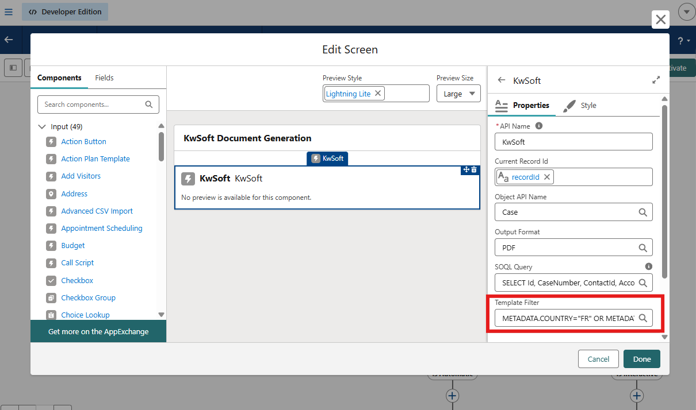

# Document Generation Flow

## Flow template: Mobee - KwSoft Document Generation

This Flow is the main entry point for users. It opens KwSoft templates and generates documents from Salesforce records.

## User journey

1. User opens a record (example: Case)
2. User launches the Flow
3. User selects a template
4. User generates the document
5. System either attaches a PDF directly or opens an interactive editing path

## Component inputs (administrator view)

The KwSoft component in the Flow uses these inputs:

1. **Current Record Id** - Purpose: identifies the Salesforce record used for document data and attachment.

2. **Object API Name** - Purpose: tells the component which Salesforce object is used (for example Case).

3. **Output Format** - Purpose: defines the export type. `PDF` is currently supported.

4. **Data Query** - Purpose: retrieves record information used to fill the document.

> If your team is not comfortable with technical query syntax, ask your Salesforce technical owner to prepare this once. Users do not need to edit it during normal operations.

5. **Template Filter (optional)** - Purpose: limits which templates users can see.

Example use case: show only templates for France and Luxembourg.

Example filter value:
METADATA.COUNTRY="FR" OR METADATA.COUNTRY="LU"

You can also build this value dynamically from Salesforce data.

### Dynamic filter using Flow Formulas

For example, if the connected user has countries assigned in Salesforce, you can generate the filter automatically instead of writing a fixed value.

Example scenario: the user has two assigned countries.

1. Create a Formula resource in Flow (Text), for example `TemplateFilterFormula`.
2. Build the expression from user data.
3. Map this Formula resource to the **Template Filter** input of the KwSoft component.

Example formula result:
METADATA.COUNTRY="{!UserCountry1}" OR METADATA.COUNTRY="{!UserCountry2}"

This approach lets each user see only the templates that match their own country assignments.

> 💡 Tip: if one country value can be empty, add basic `IF` conditions in the formula to avoid generating an incomplete expression.

## What happens after generation

### Automatic document:

1. PDF is generated
2. PDF is attached to the current record
3. User sees a success message

### Interactive document:

1. User is redirected to interactive interface for online document editing
2. System returns an editable link and a document name
3. You should store this information in the **custom log object**

## Administrator good practices

1. Keep template names simple and business-friendly
2. Use template filters to reduce user mistakes
3. Test one Flow path per object (Case, Opportunity, etc.)
4. Avoid exposing technical settings to end users
