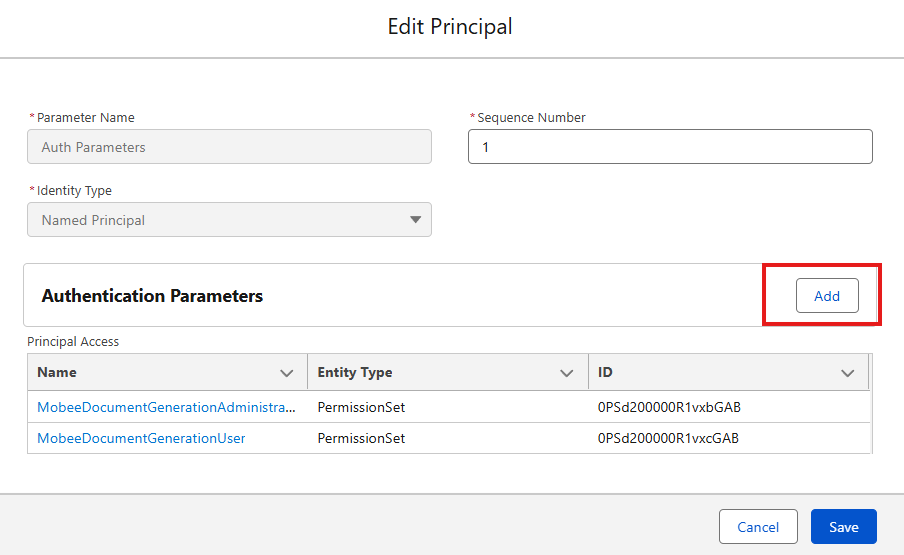

# kwsoft® Connector Setup

This page explains the one-time configuration required after installation.

## 1. Package Setup

Before configuring Flows, validate package access and authentication.

1. Confirm the package is installed in your org.
2. Open the user detail page and assign a Mobee license.
3. Assign the two required permission sets: `Mobee Document Generation Administrator` and `Mobee Document Generation User`.

4. In Setup, use Quick Find to open Named Credentials, then open **kwsoft Auth**.
5. From the named credential, open the related External Credential.

6. In the Principals section, edit the authentication parameters.

7. Add the following three values in Authentication Parameters:

- `clientId`: kwsoft-provided client ID
- `username`: kwsoft-provided username
- `password`: kwsoft-provided password
8. Save the authentication parameters.

Keep credentials confidential and limit visibility to authorized administrators only.

## 2. Create a document log object

Interactive documents are edited outside Salesforce before they are finalized. Because of that, you should store a reference to these draft documents in Salesforce.

Create a custom object (example name: kwsoft Document Log) with at least these fields:

1. Document Name (Text)
2. Document URL (URL)
3. Related Record (Lookup to your business object, for example Case)
4. Status (Picklist, recommended values: Draft, Finalized)

This object helps users find and continue unfinished documents.

## 3. Add related list to business records

Add the custom object as a related list on the main object page layout (for example, Case).

This gives users a clear view of:

1. Which interactive documents exist
2. Which documents are still drafts
3. Which record each document belongs to

## 4. Confirm user permissions

For business users:

1. Read/Create access to files and attachments
2. Access to the Flow used for generation
3. Access to the custom log object

For administrators:

1. Manage Flows
2. Update page layouts
3. Maintain kwsoft templates and metadata

## 5. Decide your operating model

Choose one of the following approaches:

1. Simple mode: automatic PDF only
2. Advanced mode: automatic PDF + interactive documents

Most teams start with Simple mode and enable Advanced mode once users are comfortable.

## 6. Validate with a pilot user

Before go-live, run one end-to-end test:

1. Open a sample record
2. Start the generation Flow
3. Generate one automatic document
4. Generate one interactive document
5. Confirm PDF attachment and log record behavior

If this pilot succeeds, you can deploy to the wider user group.
