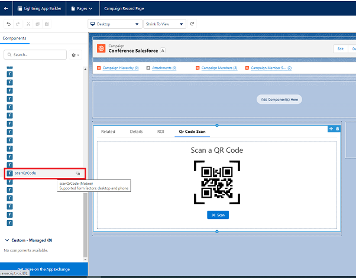
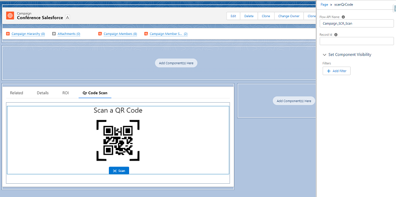
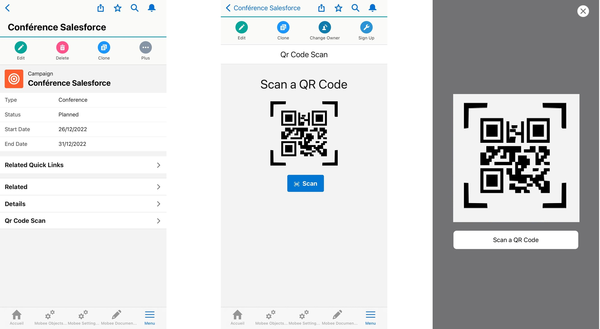
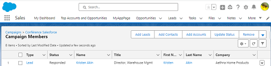
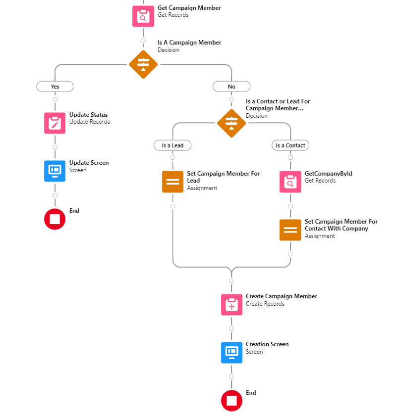

# QR Code Scanner Setup

**Description**: The QR Code Scanner component for Salesforce enables users to scan QR codes directly from their Salesforce interface. By integrating this component, you can instantly fetch and input data, simplifying various manual tasks.

## Installation:

Before utilizing the QR Code Scanner component, ensure that the Mobee package is installed in your Salesforce environment.

## How to Add the QR Code Scanner to an Object Page:

### Step-by-Step Instructions:

1. **Access the Object Page**: Navigate to the desired object page where you want to add the QR code scanner.
2. **Enter Edit Mode**: Click on the 'Edit Page' option, usually available at the top right of the screen, to enter the Lightning App Builder.
3. **Add the QR Code Scanner Component**: 
   - In the Lightning App Builder, look for the lightning components section on the left pane.
   - Drag the 'scanQrCode' component and drop it onto the desired place on your page layout.
4. **Configure Component Attributes**:
   - Click on the added QR Code Scanner component to view its properties.
   - In the 'Flow API Name' field, type in the desired flow's API name (preceded by the namespace prefix if you're using the built in Mobee Campaign Scan Flow). This flow will be executed when a QR code is scanned by the component.
   - The attribute "Record ID" can be left empty. If left blank, it will automatically be populated with the ID of the record where the component is placed.
5. **Save & Activate**: Once done, save the changes and activate the page to reflect them in the Salesforce interface.

### **Essential Notes**:

- It's crucial to create the `scannedId` variable when establishing a flow that uses the QR code scanner, as this variable will store the ID of the scanned object.

## Example Use Case: Add Contacts or Leads to a Campaign via QR Code Scanning

1. **Navigate to Campaign**: Start by accessing the desired campaign in Salesforce.
2. **Enter Edit Mode**: Click on 'Edit Page' to switch to the Lightning App Builder.

   

3. **Insert QR Code Scanner Component**: 
   - Find the 'scanQrCode' component under the 'Custom' section on the left.
   - Drag and place the component where you want it on the campaign page layout.

   

4. **Configure the Component**: 
   - Click on the component to see its attributes.
   - In the 'Flow API Name' field, enter the name "Mobee__Campaign_SCR_Scan" (or the relevant flow name associated with the scanning function for campaigns).

   

5. **Perform Scanning**:
   - Exit the Lightning App Builder and navigate to the campaign page.
   - Using a phone or a device with a camera, utilize the QR Code Scanner component to scan the QR codes of contacts or leads.

   

6. **Verification**:
   - After scanning, verify by checking the campaign membership list.
   - Ensure that the scanned contact or lead has been successfully added to the campaign.
   

**Note**: Ensure that the flow ("Mobee__Campaign_SCR_Scan" in this example) is correctly set up to handle the QR code data and perform the desired actions in Salesforce.

## QR Code Scanner Integration for Campaign Membership Management

### **Overview**

"Mobee__Campaign_SCR_Scan", provided as a template flow in the Mobee package, seamlessly integrates with the QR code scanner module. It facilitates the addition of a contact or a lead to a campaign's membership list. Given its design as a template, this flow is highly adaptable to meet varying requirements.

### **Flow Functionality**:

1. **Scanning and Identifying the ID**:
   - Upon scanning, the ID is retrieved and stored in the variable `scannedId`.
   - The flow checks if this `scannedId` corresponds to a Lead or a Contact.

2. **Unknown ID Handling**:
   - If the `scannedId` does not match a Lead or Contact, the flow redirects to a Screen displaying a message stating that the ID is unknown.
   
3. **Checking Campaign Membership**:
   
   - If the `scannedId` is identified as a Lead or Contact, the flow then verifies if the respective record is already part of the campaign members of the campaign associated with the `recordId` (i.e., the campaign where the scanner module is placed).

4. **Handling Contact's Account Information**:
   - For contacts, due to the offline nature of the scan on Mobee, the flow manually fetches the related account information using `GetCompanyById`. As of now, in the offline mode of Mobee, there is a limitation wherein related fields embedded within Salesforce flows can't be accessed directly. This issue is set to be addressed in upcoming updates.
   
5. **Adding to Campaign Membership**:
   - If the Lead or Contact is not a member of the campaign, they are added to the campaign's membership list.
   - Their status is set to 'Responded', though this can be customized within the flow as per requirements.

6. **Updating Existing Campaign Member**:
   - If the Lead or Contact is already a member of the campaign, their status will be updated to 'Responded'.

Happy Scanning!
