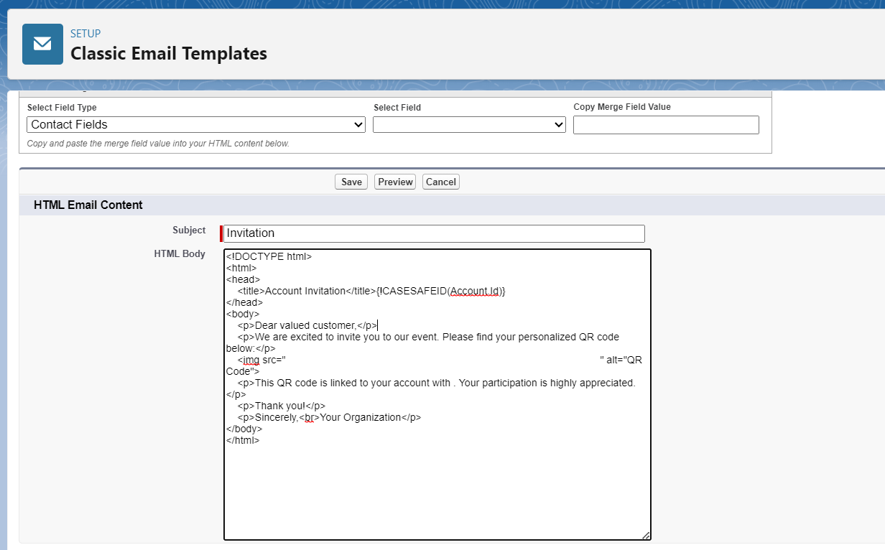
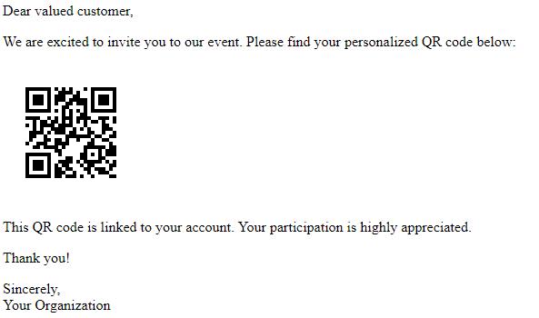

# Custom Email Template

In this example, we'll walk through the process of sending an invitation email to Salesforce contacts. The email will contain a personalized QR code that is dynamically generated for each recipient.

**Note**: While this example uses the "Contact" object, you can apply the same approach to other objects in Salesforce.

## Email Template Setup

1. **Open your Classic Email Templates**: Go to your Salesforce Setup page, and look for the `Classic Email Templates` page.
2. **Create a new Email Template**: Click on the `New Template` button, Custom (without using Classic Letterhead). Then fill the required fields on the Email Template Information page.

## Template Content

### Subject:
```html
Invitation to {!Contact.Name}
```
### HTML Body:
```html
<!DOCTYPE html>
<html>
<head>
    <title>Invitation</title>
</head>
<body>
    <p>Dear valued customer,</p>
    <p>We are excited to invite you to our event. Please find your personalized QR code below:</p>
    
    <p>This QR code is linked to your account. Your participation is highly appreciated.</p>
    <p>Thank you!</p>
    <p>Sincerely,<br>Your Organization</p>
</body>
</html>
```

## Sample HTML Body Preview:



## Resulting Email
After the template is processed by Salesforce, the email will be sent to clients. Here's what the resulting email might look like:

**Sample Email Result:**



## Explanation

+ The email template is set up as a Custom type, which means you have control over the content and layout.
+ Classic Letterhead is not used, so the email won't have a predefined header/footer from a letterhead template.
+ The subject of the email is dynamically generated using merge fields. {!Contact.Name} inserts the contact's name into the subject line.
+ The HTML body of the email is where the main content resides.
+ The img tag sources the QR code image from a URL. The URL includes the CASESAFEID(Contact.Id) merge field to dynamically generate the QR code based on the recipient's contact ID.
+ A paragraph below the QR code explains the purpose of the QR code and its association with the recipient's contact.
+ The email concludes with a thank you message and the sender's organization information.

## Personalization

This template provides a personalized invitation experience for each recipient by incorporating their contact name and a QR code linked to their specific contact.

This approach enhances client engagement and delivers a unique invitation experience through Salesforce email templates.