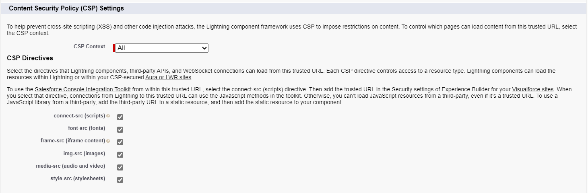

# Template Types and Syntax

## Template Types

Mobee supports two types of templates:

### Simple Document Template

When the checkbox **Combined Document** is not checked, the template is designed for unitary generation. This means that the template includes information for one only. For instance, if you create a simple template for the "Contact" object, it will incorporate the information of one contact and its related data.

### Combined Document Template

When the checkbox **Combined Document** is checked, it indicates that the template will be generated for multiple records simultaneously. This template employs a special syntax to loop through a list of records. To access fields on each record in a combined document, your template should start by looping through the list of items using the following tag `{#items}{/}`. Check the [loops section](#Loops) for more details.

## Syntax

The syntax of tags used in Mobee Templates is inspired by the language-agnostic [Mustache](https://mustache.github.io/) specification.

- Normal tags start with an alphabetical character.
- Other types of tags start with special prefixes.

**For example:**

- Accessing merge fields on the object: `{Salutation} {firstName} {lastName}`
- Accessing related lists data: `{#cases}` and `{/}` to start and close a tag. Check the **loops** section for more details.
- Inserting dynamic images: `{%ImageUrl__c}` will add the image for the field "ImageUrl\_\_c". Check the **Dynamic images** section for more details.

For example, to access the "Contact" data using the given syntax in your template:

```markdown
Hello {Salutation} {FirstName} {LastName}!
```

**Output:**

```markdown
Hello Mr. John Doe!
```

## Conditions

Conditions start with the `#` character and end with a slash. For instance, `{#Salutation == "Mr."}` starts a condition and `{/}` ends it.

**Note:** To verify checkbox fields (`true` or `false`), use the following syntax:

```markdown
The contact {Name} {#HasOptedOutOfEmail == 1}has{/}{#HasOptedOutOfEmail == 0}hasn’t{/} opted out of emails.
```

**Output:**

```markdown
The contact Mr. John Doe has opted out of emails.
```

### Logical expressions

You can use the following operators for more complex logical expressions:

- AND `a && b`
- OR `a || b`
- ADDITION `a + b`
- SUBTRACTION `a - b`
- MULTIPLICATION `a * b`
- MODULO `a % b`
- DIVISION `a / b`
- TERNARY `a ? b : c`
- ASSIGNMENT `a = 1`
- EQUALITY/INEQUALITY `a == 1, a != 1`
- RELATIONAL `a > 1, a < 1, a >= 1, a <= 1`
- OPERATOR PRECEDENCE with parentheses `(a && b) || c`
- EXPONENTIAL NOTATION: `12e3` => returns `12000`

Example:

```markdown
{#products.length > 1}There are multiple products{/}
{#firstName == "John"}Hello John{/}
```

The first condition will display the section only if there are 2 or more products.

The second condition will display the section only if the username is the string "John".

**Output:**

```markdown
There are multiple products
Hello John
```

## Loops

As mentioned earlier, we start looping through a list of data with the "#" symbol. Example:

```markdown
{#Cases}
{CaseNumber}: {Description}.
{/}
```

**Output:**

```markdown
00001299: Need Access Permission to visit location.
00001624: Support Client.
00001836: The cable of the battery charger is missing.
```

**Note:** Each merge field used in the loop section refers to the fields of the current related object. If the field is not found on the related object, the engine will reference it from the parent object.

## Dynamic Images

Dynamic images can be seamlessly integrated into your generated documents through the utilization of dynamic placeholders. For example, if you possess a field named `ProfilePicture__c` housing the URL of an image or the image encoded as a Base64 string, it can be incorporated into your document effortlessly using the designated tag: `{%ProfilePicture__c}` (starting with the `%` symbol).

### Base64 Images

To include an image using base64 data, simply encode the image into Base64 format and store it directly in your salesforce field.

### URL Images

To incorporate an image using a URL, adhere to the following procedural steps:

1. Navigate to "Setup" within Salesforce.
2. In the quick find box, locate and select "Remote Site Settings."
3. Click the "New Remote Site" button.
4. Assign a name for the site (e.g., "Imgur Site").
5. In the "Remote Site URL" field, input the base URL of the image's location—such as "https://i.imgur.com."
6. Enable the "Disable Protocol Security" checkbox to permit retrieval over HTTP.
7. Select "Save" to preserve the changes.


Proceed with the following steps to incorporate the URL into the trusted URLs with all Content Security Policy (CSP) directives enabled:

1. In the setup page, locate "Trusted URLs" using the quick find box.
2. Select the "New Trusted Site" button.
3. Assign a name for the trusted site (e.g., "Imgur Trusted").
4. In the "Site URL" field, input the same base URL as before, namely "https://i.imgur.com."
5. Enable all CSP directives: "Connect," "Font," "Img," "Media," "Object," "Script," "Style."
6. Confirm the changes by clicking "Save."




You have now set up remote site settings and trusted URLs to securely retrieve the image over HTTP. You can then use the `{% ProfilePicture__c}` tag to dynamically include the image in your generated documents.

## Additional functionalities

Mobee provides several tags and filters to help users customize their documents.

### Dates

The `{docUtils.today}` tag is a predefined element that enables the inclusion of the current date in a document template during the generation process. In addition to the filters outlined below, users have the flexibility to manipulate this date according to their specific requirements.

### Filters

Filters are predefined functions designed for the manipulation of strings, dates, and numbers within document templates. They can be applied to any tag by appending the pipe character `|` followed by the desired filter.

Here is an illustrative example of the syntax:

```markdown
Hello {Salutation} {FirstName} {LastName | upper}!
```

**Output:**

```markdown
Hello Mr. John DOE!
```

The following tags and filters are currently supported:

**String filters:**

- `lower`: Utilized to convert text to lowercase.
- `upper`: Utilized to convert text to uppercase.

**Date Filters:**

- `shortDate`: Utilized to convert the date in a concise shorter format.
- `followingMonth`: Utilized to return the subsequent month based on a given date.
- `followingYear`: Utilized to return the subsequent year based on a given date.
- `lastWorkingDayOfMonth`: Utilized to return the last working day of the month based on a given date.
- `formatDate`: A versatile filter for formatting various date values.

Usage example:

```markdown
The created date is {StartDate | shortDate}
The following month is {StartDate | followingMonth: '[["year": "numeric", "month": "long"]]'}
The following year is {StartDate | followingYear: '[["year": "numeric"]]'}
The last working day of the month is {StartDate | lastWorkingDayOfMonth}
```

**Output:**

```markdown
The created date is 21/01/2022
The following month is février 2022
The following year is 2023
The last working day of the month is 31/01/2022
```

The `followingMonth`, `followingYear`, `lastWorkingDayOfMonth`, and `formatDate` functions accept the following formatting options:

```json
[[
  weekday: 'narrow' | 'short' | 'long',
  era: 'narrow' | 'short' | 'long',
  year: 'numeric' | '2-digit',
  month: 'numeric' | '2-digit' | 'narrow' | 'short' | 'long',
  day: 'numeric' | '2-digit',
  hour: 'numeric' | '2-digit',
  minute: 'numeric' | '2-digit',
  second: 'numeric' | '2-digit',
  timeZoneName: 'short' | 'long',

  // Time zone to express it in
  timeZone: 'Asia/Shanghai',
  // Force 12-hour or 24-hour
  hour12: true | false,

  // Rarely-used options
  hourCycle: 'h11' | 'h12' | 'h23' | 'h24',
  formatMatcher: 'basic' | 'best fit'
]]
```

**List Filters:**

#### `groupBy` Function Documentation

The `groupBy` function organizes elements in a collection by grouping them based on specified keys. Multiple levels of grouping can be achieved by providing multiple keys, separated by semicolons. The grouping order follows the sequence of the specified keys.

**Returns**

The function returns an object containing the following properties:

- **`$groupedKey#`**: Represents the grouping key at each level, where `#` denotes the grouping level, starting from 1.
- **`$groupedItems#`**: Contains the items associated with each grouping key. When multiple levels of grouping are applied, each level contains its own `$groupedKey#` and `$groupedItems#`, incrementing the index for each deeper level.

**Usage Example**

**Scenario:**

Grouping invoice items by `Category` and `Subcategory`.

**Template:**

```markdown
Invoice Number: {InvoiceNumber}

{#InvoiceItems | groupBy: 'Category;Subcategory'}
- Category: {$groupedKey1}
  {#$groupedItems1}
  - Subcategory: {$groupedKey2}
    {#$groupedItems2}
    - Item: {ItemName}
      Quantity: {Quantity}
      Price: {Price | currency: 'USD'}
    {/}
  {/}
{/}
```

**Sample Data (Table Format):**

| Category    | Subcategory | Item Name    | Quantity | Price |
| ----------- | ----------- | ------------ | -------- | ----- |
| Electronics | Laptops     | Dell XPS 13  | 2        | 1200  |
| Electronics | Laptops     | MacBook Pro  | 1        | 2000  |
| Electronics | Phones      | iPhone 14    | 3        | 999   |
| Furniture   | Chairs      | Office Chair | 5        | 150   |

**Sample Data (JSON Format):**

```json
{
  "InvoiceNumber": "INV-2024-001",
  "InvoiceItems": [
    {
      "Category": "Electronics",
      "Subcategory": "Laptops",
      "ItemName": "Dell XPS 13",
      "Quantity": 2,
      "Price": 1200
    },
    {
      "Category": "Electronics",
      "Subcategory": "Laptops",
      "ItemName": "MacBook Pro",
      "Quantity": 1,
      "Price": 2000
    },
    {
      "Category": "Electronics",
      "Subcategory": "Phones",
      "ItemName": "iPhone 14",
      "Quantity": 3,
      "Price": 999
    },
    {
      "Category": "Furniture",
      "Subcategory": "Chairs",
      "ItemName": "Office Chair",
      "Quantity": 5,
      "Price": 150
    }
  ]
}
```

**Expected Output:**

Invoice Number: INV-2024-001

- **Category:** Electronics
  - **Subcategory:** Laptops
    - Item: Dell XPS 13
      Quantity: 2
      Price: $1,200.00
    - Item: MacBook Pro
      Quantity: 1
      Price: $2,000.00
  - **Subcategory:** Phones
    - Item: iPhone 14
      Quantity: 3
      Price: $999.00

- **Category:** Furniture
  - **Subcategory:** Chairs
    - Item: Office Chair
      Quantity: 5
      Price: $150.00

This example illustrates how the `groupBy` function can be used to organize data effectively based on hierarchical categories.

---

#### `sortBy` Function

The `sortBy` function helps you arrange items in a list based on specific fields, such as sorting by category and price.

**Example**

**Template:**

```markdown
{#InvoiceItems | sortBy: 'Category;Price'}
- {ItemName}: {Price}
{/}
```

**Expected Output:**

```markdown
- Office Chair: 150
- Dell XPS 13: 1200
- MacBook Pro: 2000
```

---

#### `htmlList` Function

The `htmlList` function turns an HTML string into a simple list.

**Example**

**Template:**
```markdown
{richTextField: htmlList}
```
**Data**
```markdown
{richTextField: '<ul><li>Item 1</li><li>Item 2</li></ul>'}
```

**Expected Output:**

```markdown
- Item 1
- Item 2
```

---

#### `multiPicklist` Function

The `multiPicklist` function converts a string into a list using specific options, such as a separator and bullet symbol.

**Example**

**Data**
```markdown
{fruits: 'Apple;Orange;Banana'}
```

**Template:**

```markdown
{fruits | multiPicklist: '[["separator": ";", "bulletSymbol": "-" ]]'}
```

**Expected Output:**

```markdown
- Apple
- Orange
- Banana
```

---

#### `where` Function

The `where` function helps you filter items that match specific conditions, such as selecting only electronic items.

**Example**

**Template:**

```markdown
{#InvoiceItems | where: 'Category=="Electronics"'}
- {ItemName}
{/}
```

**Expected Output:**

```markdown
- Dell XPS 13
- MacBook Pro
- iPhone 14
```
