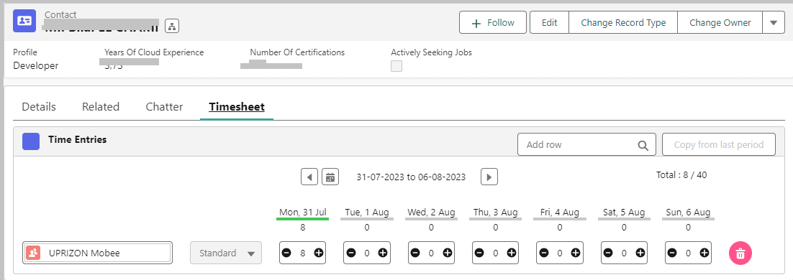

## Introduction

This user guide will help you understand and use the Time Entries management features in our system.

You will find step-by-step instructions to add new projects and assignments, as well as how to view your colleagues' Time Entries.

## Adding a New Project from an Opportunity

### Navigate to the Opportunity
Step 1: Access the "Opportunities" module

1. Log in to your Salesforce account.
2. Go to the Salesforce homepage.
3. In the top navigation bar, click on the "Opportunities" tab to open the list of opportunities.
4. Choose the relevant opportunity.

Step 2: Click on the "New Project" toolbar button to create a project from the opportunity.

The system will launch a dialog box with variables initialized from the opportunity as follows: (complete the required fields according to your needs)

The "New Project" form is presented to the user with many fields pre-filled from the opportunity. This facilitates data entry and reduces errors.

## Adding a New "Assignment" from the Project

### Navigate to the Relevant Project

Step 1: Access the project page

1. Access the list of projects by clicking on the "Projects" tab in the top navigation bar.
2. Select the project to which you want to add a new "Assignment."

Step 2: Add a New "Assignment"
* On the relevant project page,
* Click on the "New Assignment" button to create a new assignment.
* Fill in the assignment details, such as the assignee's name, price, quantity, work description, start and end dates, etc.
* Save the newly created assignment.

The "New Assignment" form is presented to the user, with many fields pre-filled from the project. This facilitates data entry and reduces errors.

## Viewing Time Entries of Salesforce Community Users

### Navigate to the Relevant Contact

Each Salesforce Community user is created as a Contact in Salesforce.

Step 1: Access "Contacts"

* Access the list of contacts by clicking on the "Contacts" tab in the top navigation bar.
* Select the contact (colleague) for whom you want to view the Time Entries.
* Use the available filter on the contact page.
* The Contact page is displayed with the details.

Step 2: Access the "Time Entries."

* The Time Entries are displayed in the tab:

## Viewing Time Entries of Standard Salesforce Users

### Use the Global Search Bar.

* Enter the colleague's name in the search bar. A list will show users matching the criteria and the nature of the found object (Account, Contact, User, etc.).
* Choose "User," and the system will direct you to the relevant user.
* The timesheet will be displayed at the top of the page as follows:

