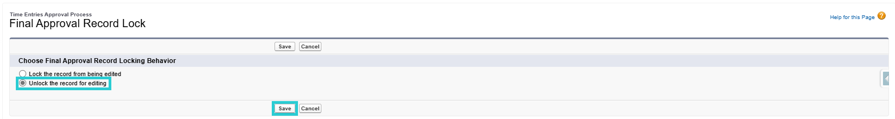
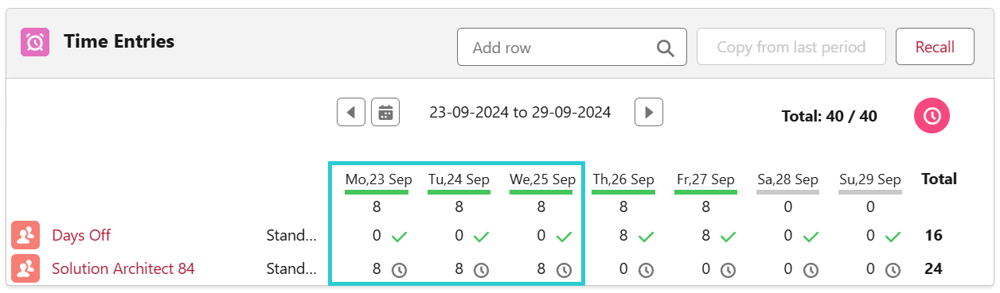

# Time Sheet Approval Process

## Introduction

You can add an approval process to have your manager, or a designated approver, review and approve or reject your submitted time entries.

  
*Approval Process Submission Preview*

---

## Approval Process Activation

### 1. Create The Approval Process

The following section is a step-by-step guide for creating a standard approval process, where some actions are mandatory and others are optional.  **(The mandatory steps are highlighted in bold)**

- Go to the setup page
- Access the approval processes
- Manage approval processes for: time period
- Create new approval process: use standard setup wizard

#### Step 1: Enter Name And Description

#### Step 2: Specify Entry Criteria

*No action to do*  

#### Step 3: Specify Approver Field And Record Editability Properties

1. Specify Approver Field (for automated approval routing)
   Select: *Manager*

2. Record Editability
   Select: *Administrators or the currently assigned approver can edit records during the approval process.*  

#### Step 4: Select Notification Templates

*No action to do*  

#### Step 5: Select Fields To Display On Approval Page Layout

*No action to do*  

#### Step 6: Specify Initial Submitters

1. Initial submitters  
   *Select: Time period owner, record creator*

2. **Submission settings**  
   ***Select: Allow submitters to recall approval requests***  

---

### 2. Manage The Approval Process

After completing the creation of the approval process, you will be able to manage actions (initial submission, final approval, final rejection, and recall).

These actions must be included for the approval process to function as intended.

  
*Actions And Approval Steps Preview*

#### 2.1. Initial Submission Actions

1. Add existing  
2. Add: *Field update: update status to submitted*

#### 2.2. Final Approval Actions

1. Edit record lock and select: *Unlock record for editing*  
2. Add existing and add: *Field update: update status to approved*

#### 2.3. Final Rejection Actions

1. Add existing  
2. Add:  
   a. *Field update: update status to rejected*  
   b. *Email alert: send email notification to assignee on rejection* (this is an email alert sent to the timesheet submitter if their timesheet is rejected by the approver. if not needed, this email alert should not be added)

#### 2.4. Recall Actions

1. Add existing  
2. Add: *Field update: update status to draft*

---

### 3. Choose The Approver

#### 3.1. Assign The Approver On The Approval Process

The approver may be the submitter's manager or a specific user responsible for all submitters, such as the hr manager, ensuring that all timesheets are directed to one individual for approval. This is also controlled at the level of the approval process after its creation.

#### 3.2. Permission Set Assignment

In setup > users, set the *Mobee approve all timesheets* permission set on the approver user.

---

## Approval Process Usage

#### 1. Submitter

User submits his time sheet for approval  
*This action is recallable (1)*  
*Submission comment (2)*  
*Time entries submitted indicator (3)*

#### 2. Approver

Assigned approver can approve/reject on submitter's contact  
*the assigned approver reviews the timesheet (submitted time entries) and has the option to either approve or reject the submission.*

---

## Approval Process Behavior And Considerations

- Partial approval is possible

Example A:  
*the user submits a request for days off, which gets approved. later, they submit their assigned workload for the remaining days*

  

Example B:  
*the user submits the last days of the month for approval. in the following month, for the same assignment, they submit the remaining weekdays for approval*

  

- When a timesheet is approved, a notification is sent to the submitter  
- When a timesheet is rejected, both a notification and an email are sent to the submitter (the email is sent if added according to 2.3. final rejection actions)  
- When any pending time entries on a timesheet are rejected, the entire timesheet becomes editable  
- Hovering over the following icons ,  and  displays comments from the submitter or approver related to the submission, approval, or rejection, respectively  
- The following icons  and  serve as indicators showing the status of the time entry