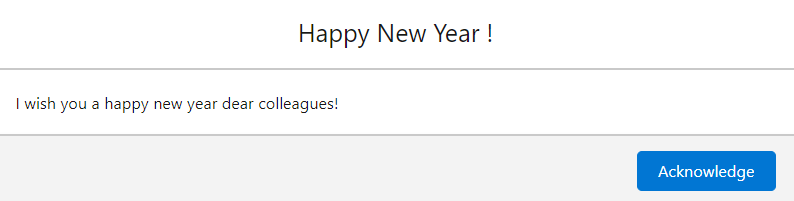

# Dynamic Information Banner LWC Component

## Overview

The 'Dynamic Information Banner' Lightning Web Component (LWC) provides a customizable notification display functionality within record pages. It retrieves information from two custom objects: 'Notification' and 'Notification Acknowledgement.' Users can create notifications with specific attributes and view them sliding in the component on the record page. Additionally, customization options for speed, background color, font color, and acknowledgment notification formatting are available.

### Custom Objects

1. **Notification**:
   - Fields: Name (required), Description, Start Date, End Date, Active (checkbox)
2. **Notification Acknowledgement**:
   - Fields: Date/Time of Acknowledgment, Acknowledged By

## Functionality

- Creation of Notifications:

  - Users can create notifications with a name, description, start date, end date, and an 'active' status checkbox.
    
  - Start date, end date, description, and active status are not mandatory fields.

- Integration in Record Page:
  - Insert the 'Dynamic Information Banner' component onto a record page to display created notifications sliding within the component.
 
    
 
  - Click on the notification and acknowledge it.
 
    
 
- Customization Options:
  - **Speed**: Configure the speed of notification sliding in seconds.
  - **Background Color**: Customize the background color of the notification banner using hexadecimal format (e.g., '#FFFFFF').
  - **Font Color**: Set the font color for the displayed notifications using hexadecimal format.
    
- Notification Acknowledgment Format:
  - Customize the format using placeholders encapsulated in brackets ({}) for field names from 'Notification Acknowledgement\_\_c'. Delimiters can be any character or none at all.

## Usage

1. **Inserting Component on Record Page**:

   - Add the 'Dynamic Information Banner' LWC component to a record page layout.

2. **Customization**:
   - Access the edit page of the component to customize:
     - Speed (in seconds)
     - Background color (hexadecimal format, e.g., '#FFFFFF')
     - Font color (hexadecimal format)

## Example Acknowledgment Format

An example of the acknowledgment format: '{Mobee**Notification**c}{SystemModstamp}' or '{Mobee**Notification**c}--{SystemModstamp}'.

- Replace 'Mobee**Notification**c' and 'SystemModstamp' with appropriate field names from 'Notification Acknowledgement\_\_c'.
- Delimiters can be modified or omitted according to the desired format.

## Notes

- Ensure necessary access permissions for the 'Notification' and 'Notification Acknowledgement' custom objects.
- Validate field-level security and user permissions for CRUD operations on both objects.
- Customization settings might require proper documentation for users/administrators.
