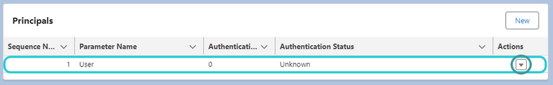
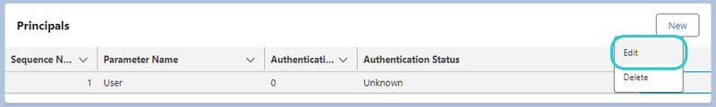
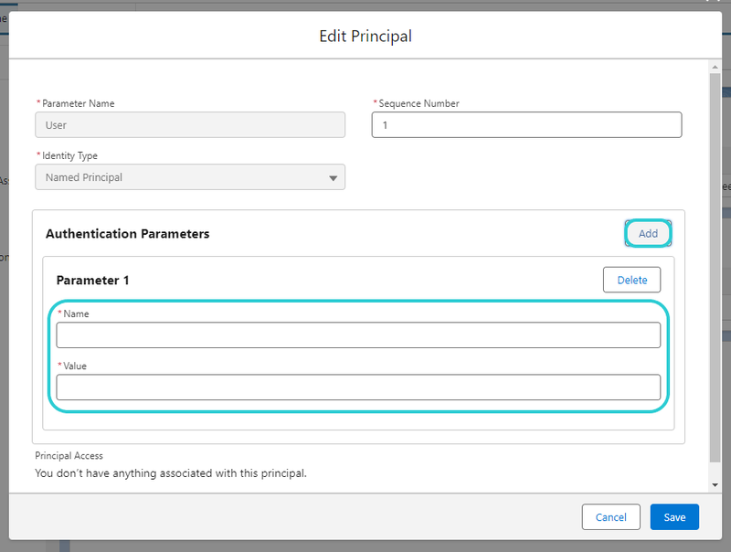
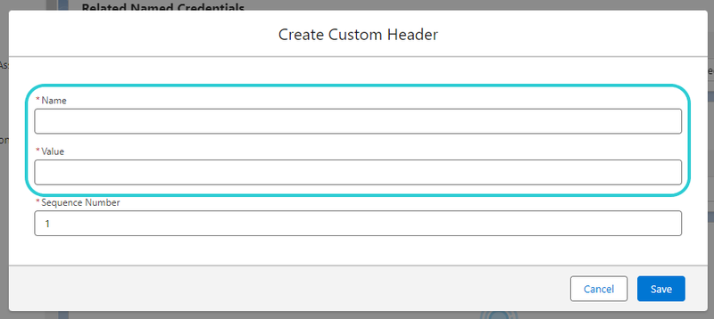

# Mobee Document Generator External Credential Setup

This document provides a step-by-step guide on how to set up external credentials for Mobee Document Generator, including creating a custom authentication protocol, adding parameters, custom headers, and integrating with Uprizon for authentication.

## Setup External Credentials

1. Open the external credentials management interface by navigating to **Setup** > **Security** > **Named Credentials**.

   

2. Click on the "External Credentials" tab.

   

3. Locate the external credential with the label "Document Generation External Credentials" and click on it.

   

4. Inside the "Document Generation External Credentials," find the principal with the Parameter Name "user." Click on the arrow on the right and select "Edit."

   

   

   

5. Inside the Principals Window, Add Authentication Parameters:
    - Click on the "Add" button next to Authentication Parameters.
    - In the Parameter 1 section, add:
        - **Name:** Authorization
        - **Value:** [Token provided by Mobee]

          **Note:** Before saving, ensure that the token has the "Bearer " prefix. If not, add the prefix with a space.

            For example: If the token is `3259eae457d982a08f72d91e72d64903aa87fc164dcfcf244b4fb2840403c2af`, make it: `Bearer 3259eae457d982a08f72d91e72d64903aa87fc164dcfcf244b4fb2840403c2af`

    - Click on "Save" to save the changes.

   

6. In the "Document Generation External Credentials," navigate to the Custom Headers section and click on "New" to add a new custom header.

   

7. Inside the Custom Header Window, add a new custom header.
    - Add:
        - **Name:** Authorization
        - **Value:** [Token provided by Mobee]

          **Note:** Before saving, ensure that the token has the "Bearer " prefix. If not, add the prefix with a space. 
          
            For example:If the token is `3259eae457d982a08f72d91e72d64903aa87fc164dcfcf244b4fb2840403c2af`, make it: `Bearer 3259eae457d982a08f72d91e72d64903aa87fc164dcfcf244b4fb2840403c2af`

    - Click on "Save" to save the custom header.
    
   

8. You are now done with the setup for Mobee Document Generator External Credentials.

   Make sure when the token generated by Uprizon is updated, you have to update the token in both the Authentication Parameters and Custom Headers.
