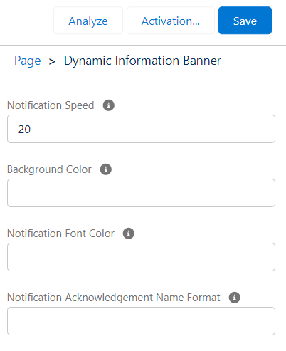

# Notifications Banner Component

## Overview

The 'Notifications Banner' Lightning Web Component (LWC) provides a customizable notification display functionality within record pages. It retrieves information from two custom objects: 'Notification' and 'Notification Acknowledgement.' Users can create notifications with specific attributes and view them sliding in the component placed on the desired lightning page. Additionally, customization options for speed, background color, font color, and acknowledgment notification formatting are available.

### Custom Objects

1. **Notification**:
   - Fields: Name (required), Description, Start Date, End Date, Active (checkbox)
2. **Notification Acknowledgement**:
   - Fields: Date/Time of Acknowledgment, Acknowledged By

## Functionality

### Creation of Notifications:

Users can create new notifications by providing a name which will be displayed as the title, description, start date, end date, and indicates if it's active or not.

**Note**: Start date, end date, description, and active status are not mandatory fields.

### Integration in Record Page:

Insert the 'Notifications Banner' component onto a lightning page to display created notifications sliding within the component.

Click on the notification and acknowledge it.

### Customization Options:

- `Notification Speed`: This parameter controls the speed at which the notifications texts slide across the display. If you enter a higher value, the notifications will move faster.
- `Background Color`: Customize the background color of the notification banner using hexadecimal format (e.g., '#FFFFFF').
- `Notification Font Color`: Set the font color for the displayed notifications using hexadecimal format.

- `Notification Acknowledgement Name Format`: Customize the format using placeholders encapsulated in brackets (`{}`) for field names from `Notification Acknowledgement__c`. Delimiters can be any character or none at all.

## Usage

### Inserting Component on a Lightning Page:

Add the 'Notifications Banner' LWC component to a record page layout.

### Customizations:

In the Lightning Page Builder, you can access its properties by clicking on the component to customize the following:
- Speed of sliding
- Background color
- Font color

### Example Acknowledgment Format

An example of the acknowledgment format: `{Mobee__Notification__c}{SystemModstamp}` or `{Mobee__Notification__c}--{SystemModstamp}`.

- Replace `Mobee__Notification__c` and `SystemModstamp` with appropriate field names from `Notification Acknowledgement__c`.
- Delimiters can be modified or omitted according to the desired format.

## Notes

- Ensure necessary access permissions for the **Notification** and **Notification Acknowledgement** custom objects.
- Validate field-level security and user permissions for CRUD operations on both objects.
- Customization settings might require proper documentation for users/administrators.
