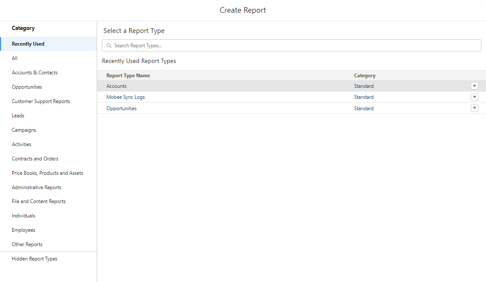
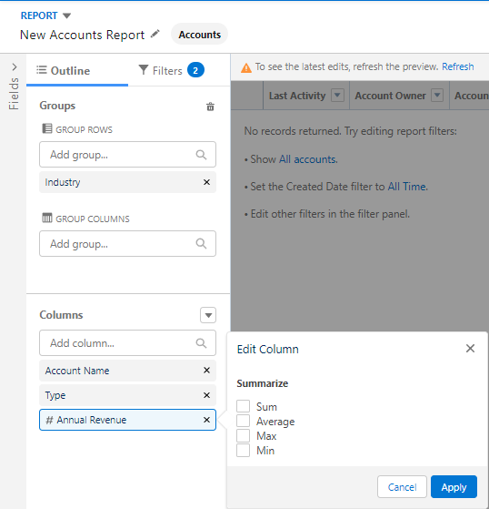
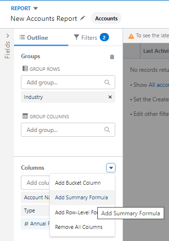
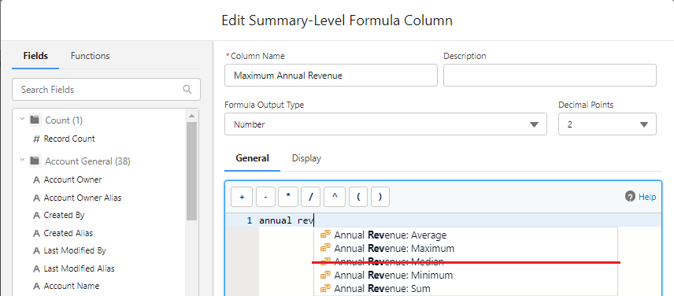
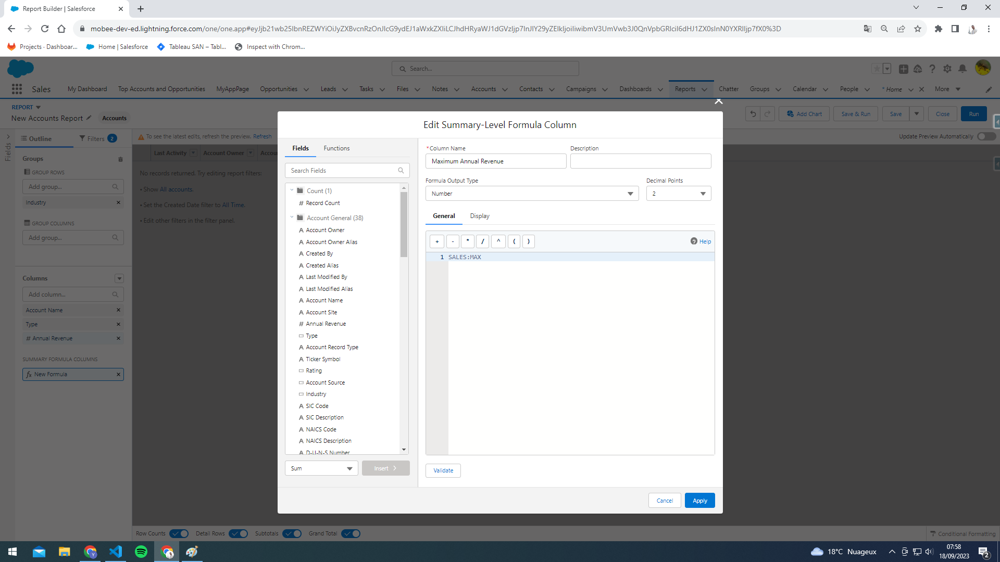
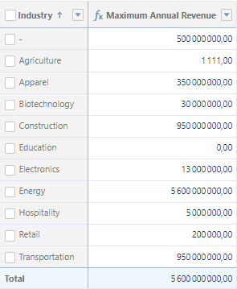

## Salesforce Reports Management on Mobee Offline

### Overview
Managing Salesforce reports on Mobee Offline brings with it certain nuances. Due to the inherent complexity of Salesforce reports, many features aren't supported in the offline reports on Mobee. Nevertheless, this documentation aims to guide users in creating and optimizing Salesforce reports for the best Mobee offline experience.

### Creating a Salesforce Report

1. **Access Salesforce Reports**:
   - From your Salesforce homepage, navigate to the "Reports" tab.
   - Click on "New Report".  

   
   
2. **Selecting the Object**:
   - Choose the desired object for which you wish to generate the report.
   - Click on "Create".
3. **Configuring Report Details**:
   - Add the fields required for the report.
   - While setting up the report layout and criteria, please keep in mind the limitations for Mobee offline as mentioned below.

### Limitations & Considerations for Mobee Offline

1. **Row Groupings**:
   - Only 'Group rows' functionality is supported on Mobee.
   - Only one field can be used for row grouping.  

    
2. **Handling Numeric Fields**:
   - The 'Summarize' tool for numeric fields is not compatible with Mobee offline.
   - If aggregation is needed on numeric fields, users should create formulas.
   - Supported formulas for aggregations on Mobee include:
     - `MAX`
     - `MIN`
     - `AVG`
     - `SUM`  

    
    
    
3. **Visibility of Row Counts**:
   - "Row Counts" are not displayed in offline reports on Mobee. It's essential to keep this in mind when reviewing or analyzing report data offline.  
   
   

### Conclusion

Mobee's offline capabilities make Salesforce reports accessible even without an active internet connection. However, understanding and adapting to Mobee's constraints is vital for ensuring a seamless and accurate report representation offline.
