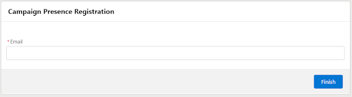
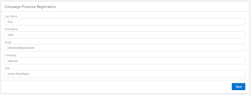
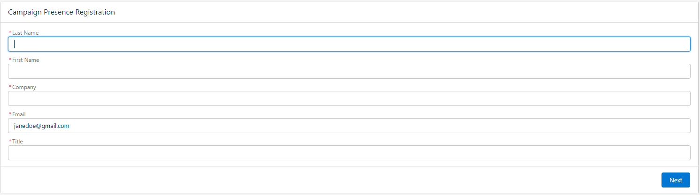
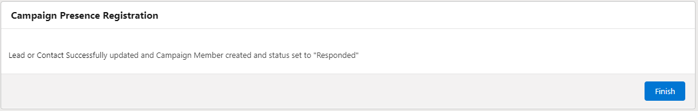

# Campaign Presence Registration

Enhancing Campaign Membership Management through Flow

### **Overview**

The "Campaign Presence Registration" flow is aimed at streamlining the process of adding or updating contacts and leads to a campaign's membership list via Salesforce. With an emphasis on efficient campaign memberships management and providing a user-friendly and customizable platform, this flow navigates through a systematic process to verify, update, and manage the associated contact or lead, ensuring data accuracy and enriched user interactions.

### **Objective**

The primary objective of the "Campaign Presence Registration" flow is to facilitate seamless management of campaign memberships by utilizing an email address as the key data point. This flow enhances the user experience in campaign management by offering options to verify, update, or create records, ensuring that each interaction is effectively capitalized upon for campaign membership management.

### **Full Customizability Tailored to User Needs**:

This flow provides comprehensive customization, allowing it to be adapted to meet specific user and business requirements. It not only addresses fundamental use-cases involving adding and updating members in a campaign but also provides a flexible platform to:
- Introduce additional fields for updating.
- Implement unique logic for campaign member status updating.
- Customize user interaction screens for enhanced user experience.
- Integrate additional checks or processes as per the business workflow.

### **Flow Functionality**:

1. **Email Address Entry**:
   - The flow initiates by accepting an email address as input.
   - The email address serves as a pivotal point to fetch relevant data and perform subsequent actions.  

    
2. **Identification of Contact or Lead**:
   - The flow identifies whether the input email address is associated with a Lead or Contact within Salesforce.
   
3. **Data Update Interaction**:
   - If the email corresponds to a known Lead or Contact, the user is prompted to update specific fields:
     - For Leads: Last Name, First Name, Email, Company, and Title.  

     
     - For Contacts: Last Name, First Name, and Email.  

       

   - Note: Updating the 'Company' for Contacts is intentionally omitted due to its relation with the Account object and should be modified directly in Salesforce if required.

4. **Lead Creation for Unknown Email**:
   - If the email address does not correspond to an existing Lead or Contact, the user is provided an option to create a new Lead.
   - The user can enter relevant information: Last Name, First Name, Email, Company, and Title to create a new Lead record.  

   

5. **Campaign Membership Management**:
   - Post-data update or Lead creation, the flow checks if the Contact or Lead is already a member of the campaign specified by `recordId`.
   - If not a member, the individual is added to the campaign, and their membership status is initialized (e.g., 'Responded').
   - If they are already a member, the status is updated accordingly.  

   

"Campaign Presence Registration" allows users to ensure a structured and efficient method for managing campaign memberships, maintaining the flexibility to adapt the flow in alignment with dynamic business needs while ensuring that no potential leads are lost in the process.
