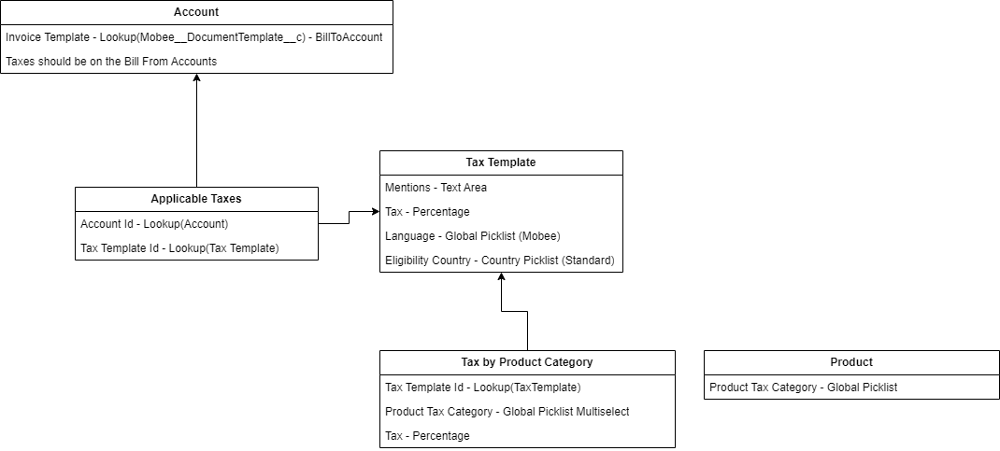

# Introduction

The **Mobee Invoicing and Billing Module** uses several custom objects to manage invoices, invoice line items, and taxes effectively. This ensures accurate billing, tax calculation, and reporting flexibility across various business scenarios. The custom objects can be divided into two categories:

- **Main Objects**: These represent the core invoicing components, such as **Invoice** and **Invoice Line Item**.
- **Objects Related to Taxes**: These handle tax rules and calculations, including **Tax Template**, **Tax by Product Category**, and **Applicable Taxes**.

---

# Main Objects

## Invoice

The **Invoice** object is the main record for billing. It stores details like the customer, the amount due, and the invoice status. It also links to related records like Opportunities, Orders, or Projects.

### Key Information:
- **Bill To Account (Lookup - Account):** The account being billed for the invoice.
- **Bill To Contact (Lookup - Contact):** The contact responsible for receiving the invoice.
- **Customer (Lookup - Account):** The account linked to this invoice.
- **Payable To (Lookup - Account):** The account to whom the invoice payment is due.
- **Currency (Picklist):** Specifies the currency for the invoice.
- **Due Date (Date):** The date by which the invoice payment is expected.
- **Total Amount (Formula - Currency):** The total amount due, calculated as a roll-up of all associated **Invoice Line Items**.
- **Tax Amount (Roll-Up Summary - Currency):** The total tax amount for the invoice, calculated from the associated **Invoice Line Items**.
- **Invoice Date (Date):** The date on which the invoice is generated.
- **Invoice Number (Text):** A unique identifier for the invoice.
- **Opportunity (Lookup - Opportunity):** Links the invoice to a related opportunity (if applicable).
- **Project (Lookup - Project):** Links the invoice to a related project (if applicable).
- **Tax Template (Lookup - Tax Template):** Links to the appropriate **Tax Template** used for applying tax rates to the invoice.

### Usage:
The **Invoice** record is used to track billing and payments. It pulls information from **Invoice Line Items** for the total amount and taxes. Invoices can be created based on Opportunities, Orders, Projects, or Assignments.

---

## Invoice Line Item

The **Invoice Line Item** object represents each item or service being billed on an invoice. It includes pricing, quantity, and taxes.

### Key Information:
- **Product (Lookup - Product):** The product or service being billed in this line item.
- **Quantity (Number):** The quantity of the product or service being invoiced.
- **Unit Price (Currency):** The price per unit of the product or service.
- **Discount Percentage (Percent):** Any discount applied to the line item, expressed as a percentage.
- **Total Amount (Formula - Currency):** The total amount for this line item, calculated as **Quantity × Unit Price** minus any discounts.
- **Tax Rate (Percent):** The tax rate applied to this line item.
- **Tax Amount (Formula - Currency):** The total tax for this line item, calculated as **Total Amount × Tax Rate**.
- **Amount Before Taxes (Formula - Currency):** The total before taxes, calculated as **Quantity × Unit Price** minus discounts.
- **Currency (Picklist):** The currency used for the line item.
- **Start Date (Date):** The start date of the service or product being invoiced.
- **End Date (Date):** The end date of the service or product being invoiced.
- **Invoice (Master-Detail - Invoice):** The parent invoice to which this line item belongs.

### Usage:
Each line item details what is being billed and calculates the total for that item, including any taxes and discounts. These items come together to form the total amount due on the invoice.

---

# Tax-Related Objects

These objects define tax rules based on product categories, accounts, and regions.

## Tax Template

The **Tax Template** object defines how taxes are applied to invoices, including the tax rate and region. 

### Key Information:
- **Tax Rate**: The percentage of tax to apply.
- **Language and Country**: Specifies which language and country the tax applies to.
- **Legal Mentions**: Any legal or tax-related text for the invoice.

### Usage:
1. **Retrieve Tax Templates for the Bill From Account**:
   - Start by fetching all **Tax Templates** associated with the **Bill From Account**.

2. **Identify the Correct Tax Template**:
   - **Language Matching**: Match the **Language** from the **Bill To Account** -> **Mobee Document Template** -> **Language**.
   - **Country Matching**: Match the **Country** from the **Bill To Account** -> **Billing Country**.

3. **Apply the Tax Template**:
   - Once the correct **Tax Template** is identified, apply it to the invoice to ensure the appropriate tax rules are followed.

## **Example Process**:
When generating an invoice, the system retrieves the Tax Templates related to the **Bill From Account**. It then matches the language and country from the **Bill To Account** with the available Tax Templates to determine the most suitable one.

---

## Tax by Product Category

The **Tax by Product Category** object ensures that products are taxed appropriately based on their category.

### Key Information:
- **Product Category**: The type of product being billed.
- **Tax Rate**: The tax rate for this category.

### Usage:
When invoicing **products** from an **Opportunity** or **Order**, the process is as follows:

## **1. Retrieve the Correct Tax Template**:
- Use the same process as above to retrieve the correct **Tax Template**, based on the **Bill From Account** and matching the **Language** and **Country** from the **Bill To Account**.

## **2. Check Tax by Product Category**:
- For each **Opportunity Product** or **Order Product**, check the custom **Tax Category** field (picklist) on the product.
- Compare this value to the **Product Tax Category** field in the **Tax by Product Category** object.
- Ensure the **Tax by Product Category** is linked to the same **Tax Template** identified earlier.

## **3. Apply Tax**:
- **If a match is found**:
  - Use the **Tax** (percentage) from the corresponding **Tax by Product Category**.
- **If no match is found**:
  - Apply the tax rate defined in the identified **Tax Template**.

## **4. Repeat for Each Product**:
- Perform the above steps for every product in the **Opportunity** or **Order**, ensuring accurate taxation for each.

This process ensures that products are taxed correctly, following both the regional tax rules and product-specific tax categories.

---

## Applicable Taxes

The **Applicable Taxes** object links tax rules to specific accounts, ensuring the correct tax is applied based on the account’s location.

### Key Information:
- **Account**: The account to which the tax rules apply.
- **Tax Template**: The template used for calculating taxes for that account.

### Usage:
The system finds the correct tax template based on the account's country and applies it to invoices.

---