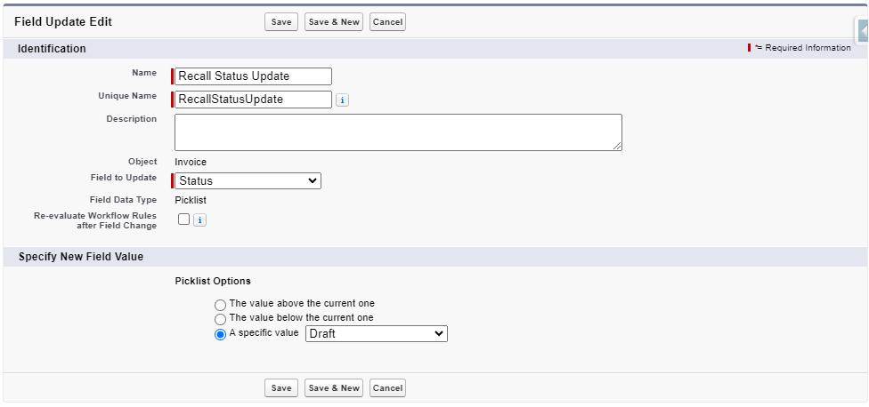

# Configuration and Setup for Invoicing and Billing

This section will guide you through setting up key features such as the approval process, adding the "New Invoice" button, configuring Lightning Page assignments, managing user and admin permissions, and assigning Record Types to profiles.

## Managing Custom Permission Sets

Two key custom permission sets are provided within the package to control access to the invoicing functionality:

1. **Mobee Invoice Administrator**
2. **Mobee Invoice User**

These permission sets define the level of access for different types of users, ensuring that administrators can fully manage invoicing operations while standard users have restricted, read-only access with the ability to generate invoices via Flow.

### **Mobee Invoice Administrator**

The **Mobee Invoice Administrator** permission set is intended for administrators who are responsible for managing the invoicing process, templates, and configuration. Administrators have full control over all invoicing-related objects and flows.

#### Permissions:
- **Read/Write** access to all custom objects related to invoicing, including:
  - **Invoice**
  - **Invoice Line Item**
  - **Tax Template**
  - **Tax by Product Category**
  - **Applicable Taxes**
- **Full control** over Flow templates related to invoicing:
  - Administrators can create, edit, and delete **Template Flows** used for generating invoices.

#### Usage:
- The **Mobee Invoice Administrator** permission set is assigned to users who need to administer all aspects of invoicing, including customizing invoice generation flows and managing tax settings. This role is suitable for finance and operations teams responsible for overseeing the billing process.

---

### **Mobee Invoice User**

The **Mobee Invoice User** permission set is intended for standard users who need to interact with the invoicing process but do not require full administrative access. Users with this permission can generate invoices via Flow but cannot modify invoicing templates or configuration settings.

#### Permissions:
- **Read-Only** access to all invoicing-related custom objects, including:
  - **Invoice**
  - **Invoice Line Item**
  - **Tax Template**
  - **Tax by Product Category**
  - **Applicable Taxes**
- **Flow Access**: Users can access and use the Flow to create and submit invoices, but they cannot modify the Flow configuration or templates.

#### Usage:
- The **Mobee Invoice User** permission set is designed for sales, service, or project team members who need to generate invoices but do not manage the invoicing system. This role allows users to interact with the invoicing Flow while maintaining strict access control over the invoicing data and configurations.

---

## Assigning Permission Sets to Users

The custom permission sets are already included in the **Mobee Invoicing and Billing Module** package. Follow these steps to assign them to users:

### Assigning Mobee Invoice Administrator Permission Set:

1. **Go to Setup** > **Permission Sets**.
2. Search for the permission set: `Mobee Invoice Administrator`.
3. Click on the permission set and select **Manage Assignments**.
4. Click **Add Assignments**.
5. Select the users who need **administrator** access to the invoicing system.
6. Click **Assign**.

### Assigning Mobee Invoice User Permission Set:

1. **Go to Setup** > **Permission Sets**.
2. Search for the permission set: `Mobee Invoice User`.
3. Click on the permission set and select **Manage Assignments**.
4. Click **Add Assignments**.
5. Select the users who need **user** access to interact with the invoicing Flow.
6. Click **Assign**.

---

## Assigning Record Types to Profiles

To ensure proper access to specific record types, follow these steps to configure Record Type access for user profiles:

1. **Go to Setup** > **Profiles**.  
2. Select the profile for which you want to assign Record Type permissions.  
3. Under the **Apps** section, click **Object Settings**.  
4. Find and click on the **Invoice** object.  
5. Click **Edit**.  
6. In the **Record Types and Page Layout Assignments** section, select the appropriate Record Types **Approved Invoice**, **Draft Invoice** to assign to the profile.
7. Set **Draft Invoice** as the **Default Record Type**.  
8. Click **Save**.

This configuration ensures that users with specific profiles can access and work with the relevant record types for the **Invoice** object.

---

## Lightning Record Page Assignments for Invoices

The **Mobee Invoicing and Billing Module** includes two **Lightning Record Pages** for invoices to provide distinct layouts based on the invoice status. However, due to package limitations, the assignment of these pages to specific invoice record types must be done manually. This section details how to assign the record pages appropriately.

---

### Available Lightning Record Pages

1. **Mobee Approved Invoice Record Page**: This page layout is designed for invoices with the record type **Approved Invoice**.
2. **Mobee Draft Invoice Record Page**: This page layout is designed for invoices with the record type **Draft Invoice**.

#### Important: 
The record page assignments are not automatically handled by the package, so manual configuration is required to ensure the correct page layouts are applied based on the invoice's status.

---

### Manual Assignment of Lightning Record Pages

To assign these Lightning Record Pages to the appropriate invoice record types, follow the steps below:

#### Assigning the **Mobee Approved Invoice Record Page** to the **Approved Invoice** Record Type:

1. **Go to Setup** > **Object Manager**.
2. Search for and select the **Invoice** object.
3. From the left-hand side, click on **Lightning Record Pages**.
4. Look for the record page named **Mobee Approved Invoice Record Page**.
5. Click **View Assignment** or **Assign as Org Default**.
6. Select **App, Record Type, and Profile** from the assignment list.
7. Choose **Approved Invoice** as the record type.
8. Click **Save**.

#### Assigning the **Mobee Draft Invoice Record Page** to the **Draft Invoice** Record Type:

1. **Go to Setup** > **Object Manager**.
2. Search for and select the **Invoice** object.
3. From the left-hand side, click on **Lightning Record Pages**.
4. Look for the record page named **Mobee Draft Invoice Record Page**.
5. Click **View Assignment** or **Assign as Org Default**.
6. Select **App, Record Type, and Profile** from the assignment list.
7. Choose **Draft Invoice** as the record type.
8. Click **Save**.

By following these steps, you will ensure that the correct **Lightning Record Pages** are assigned to the appropriate invoice record types, maintaining clear and distinct views for different invoice statuses.

---

## Adding the New Invoice Button to the Page

To streamline the invoicing process, you can add a **New Invoice** button to the relevant page layouts, allowing users to create invoices quickly through a flow.

Follow the steps below to add the **New Invoice** button.

---

### Add the New Invoice Button to the Page Layout

1. In the left-hand panel, select **Page Layouts**.
2. Select the page layout where you want to add the **New Invoice** button (e.g., Opportunity Layout).
3. In the layout editor, scroll down to the **Salesforce Mobile and Lightning Experience Actions** section.
4. Drag the **New Invoice** button from the panel to the **Salesforce Mobile and Lightning Experience Actions** section.
5. Click **Save**.

---

By following these steps, you’ll have a **New Invoice** button on your page, providing users with an easy way to initiate the invoice creation process through the associated Flow.

---

## Setting Up the Approval Process for the Invoice Object

An approval process for invoices ensures that each invoice follows a consistent review and approval workflow. In this section, we will guide you through setting up the approval process using Salesforce's Approval Process Wizard, complete with details for each step.

---

### Step 1: Creating the Approval Process with the Wizard

1. **Go to Setup** > **Approval Processes**.
2. In the **Jump Start Wizard**, choose **Create New Approval Process**.
3. Select the **Invoice** object.
4. **Enter the name of the approval process** (e.g., "Invoice Approval Process") and provide a description.
5. **Select Entry Criteria**:
   - Set conditions that determine when an invoice enters the approval process (e.g., Use **Formula evaluates to true** and set the formula to trigger the process when the status is **Draft**: `ISPICKVAL(Status__c, 'Draft')`).

      
10. Click **Next** to proceed with the approval process setup.

---

### Step 2: Define Initial Submission Actions

1. Under **Initial Submission Actions**, choose **Add New** > **Field Update** to update the invoice status to **Submitted for Approval**.

2. Select **Field Update** from the action types dropdown.

   

3. Create the **Field Update** to change the invoice **Status** field to **Submitted for Approval**.

   

4. Save your changes to complete the **Initial Submission Actions** configuration
   
---

This completes the setup for locking the record and updating the invoice status during the initial submission for approval.
   
---

### Step 3: Final Approval Actions

For the **Final Approval Actions**, you will configure the steps that occur when an invoice is approved.

1. Create a **Field Update** to change the **Invoice Record Type** to **Approved Invoice**.

   

2. Create a **Field Update** to change the invoice **Status** to **Approved**.

   

---

This completes the setup for unlocking the record, updating the record type, and marking the invoice as approved during the final approval process.

---

### Step 4: Defining Rejection and Recall Actions

1. In the **Rejection Actions**, configure what happens if the invoice is rejected:
   - **Field Update**: Set the **Invoice Status** to **Draft**.
   
   
   
2. Similarly, configure the **Recall Actions** to update the invoice status to **Draft** when a recall action is performed.

   

---

### Final Step: Activate the Approval Process

1. After setting up the initial submission, approval, rejection, and recall actions, review your approval process settings.
2. Click **Activate** to make the approval process live for the **Invoice** object.

---

By following these steps, you’ll have a fully functioning approval process for invoices, ensuring that invoices go through proper review and status changes based on approval outcomes.