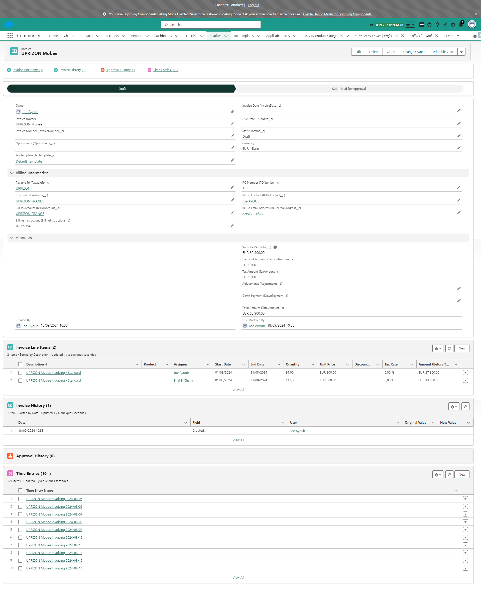

# Usage of the Mobee Invoicing and Billing Module

This guide walks you through generating an invoice from a **Project** using the Mobee Invoicing and Billing module. You will be able to create an invoice based on the **Time Entries** from project assignments, and then submit it for approval.

---

### Step 1: Navigate to the Project

1. Go to the **Project** from which you want to generate an invoice.
2. The **Assignments** related to this project will be used to calculate the invoice amount.

   

---

### Step 2: View Assignments Related to the Project

1. In the **Related** tab, view the **Assignments** linked to the project.
2. **Only billable and active assignments** will be included in the invoice calculation.
3. These assignments represent the work that will be billed in the invoice.

   

---

### Step 3: View Time Entries for an Assignment

1. Open one of the **Assignments** to view the **Time Entries** recorded for it.
2. **Time Entries within the selected From-To date range** will be summed to calculate the total time for the assignment in the invoice.
3. These **Time Entries** will be added to the invoice as **Invoice Line Items**.

   

---

### Step 4: Generate the Invoice

1. Go back to the **Project** and click the **Generate Invoice** button.
2. A popup will appear where you can select the **From Date** and **To Date** for the period you want to invoice.

   

---

### Step 5: Select Date Range

1. In the popup, select the **From Date** and **To Date** for the invoice. By default, these dates will be prefilled as the start of the previous month to the end of the previous month.
2. **The From-To date selected will determine which Time Entries are taken and calculated for the invoice**.
3. Click **Next** to proceed.

   

---

### Step 6: Invoice is Generated

1. After clicking **Next**, the invoice will be created and linked to the project.
2. You can view the newly generated invoice in the **Related** list under the **Project**.

   

---

### Step 7: View the Invoice Record

1. Open the invoice to view its details. The invoice is created in **Draft** status, and the assignments from the project are listed as **Invoice Line Items**.
2. Review the invoice to ensure all the details are correct.

   

---

### Step 8: Submit the Invoice for Approval

1. Once you have reviewed the invoice, click on the **Submit for Approval** button to send the invoice through the approval process.
2. After submission, the invoice status will change to **Submitted for Approval**.

   

---

### Step 9: Approved Invoice

1. Once the invoice is approved, its status will be updated to **Approved**, and it will be assigned an **Invoice Number**.
2. The invoice number is generated by a Flow, which takes the last invoice number from the **Bill From Account** and increments it for the new invoice.
3. If the invoice is **rejected** or **recalled**, its status will return to **Draft**

   

---

By following these steps, you will be able to successfully generate an invoice, submit it for approval, and receive the final approved invoice with a unique invoice number.

### Important Note:

The status changes described above (Submitted for Approval, Approved, or Draft on rejection/recall) are determined by the **Approval Process** that was configured in the previous **Configuration and Setup** section. These behaviors may vary if the client has modified the approval process.

## Additional Features for Approved Invoices

The following features are available for approved invoices to streamline document handling and email communication.

---

### Automatic Invoice Document Generation

1. Once an invoice is approved, a document is automatically generated based on the template defined in the **Mobee Document Template**.
2. This document is attached to the invoice and can be found in the **Notes and Attachments** section of the invoice record.

   

---

### Generate Invoice Document

1. The **Generate Invoice Document** button allows users to update the version of the previously generated document.
2. If any changes are made to the invoice, clicking this button regenerates the invoice document with the updated data.

   

---

### Email Invoice

1. The **Email Invoice** button opens a custom component for sending the invoice via email.
2. The following rules are applied to prefill the **To** and **CC** fields:
   - **To** is filled by the **Bill To Email Address**.
   - **CC** is filled by the **Bill To Contact's Email Address**.
   - If the **Bill To Email Address** is empty:
     - **To** is filled by the **Bill To Contact's Email Address**.
     - **CC** is left empty.
   - If both **Bill To Email Address** and **Bill To Contact's Email Address** are empty:
     - Both **To** and **CC** fields are left empty.

3. The **Notes and Attachments** files from the invoice are automatically added as email attachments.
   - The user can remove these files or add other files to the email as needed.

4. The user selects an **Email Template**, and the following fields are populated:
   - **Subject**: Automatically filled based on the selected template, but the user can edit it.
   - **Body**: Automatically populated based on the selected template, but the user can also edit and customize the body.

5. Once all details are finalized, the user can send the email directly.

