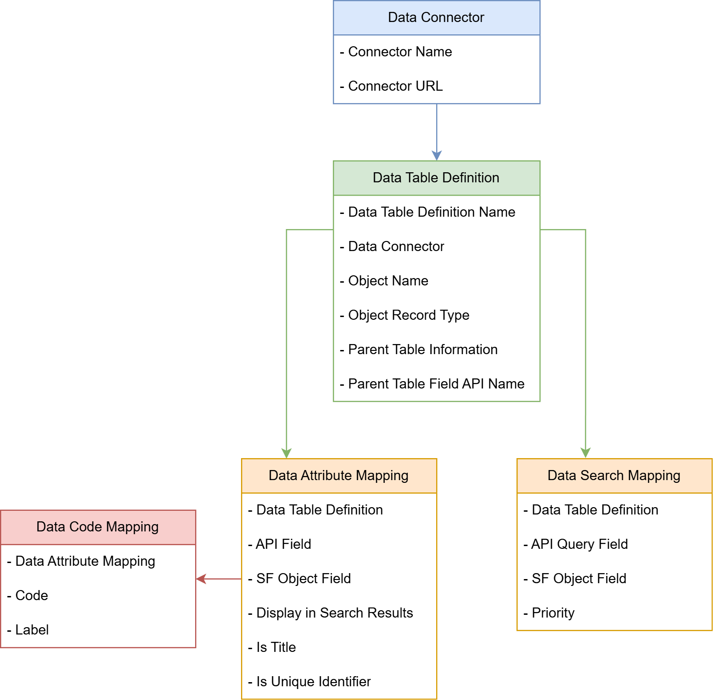

# Salesforce Objects (Data Settings)

To configure and personalize your Data Connector, we use four objects. These allow you to define how your connector behaves, which data it pulls, and how it maps to your Salesforce records.

 

---

## 1. Data Connector

This record represents an external API you want to connect to.

| Field Label | API Name | Type | Description |
|-----------------|--------------|----------|-----------------|
| **Connector Name** | `Name` | Text | A friendly name for the Data Connector |
| **Connector Type** | `Mobee__ConnectorType__c` | Picklist | Specifies the type of connector from the available list (Example: "API Recherche Entreprise", "iRaiser Connector") |

📌 Each Data Connector can contain one or more “Data Table Definitions”.

---

## 2. Data Table Definition

This record links the connector to a specific Salesforce object (like Accounts, Contacts, etc.) and defines how to display and interact with the data.

| Field Label | API Name | Type | Description |
|-----------------|--------------|----------|-----------------|
| **Data Table Definition Name** | `Name` | Text | A user-friendly label for this data table configuration |
| **Data Connector** | `Mobee__DataConnector__c` | Lookup | References the parent Data Connector configuration this table belongs to |
| **Object Name** | `Mobee__ObjectName__c` | Text | API name of the Salesforce object this data will populate (Example: `Account`, `Contact`) |
| **Object Record Type** | `Mobee__ObjectRecordType__c` | Text | Specifies the Record Type(s) to use when handling records (optional) |
| **Parent Table Definition** | `Mobee__ParentTableDefinition__c` | Lookup (Data Table Definition) | Links this table to another Data Table Definition for hierarchical parent-child sync (Example: Contact under Account) (optional) |
| **Parent Table Field API Name** | `Mobee__ParentTableFieldAPIName__c` | Text | API name of the lookup field used to relate records to the parent (Example: `AccountId`) (optional) |

📌 Each Data Table Definition can include multiple attribute and search mappings.

---

## 3. Data Attribute Mapping

These records map external API fields to Salesforce fields, define what is shown in the search results, and allow values to pre-fill when creating new Salesforce records.

| Field Label | API Name | Type | Description |
|-----------------|--------------|----------|-----------------|
| **Data Table Definition** | `Mobee__DataTableDefinition__c` | Lookup | The related table this mapping belongs to |
| **SF Object Field** | `Mobee__SFObjectField__c` | Text | The Salesforce field API name to map the incoming value to |
| **API Field** | `Mobee__APIField__c` | Text | The external system field name being mapped |
| **Display in Search Results** | `Mobee__DisplayInSearchResults__c` | Checkbox | When checked, this field appears in the results list in the interface |
| **Is Title** | `Mobee__IsTitle__c` | Checkbox | When checked, this field is used as the primary title in search results |
| **Is Unique Identifier** | `Mobee__IsUniqueIdentifier__c` | Checkbox | Indicates that this field uniquely identifies the record for matching/upsert logic |

📌 Use this to control the output that users see and which values are passed to Salesforce.

---

## 4. Data Search Mapping

These records define the parameters users can apply to filter data in both Salesforce and the API when initiating a search. Each parameter corresponds to a Salesforce field and links to a specific API query parameter.

| Field Label | API Name | Type | Description |
|-----------------|--------------|----------|-----------------|
| **Data Table Definition** | `Mobee__DataTableDefinition__c` | Lookup | The related table this search parameter belongs to |
| **SF Object Field** | `Mobee__SFObjectField__c` | Text | The Salesforce field shown in the filter bar |
| **API Query Filter** | `Mobee__APIQueryFilter__c` | Text | The query parameter sent to the external API |
| **Priority** | `Mobee__Priority__c` | Number | Determines the order to try filters if multiple SF fields map to the same API parameter |

📌 Use this to define what filtering options appear at the top of the search screen.

---

## 5. Data Code Mapping

**Data Code Mapping** records establish the translation layer between the raw codes returned by the external API and the standardized values displayed to users. Each mapping is linked to a **Data Attribute Mapping** (the field definition) and together they form a dictionary of Code → Label. This ensures users see clear, human-readable labels instead of technical codes, while maintaining internal consistency across fields such as classifications, statuses, or other coded data.

| Field Label | API Name | Type | Description |
|-----------------|--------------|----------|-----------------|
| **Data Attribute Mapping** | `Mobee__DataAttributeMapping__c` | Lookup | The attribute this code mapping belongs to (grouping key) |
| **Code** | `Mobee__Code__c` | Text | The raw code received from the external API |
| **Label** | `Mobee__Label__c` | Text | The user-friendly value shown in Salesforce |

📌 Use this object to translate external API codes into readable labels and maintain consistent values across the Data Connector’s UI and logic.

---