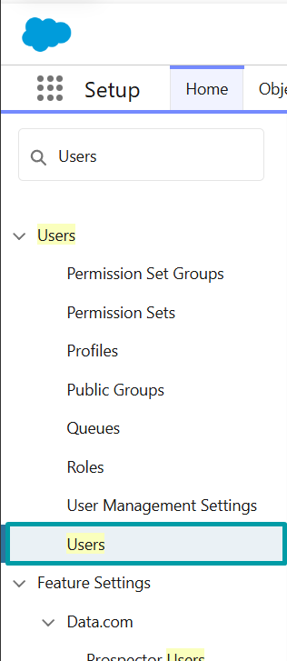
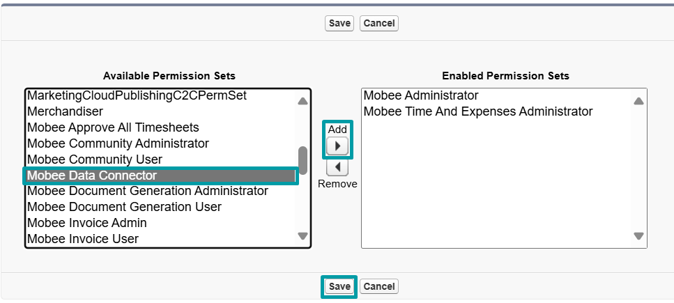
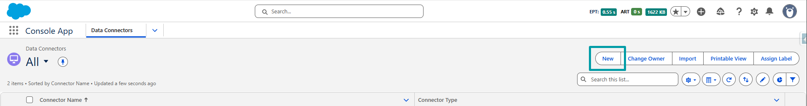

# Data Connector Configuration

## Overview

This guide covers how to configure Data Connectors in Salesforce. There are two layers of configuration:

1. [**General configuration**](3-data-connector-module-configuration.md#general-configuration-1) – Applies to all data connectors

2. [**Connector-specific configuration**](3-data-connector-module-configuration.md#connector-specific-configuration) – Applies to individual connectors like `Recherche Entreprise`, `iRaiser Connector`, etc.

---

## General Configuration

These steps must be completed for every data connector:

1. **Assign Permission Sets** – Give users access.
2. **Create a Data Connector** – Define the connector and its type.

---

## Access & Permissions

To ensure the module works correctly and securely, users must be granted access to key components:

### Permission Set: `Mobee Data Connector`

Assign this permission set to all users who will use the Data Connector. It includes:

- Access to Apex classes used by the connector
- Access to Lightning Web Components (LWC)
- Access to the external credentials used by the named credentials that rely on it
- Object and field permissions (read/create on the connector objects)

> ❗ Without this permission set, users will encounter authorization errors when attempting to use the connector.

#### Steps to Assign the Permission Set

1. **Go to Setup → Users**  
   
 

2. **Go to the desired User**  
   
 

3. **In the user detail page, scroll down to Permission Set Assignments → Click "Edit Assignments"**  
   
 

4. **Select `Mobee Data Connector` from the list on the left → Click "Add" → Save**  
   
 

5. **Verify that the permission set is now listed under the user's assignments**  
   
 

---

## Create a [Data Connector](2-data-connector-module-custom-objects.md#1-data-connector)

1. **Open the Data Connector tab**
   - In the Salesforce App Launcher, search for **Data Connectors**.
   
   

2. **Create a new Data Connector**
   - Click **New**.
   
   

3. **Fill in the connector details**
   - Enter a **Connector Name**
   - Select the appropriate **Connector Type**
   
   

📌 After saving, your connector is ready to be linked to table definitions and mappings.

---

## Connector-specific Configuration

Once the steps above are completed, continue with the configuration guide for your specific connector:

| Data Connector | Documentation |
|----------------|--------------|
| **Recherche Entreprise** | [View Guide](./5-dcm-recherche-entreprise-configuration.md) |
| **iRaiser** | [View Guide](./7-iraiser-connector-introduction.md) |

📌 Each connector may require additional setup steps depending on its API structure and business use case.

---