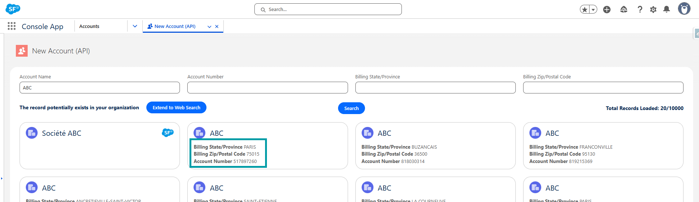
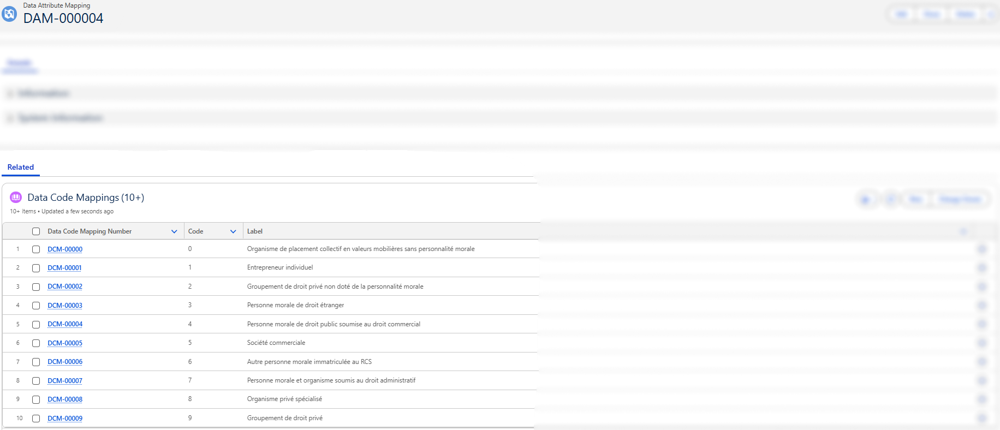

# Recherche Entreprise Configuration

## Overview

> ⚠️ **Prerequisite:** Before configuring this connector, make sure the **General Configuration** is completed.  
> See [General Configuration](3-data-connector-module-configuration.md) for steps on assigning permission sets and creating a Data Connector.

1. [**Create the Data Table Definition**](5-dcm-recherche-entreprise-configuration.md#data-table-definition) – Link the connector to a Salesforce object.
2. [**Configure the Filters & Search Inputs**](5-dcm-recherche-entreprise-configuration.md#filters--search-inputs) – Define filters for searching external data by creating Data Search Mappings.
3. [**Configure the Results Display**](5-dcm-recherche-entreprise-configuration.md#search-results-display) – Define how response data maps to Salesforce fields by creating Data Attribute Mappings.
4. [**Configure the Code Mappings (If needed)**](5-dcm-recherche-entreprise-configuration.md#data-code-mapping) – Translate raw API codes into human-readable labels so users see meaningful values instead of codes by creating Data Code Mappings.
5. [**Add the Lightning Web Component**](5-dcm-recherche-entreprise-configuration.md#lightning-web-component-data-connector) – Embed the UI where users need it.

In the next section, we’ll take a closer look at each of these configuration steps and how the different components work together to power the `Recherche Entreprise` data connector.

---

## Data Table Definition

As described in the [Data Table Definition](2-data-connector-module-custom-objects.md#2-data-table-definition) section, this configuration links a Data Connector to a Salesforce object.  

##### Example


### Create the Data Table Definition

The Data Table Definition determines which Salesforce object the connector will search and enrich.  
For the **Recherche Entreprise** connector, we will configure it on the **Account** object — however, keep in mind that the connector is designed to support other objects as well if needed.

#### Required Fields to Fill

| Field | Meaning | Value to Set |
|-------|--------|--------------------------|
| **Data Connector** | Links this table definition to the connector you created earlier | Select your *Recherche Entreprise* connector |
| **Object Name** | The Salesforce object where the API will create or update records | Type the Object API Name. *Example:* `Account` or `Company__c` |
| **Object Record Type** *(optional)* | Limits external API calls to the specified record types. Other record types can still open the component but will only search Salesforce (no API call). | Only if your object has record types. **Developer Names** separated by commas. |

> 💡 If your org does **not** use record types on the designated object, leave **Object Record Type** blank.  
> 🛑 When filling **Object Record Type**, enter the **Developer Name**, not the label.  
> Example: `Business_Account, NGO_Account`

#### Example Configuration

| Field | Example Value |
|-------|---------------|
| Data Connector | *Recherche Entreprise* |
| Object Name | `Account` |
| Object Record Type | `Business_Account, PersonAccount` |

#### Steps

1. Go to **Data Table Definitions**
2. Click **New**
3. Complete the fields as described above
4. Save the record


---

## Filters & Search Inputs

### Preview

The filter bar shown at the top of the component is generated from **Data Search Mapping** records.


Each filter is tied to a Salesforce field and an API query parameter, giving users a dynamic and guided way to search.

### How to Configure Filters (Technical Guide 🛠️)

Each filter is defined in a **Data Search Mapping** record and requires two key values:

| Field | Meaning | Value to Set |
|----------|-------------|------------------|
| **Data Table Definition** | Links this search filter to the corresponding data table definition | Select the related *Data Table Definition* record |
| **SF Object Field** | Salesforce field whose value will be used as the search input | Developer Name of the field (Example: `Name`, `AccountNumber`) |
| **API Query Filter** | Query parameter the external API expects for searching | API parameter name (Example: `q`, `code_postal`) |
| **Priority** | Determines the order in which multiple search mappings for the same API query parameter are evaluated. Lower numbers are tried first, ensuring that the most important or specific mapping is applied before others. This priority only affects the mappings sharing the same parameter; all other parameters are always included in the request. | `1`, `2`, `3`, etc. |

> 💡 **Priority Use Case:**  
> If two mappings share the same parameter query parameter (Example: `q`), one mapped to **Account Number** (priority 1) and the other to **Account Name** (priority 2), the connector will first attempt the search using the Account Number. If no results are found, it will automatically retry using the Account Name.

#### 1. Setting the SF Object Field in the Data Search Mapping

- This is the internal API name of the Salesforce field you want the user to fill in.
- It must exist on the object associated with your Data Table Definition.
- You can find it in **Object Manager → [Your Object] → Fields & Relationships**.

📌 <u>*Example:*</u>

To allow users to search accounts using their `Account Name`, set the **SF Object Field** to `Name`:
 


#### 2. Setting the API Query Filter in the Data Search Mapping

- This value comes from the **external API’s documentation**.
- It tells you what query string parameters the API supports for filtering.
- These parameters are **not found in the response**, but rather in the **request** — usually documented under "search", "filter", or "GET parameters".

📌 <u>*Example:*</u>

If the API allows general search using a parameter `q`, and you want to allow users to search by Account Name, then set the **API Query Filter** to `q`


> The final request will look something like:
> `https://external-api.com/search?q=ABC`

#### 3. Example of Data Search Mapping Records


---

## Search Results Display

### Preview

The columns shown in the search results list are defined via **Data Attribute Mapping** records.



> 💡 Only the fields with **Display in Search Results** checked will appear here. When a user selects a result, the mapped fields are used to populate the Salesforce record.

### How to Configure Result Attributes (Technical Guide 🛠️)

Each result attribute is defined in a **Data Attribute Mapping** record with key fields:

| Field | Meaning | Value to Set |
|-------|--------|-------------|
| **Data Table Definition** | Links this mapping to the corresponding data table definition | Select the related *Data Table Definition* record |
| **SF Object Field** | Salesforce field where the value should be stored | Developer Name of the field (Example: `Name`, `AccountNumber`) |
| **API Field** | Field path from the external API response | API JSON field path (Example: `siren`, `siege.code_postal`) |
| **Display in Search Results** | Indicates whether this field should be visible in search result lists | Checked or unchecked |
| **Is Title** | Marks this field as the main title in search results | Checked or unchecked |

#### 1. Setting the SF Object Field in the Data Attribute Mapping

- This is the internal API name of the Salesforce field you want the user to fill in.
- It must exist on the object associated with your Data Table Definition.
- You can find it in **Object Manager → [Your Object] → Fields & Relationships**.

📌 <u>*Example:*</u>

To map the `Account Number` field, set the **SF Object Field** to `AccountNumber`:
 


#### 2. Setting the API Field in the Data Attribute Mapping

This is the exact field name (or path) as returned by the external API.

- Use **dot notation** to access nested objects.
- Make sure the field exists in the `results` array object.

📌 <u>*Example:*</u>

<details>
<summary>View API JSON response</summary>

```json
Example of API response:

{
  "results": [
    {
      "siren": "123456789",
      "nom_complet": "Dummy Company",
      "nom_raison_sociale": "DUMMY COMPANY SARL",
      "sigle": null,
      "nombre_etablissements": 10,
      "nombre_etablissements_ouverts": 8,
      "siege": {
        "activite_principale": "00.00X",
        "activite_principale_registre_metier": null,
        "annee_tranche_effectif_salarie": "2023",
        "adresse": "1 RUE EXEMPLE 75001 PARIS",
        "caractere_employeur": "O",
        "cedex": null,
        "code_pays_etranger": null,
        "code_postal": "75001",
        "commune": "75001",
        "complement_adresse": "DIRECTION GENERALE",
        "date_creation": "2020-01-01",
        "date_fermeture": null,
        "date_debut_activite": "2020-02-01",
        "date_mise_a_jour": "2025-01-01T00:00:00",
        "departement": "75",
        "distribution_speciale": null,
        "est_siege": true,
        "etat_administratif": "A",
        "geo_id": "75001_0001",
        "indice_repetition": null,
        "latitude": "48.8566",
        "libelle_cedex": null,
        "libelle_commune": "PARIS 1",
        "libelle_commune_etranger": null,
        "libelle_pays_etranger": null,
        "libelle_voie": "RUE EXEMPLE",
        "liste_enseignes": ["DUMMY COMPANY"],
        "liste_finess": ["000000001"],
        "liste_idcc": ["0001"],
        "liste_id_bio": ["0001"],
        "liste_rge": ["RGE001"],
        "liste_uai": ["UAI001"],
        "longitude": "2.3522",
        "nom_commercial": null,
        "numero_voie": "1",
        "region": "11",
        "epci": "000000001",
        "siret": "12345678900001",
        "statut_diffusion_etablissement": "O",
        "tranche_effectif_salarie": "5",
        "type_voie": "RUE"
      },
      "date_creation": "2020-01-01",
      "date_fermeture": null,
      "tranche_effectif_salarie": "5",
      "annee_tranche_effectif_salarie": "2023",
      "date_mise_a_jour": "2025-01-01",
      "categorie_entreprise": "SME",
      "caractere_employeur": "O",
      "annee_categorie_entreprise": "2023",
      "etat_administratif": "A",
      "nature_juridique": "1234",
      "activite_principale": "00.00X",
      "section_activite_principale": "A",
      "statut_diffusion": "O",
      "matching_etablissements": [
        {
          "activite_principale": "00.00X",
          "adresse": "2 RUE TEST 75001 PARIS",
          "annee_tranche_effectif_salarie": "2023",
          "ancien_siege": false,
          "caractere_employeur": "O",
          "code_postal": "75001",
          "commune": "75001",
          "date_creation": "2020-02-01",
          "date_debut_activite": "2020-02-01",
          "date_fermeture": null,
          "epci": "000000001",
          "est_siege": false,
          "etat_administratif": "A",
          "geo_id": "75001_0002",
          "latitude": "48.8566",
          "libelle_commune": "PARIS 1",
          "liste_enseignes": ["DUMMY COMPANY"],
          "liste_finess": ["000000002"],
          "liste_idcc": ["0002"],
          "liste_id_organisme_formation": ["OF001"],
          "liste_id_bio": ["0002"],
          "liste_rge": ["RGE002"],
          "liste_uai": ["UAI002"],
          "longitude": "2.3522",
          "nom_commercial": null,
          "region": "11",
          "siret": "12345678900002",
          "statut_diffusion_etablissement": "O",
          "tranche_effectif_salarie": "3"
        }
      ],
      "dirigeants": [
        {
          "nom": "Doe",
          "prenoms": "Jane",
          "annee_de_naissance": "1980",
          "date_de_naissance": "1980-06",
          "qualite": "Directeur général",
          "nationalite": "Française",
          "type_dirigeant": "personne physique"
        }
      ],
      "finances": {
        "2023": {
          "ca": 1000000,
          "resultat_net": 100000
        }
      },
      "complements": {
        "collectivite_territoriale": {
          "code_insee": "01",
          "code": "01",
          "niveau": "département",
          "elus": [
            {
              "nom": "Smith",
              "prenoms": "Alice",
              "annee_de_naissance": "1975",
              "fonction": "Maire",
              "sexe": "F"
            }
          ]
        },
        "convention_collective_renseignee": true,
        "liste_idcc": ["0001"],
        "egapro_renseignee": true,
        "est_achats_responsables": true,
        "est_alim_confiance": true,
        "est_association": false,
        "est_bio": true,
        "est_entrepreneur_individuel": false,
        "est_entrepreneur_spectacle": false,
        "est_ess": false,
        "est_finess": false,
        "est_organisme_formation": true,
        "est_patrimoine_vivant": true,
        "est_qualiopi": true,
        "liste_id_organisme_formation": ["OF001"],
        "est_rge": false,
        "est_siae": false,
        "est_service_public": false,
        "est_l100_3": false,
        "est_societe_mission": false,
        "est_uai": false,
        "bilan_ges_renseigne": false,
        "identifiant_association": null,
        "statut_bio": true,
        "statut_entrepreneur_spectacle": "string",
        "type_siae": "string"
      }
    }
  ],
  "total_results": 0,
  "page": 1,
  "per_page": 10,
  "total_pages": 1000
}
```

</details>

| SF Object Field | API Field |
|-----------|-------------------|
| AccountNumber | `siren` |
| Name | `nom_raison_sociale` |
| BillingPostalCode | `siege.code_postal` |
| MainActivityCode__c | `siege.activite_principale` |

##### Understanding the Difference Between `nom_complet` and `nom_raison_sociale`

When mapping the name of a company or establishment, the Recherche Entreprise API provides two different fields. Selecting the correct one depends on the type of entity you are dealing with.

**`nom_complet`**  
- The default display name returned by the API.  
- Always populated for both **individual entities** (sole proprietors) and **legal entities** (companies).

**`nom_raison_sociale`**  
- The official legal name of the company (also called *legal name* or *corporate name*).  
- Only populated for **legal entities** (SAS, SARL, SA, associations, etc.).

In most cases, `nom_complet` is the safest field to map when you want consistent behavior across all entity types. Use `nom_raison_sociale` only if you specifically need the legal corporate name for company-only contexts.

#### 3. Example of Data Attribute Mapping Records


---

## Data Code Mapping

### Purpose

Data Code Mapping records define the translation layer between the raw codes returned by the **Recherche Entreprise** API (like the *Nature Juridique*, or the *Activité Principale*) and their labels. This ensures that users see meaningful values instead of cryptic codes.

### Preview

The search results show human-readable labels for the `Nature Juridique` field instead of the raw codes returned by the API.


### How to Configure Data Code Mapping (Technical Guide 🛠️)

Each **Data Code Mapping** record is connected via a lookup to a **Data Attribute Mapping** record. When several **Data Code Mapping** records are linked to the same **Data Attribute Mapping**, they collectively create a dictionary of **Code → Label** that is used to display meaningful values to users and populate Salesforce fields with the labels.

Each **Data Code Mapping** record includes the following key fields:

| Field | Meaning | Value to Set |
|-------|---------|--------------|
| **Data Attribute Mapping** | Links this code mapping to the Salesforce field where the label will be used | Select the related *Data Attribute Mapping* record |
| **Code** | The exact code received from the Recherche Entreprise API | Example: `A`, `I`, `4711D`, `GE` |
| **Label** | Human-readable meaning of the code | Example: `Actif`, `Inactif`, `Société commerciale`, `Entrepreneur individuel` |

#### 1. Identifying the Code in the API Response

The Recherche Entreprise API contains several coded fields such as:

- `activite_principale`
- `etat_administratif`
- `nature_juridique`
- `tranche_effectif_salarie`
- `categorie_entreprise`

**Example API response snippet:**

```json
{
  "activite_principale": "4711D",
  "etat_administratif": "A",
  "nature_juridique": "5499",
  "tranche_effectif_salarie": "3",
  "categorie_entreprise": "SME"
}
```

#### 2. Creating the Corresponding Data Code Mapping Records

##### <u>Source</u>

The **Recherche Entreprise** API provides official nomenclatures for many of its coded fields, such as *Nature Juridique* or *Activité Principale – NAF*. These nomenclatures are published by **INSEE** and available in Excel format, containing the complete tables of **Code → Label** pairs:

🌐 https://www.insee.fr/fr/information/2016811

You can use these official files to populate your Data Code Mapping records. This ensures that:

- All possible codes are covered  
- Labels are accurate and standardized  
- Users always see the correct terminology defined by INSEE  

> 💡 Using the official nomenclatures is strongly recommended when configuring mappings for fields like `nature_juridique`, `activite_principale`, or any other coded attribute returned by the Recherche Entreprise API.

##### <u>Upload Method</u>

The most efficient method is to prepare your mappings in a spreadsheet into a CSV and import them into Salesforce using one of the available bulk tools.

Here is the recommended process:

1. **Download the INSEE nomenclature Excel file** for the coded field you want to configure.
<br/>

2. **Open the Excel file** and manipulate it to prepare it for import:
   - Clean up the rows that do not constitute a **Code → Label** pair
   - Add a new column that represents the **Data Attribute Mapping**
   - Fill this column with the **Name** (or Id) of the **Data Attribute Mapping** that these codes belong to.
  **N.B:** The column titles are not import as they will be mapped with Salesforce fields during import.
<br/>

3. **Save the file as CSV**
<br/>

4. **Open the Salesforce Data Import Wizard** and select your **Data Code Mapping** object.
<br/>

5. **Upload your CSV**, and during field mapping:
   - Map the INSEE *Code* column → `Code__c`
   - Map the INSEE *Libellé* column → `Label__c`
   - Map your new column → `DataAttributeMapping__c`
<br/>

6. **Run the import** and verify the records in Salesforce.

#### 3. Example of Data Code Mapping Records



---

## Lightning Web Component: `Data Connector`

- Custom UI where users:
  - Enter search terms (using mapped filters)
  - View external data (based on mapped attributes)
  - Select and import records into Salesforce

> 💡 This component is configuration-driven — it uses the data and mappings defined in the **Data Connector**, **Data Table Definition**, **Data Attribute Mappings**, and **Data Search Mappings** to function.

### Adding the Component as a List View Button

The Data Connector can be launched directly from a list view button, giving users quick access to the component without navigating through other menus.

In this guide, we will illustrate how to enable the Data Connector for any object by creating the required Lightning Page, Lightning Tab, and List View button.

#### 1. Creating the Lightning Page

1. Go to **Setup** → **Lightning App Builder** and click on **New**  
   

2. Choose **App Page** as the type  
   

3. Create and configure the page

4. Add the **Data Connector** component to the page and configure its parameters, then save and activate it  
   

#### 2. Create / Verify the Lightning Tab

1. From **Setup**, search for **Tabs**
2. Scroll to **Lightning Page Tabs**
3. Check if a tab is already created for your Lightning Page *(3a)*
4. If not, create a new tab and link it to the page *(3b)*  
   

#### 3. Create a List View Button

1. Go to **Object Manager** and open the object where you want to expose the Data Connector (Example: **Account**, **Contact**)  
   

2. Go to **Buttons, Links, and Actions** → **New Button or Link**  
   

3. Choose **List Button** as the display type

4. In the URL, reference the Lightning Tab you created  
   _Example:_ `/lightning/n/Mobee__TestingNewLightningPage`  
   

5. Save the button

#### 4. Add the Button to the List View

1. Edit the **List View Button Layout**.


2. In the **Available Buttons** list, locate **New** and move it to the **Selected Buttons** section.


3. The **New** button will now appear on the Account list view, launching the Account Creation page powered by the **Data Connector**.

Now, when users open the list view for that object, they will see your custom button. Clicking it will open the Data Connector in the Lightning Page you assigned.

👉 By following this approach, you can replicate the **Account** example for any other object that needs the Data Connector. The Account setup serves as a template, but you are free to extend it across your org.

---