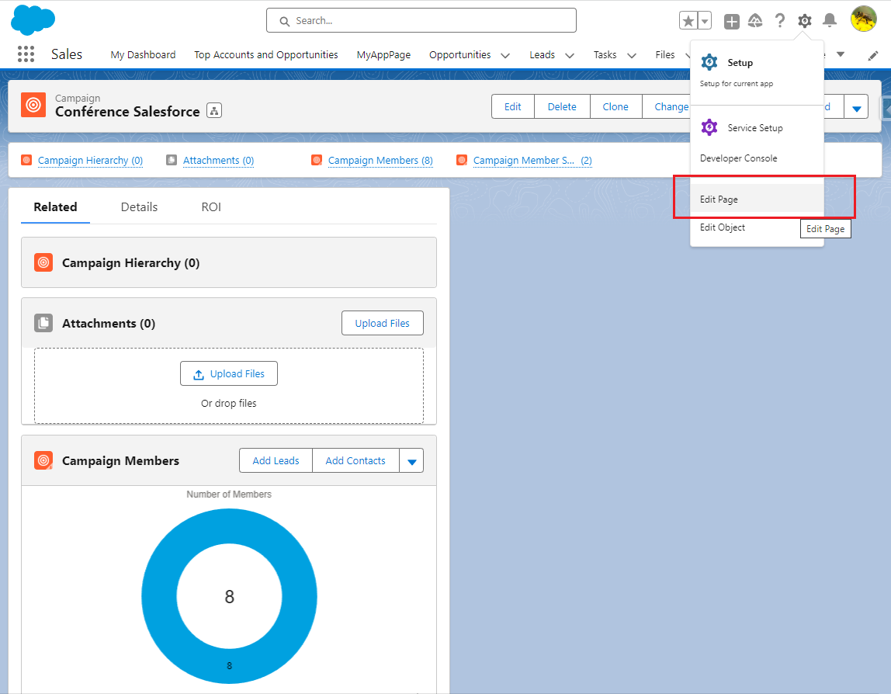
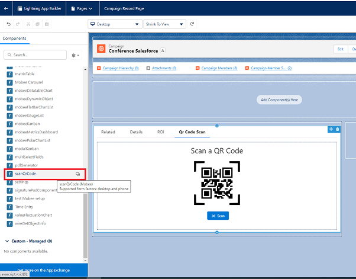
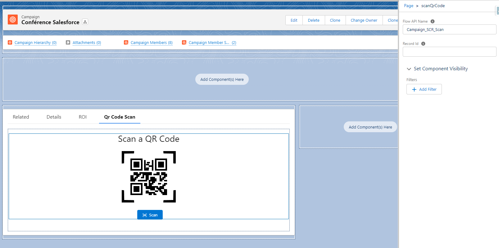
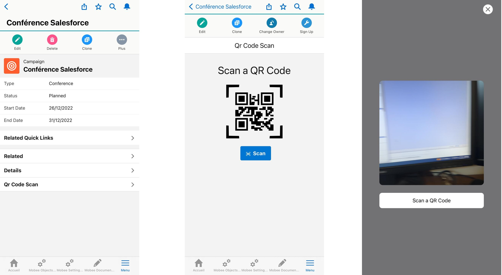
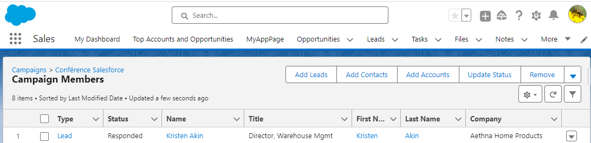

# Salesforce QR Code Scanner Component Documentation

**Description**: The QR Code Scanner component for Salesforce enables users to scan QR codes directly from their Salesforce interface. By integrating this component, you can instantly fetch and input data, simplifying various manual tasks.

## Installation:

Before utilizing the QR Code Scanner component, ensure you've installed it into your Salesforce environment.

## How to Add the QR Code Scanner to an Object Page:

### Step-by-Step Instructions:

1. **Access the Object Page**: Navigate to the desired object page where you want to add the QR code scanner.
2. **Enter Edit Mode**: Click on the 'Edit Page' option, usually available at the top right of the screen, to enter the Lightning App Builder.
3. **Add the QR Code Scanner Component**: 
   - In the Lightning App Builder, on the left pane, find the 'Custom' section.
   - Drag the 'scanQrCode' component and drop it onto the desired place on your page layout.
4. **Configure Component Attributes**:
   - Click on the added QR Code Scanner component to view its properties.
   - In the 'Flow API Name' field, type in the desired flow's name, preceded by the namespace prefix. This flow will be executed when a QR code is scanned by the component.
   - The attribute "Record ID" can be left empty. If left blank, it will automatically be populated with the ID of the record where the component is placed.
5. **Save & Activate**: Once done, save the changes and activate the page to reflect them in the Salesforce interface.

## Example Use Case: Add Contacts or Leads to a Campaign via QR Code Scanning

1. **Navigate to Campaign**: Start by accessing the desired campaign in Salesforce.
2. **Enter Edit Mode**: Click on 'Edit Page' to switch to the Lightning App Builder.

   

3. **Insert QR Code Scanner Component**: 
   - Find the 'scanQrCode' component under the 'Custom' section on the left.
   - Drag and place the component where you want it on the campaign page layout.

   

4. **Configure the Component**: 
   - Click on the component to see its attributes.
   - In the 'Flow API Name' field, enter the name "Campaign Scan" (or the relevant flow name associated with the scanning function for campaigns).

   

5. **Perform Scanning**:
   - Exit the Lightning App Builder and navigate to the campaign page.
   - Using a phone or a device with a camera, utilize the QR Code Scanner component to scan the QR codes of contacts or leads.

   

6. **Verification**:
   - After scanning, verify by checking the campaign membership list.
   - Ensure that the scanned contact or lead has been successfully added to the campaign.
   

**Note**: Ensure that the flow ("Campaign Scan" in this example) is correctly set up to handle the QR code data and perform the desired actions in Salesforce.

Happy Scanning!
