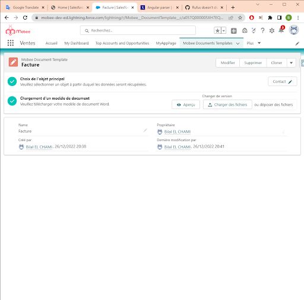

# Mobee Document Generation Module

## User Profile Requirements and Permissions
- The user must meet three of the following requirements to use the module:
  - A Mobee license.
  - "Mobee User" or "Mobee Administrator" permission set.
  - Active "Flow User" option.

## Adding the Document Generation Action Button to a Page
1. Go to the object where you want the generation button to be available, then navigate to the "Buttons, Links, and Actions" section to add a new action.
2. Choose the "Lightning Web Component" option for the "Action Type," then select the "Mobee:documentGeneratorAction" option for the "Lightning Web Component."
   
<br />
3. Once the action button is created, you'll need to add it to a desired "Page Layout."
   
<br />
## Preparing the Word or PowerPoint Template
1. Creating a document template in Salesforce:
   - Go to the "Mobee Documents Templates" page to create a new template.
   - Click the "New" button and provide a name for the template.
     
<br />
   - Once the template is created, you'll need to associate it with a Salesforce object by clicking the "Choose Main Object" button.
   - The object can be selected using the search field.
     
<br />
   - The first step should now be completed, and you can proceed to download your Word document template in the second step.
<br />
     
<br />
## Generating Documents from the Created Template
1. Navigate to a record of the same object type as the created document template.
2. Click the Generate Document action button.
3. Select the desired template from the selection list.
4. The document should be generated and automatically downloaded.
   
<br />
## Adding an Image to the Document
- You can include images in your generated documents using dynamic placeholders. For instance, if you have an image field named "Profile_Picture" in your Salesforce object, you can add it to your document using the following tag: `{% Profile_Picture }`.Users have the flexibility to choose between two methods to provide the image: using base64 data or providing a URL.

### Base64 Image
- To include an image using base64 data, simply encode the image into base64 format and insert it directly into your salesforce object.

### URL Image
- To include an image using a URL, follow these steps:
  + If the image URL is "https://i.imgur.com/JpA66EI.png," you need to set up remote site settings to ensure secure retrieval of the image:
1. Go to "Setup" in Salesforce.
2. In the quick find box, search for "Remote Site Settings" and select it.
3. Click the "New Remote Site" button.
4. Provide a name for the site (e.g., "Imgur Site").
5. In the "Remote Site URL" field, enter the base URL of the image's location, in this case, "https://i.imgur.com."
6. Check the "Disable Protocol Security" checkbox to allow retrieval over HTTP.
7. Click "Save."
  


  + Now, you need to add the URL to the trusted URLs with all CSP (Content Security Policy) directives enabled:
1. find the "Trusted URLs" in the quick find box.
2. Click the "New Trusted Site" button.
3. Provide a name for the trusted site (e.g., "Imgur Trusted").
4. In the "Site URL" field, enter the same base URL as before, "https://i.imgur.com."
5. Check all CSP directives: "Connect," "Font," "Img," "Media," "Object," "Script," "Style."
6. Click "Save."


  + You have now set up remote site settings and trusted URLs to securely retrieve the image over HTTP. You can then use the `{% Profile_Picture}` tag to dynamically include the image in your generated documents.

## Usage Rules
### Tag Types
- The document generation module accepts any Word document.
- Tag syntax is inspired by Mustache annotation. Normal tags start with an alphabetic character, while other tag types start with special prefixes. For example:
  - {#loop} and {/} to start and end a loop for iterating through data lists.
- Logical expressions also start with the "#" character and support the following operators:

````md
  - AND a && b
  - OR a || b
  - ADDITION a + b
  - SUBTRACTION a - b
  - MULTIPLICATION a * b
  - MODULO a % b
  - DIVISION a / b
  - TERNARY a ? b : c
  - ASSIGNMENT a = 1
  - EQUALITY/INEQUALITY a == 1, a != 1
  - RELATIONAL a > 1, a < 1, a >= 1, a <= 1
  - OPERATOR PRECEDENCE with parentheses (a && b) || c
  - EXPONENTIAL NOTATION: 12e3 => returns 12000
- Example:
  - {#products.length > 1}
    - There are multiple products
  - {/}
  - {#firstName == "John"}
    - Hello John
  - {/}
  - The first condition will display the section only if there are 2 or more products.
  - The second condition will display the section only if the username is the string "John".
````

### Filters and Utilities
Mobee provides several features to help users customize their documents.
 - To get the current date, you can use the value "docUtils.today".
````md
    - Today is {docUtils.today}
- Here are the supported filters:
  - lower: A function that converts text to lowercase.
  - upper: A function that converts text to uppercase.
  - shortDate: A function that returns the date in a short format.
  - followingMonth: A function that returns the next month from a given date.
  - followingYear: A function that returns the next year from a given date.
  - lastWorkingDayOfMonth: A function that returns the last working day of the month from a given date.
  - formatDate: A general function for calculating date values.
- Usage example:
  - The created date is {CreatedDate | shortDate}
  - The following month is {CreatedDate | followingMonth: '[[ "year": "numeric", "month": "long" ]]'}
  - The next year is {CreatedDate | followingYear: '[[ "year": "numeric"]]'}
  - The last working day of the month is {CreatedDate | lastWorkingDayOfMonth}
- The followingMonth, followingYear, lastWorkingDayOfMonth, and formatDate functions accept the following formatting options:
  - [[
  weekday: 'narrow' | 'short' | 'long',
  era: 'narrow' | 'short' | 'long',
  year: 'numeric' | '2-digit',
  month: 'numeric' | '2-digit' | 'narrow' | 'short' | 'long',
  day: 'numeric' | '2-digit',
  hour: 'numeric' | '2-digit',
  minute: 'numeric' | '2-digit',
  second: 'numeric' | '2-digit',
  timeZoneName: 'short' | 'long',

  // Time zone to express it in
  timeZone: 'Asia/Shanghai',
  // Force 12-hour or 24-hour
  hour12: true | false,

  // Rarely-used options
  hourCycle: 'h11' | 'h12' | 'h23' | 'h24',
  formatMatcher: 'basic' | 'best fit'
]]
````