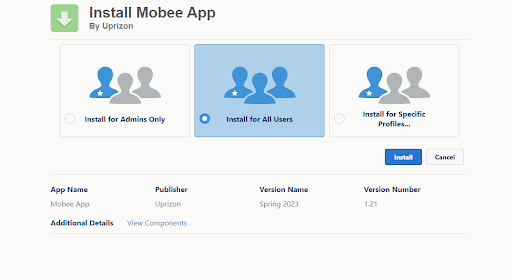

# Mobee Installation Guide

## Salesforce AppExchange Package

To seamlessly install the Mobee App Package from the AppExchange, follow the steps below:

## 1. **Navigate to Mobee App Page:**
   - Launch your web browser.
   - Access the Mobee App page on AppExchange using the following link: [Mobee App on AppExchange](https://appexchange.salesforce.com/appxListingDetail?listingId=a0N3u00000ONmC7EAL&tab=e).
   
   

## 2. **Install the Package:**
   - Click on the "Get It Now" button.
   - Choose the Salesforce org where you'd like to install the package.

## 3. **User Management & Permission Assignment:**
   - Navigate to the user management page in Salesforce.
   - Select a user.
   - Assign the required permissions based on your operational requirements (options include: Mobee Administrator, Mobee User, Mobee Community Administrator, Mobee Community User, Mobee Time And Expenses Administrator, Mobee Time And Expenses User).

   

## 4. **License Management:**
   - Go to the Setup Page.
   - Access the “Installed Packages” section.
   - Click on the “Manage Licenses” link adjacent to the Mobee Package. This is where you can allocate licenses to specific users.

   

## 5. **Mobee Object Setup:**
   - If you're a Mobee Administrator user, head over to the “Mobee Object Setup” tab.
   - This tab is crucial for determining the objects that will synchronize with the mobile app.

## 6. **Define Synchronization Settings:**
   - Input the Object API Name.
   - Adjust the settings as per your requirements.

   

## 7. **Finalizing the Setup:**
   - Upon finalizing your synchronization objects, users granted the correct permissions can now download and utilize the mobile application on both iOS and Android platforms.

# Mobee Mobile App User Guide

To make the most of the Mobee Mobile App experience, follow these streamlined steps:

## 1. **Installation:**
   - Download and install the Mobee Mobile App from the [App Store](https://apps.apple.com/fr/app/mobee-app/id1617645272) (for iOS devices) or [Google Play Store](https://play.google.com/store/apps/details?id=com.mobee_app) (for Android devices).

## 2. **Initial Setup:**
   - Launch the app. Upon opening, a login prompt will appear.
   - Use your Salesforce credentials for logging in.
   - Modify the connection server based on your requirements: choose from Production, Sandbox, or Custom Domain.

## 3. **Confirmation and Access Permissions:**
   - After logging in, you'll receive a confirmation code. Enter this code as prompted.
   - For seamless operation, grant the necessary permissions when requested by the app.

## 4. **Synchronization:**
   - Upon successful login, you'll be greeted with a splash screen detailing the synchronization process.
   - This step's duration varies based on the volume of data to synchronize. 

## 5. **Optimizing Synchronization:**
   - For a faster sync, consider limiting the number of objects you wish to synchronize.
   - Utilize the “List View Filter” and the “File Sync Down” options available in Mobee Object Setup.
     > **Note:** Disabling the “File Sync Down” option will stop files from being downloaded to your device. However, any attachment created by users will still be uploaded.

## 6. **Offline Access:**
   - Once data synchronization is complete, you can access the Home Pages, App Pages, Listviews, and Record Pages entirely offline.

---

Congratulations! You've successfully set up and are using the Mobee App tool seamlessly with your Salesforce org and mobile device.

