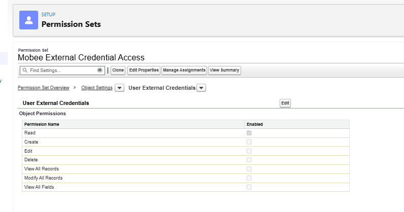
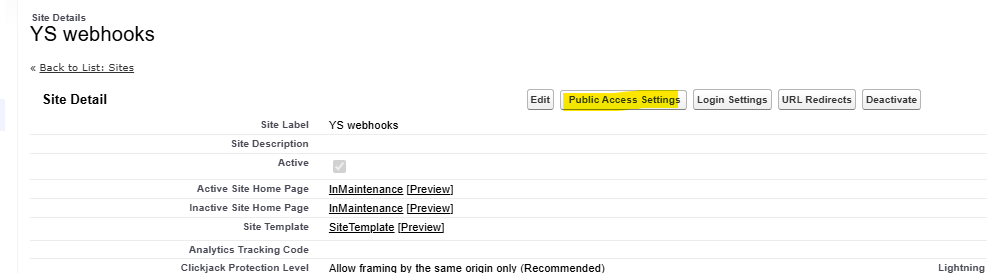
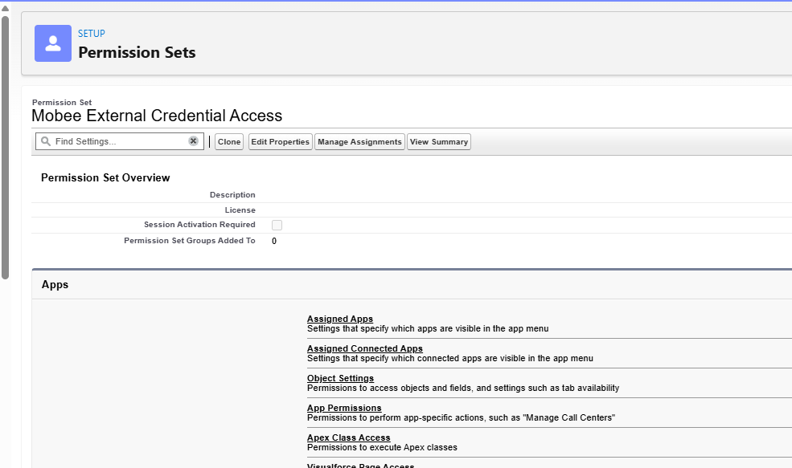
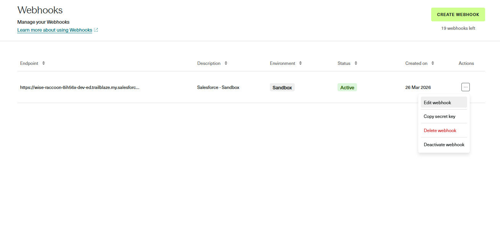

# Mobee E-Signature - Guía de Configuración

> **Módulo:** E-Signature (Integración Yousign API V3)
> **Paquete:** Mobee by Uprizon
> **Requisito previo:** Paquete Mobee instalado en su org de Salesforce

---

## Descripción general

El módulo Mobee E-Signature proporciona un ciclo de vida completo de firma electrónica directamente dentro de Salesforce, impulsado por la **API Yousign V3**. La integración incluye un asistente guiado basado en Screen Flows, componentes Lightning Web personalizados, automatizaciones activadas por registros y servicios backend en Apex.

Esta guía cubre todos los pasos de configuración necesarios para activar la función E-Signature después de instalar el paquete Mobee.

---

## Requisitos previos

Antes de comenzar, asegúrese de tener:

- El **paquete Mobee** instalado en su org de Salesforce
- Una **cuenta de Yousign** (Sandbox para desarrollo, Producción para lanzamiento)
- Acceso de **Administrador del sistema** en Salesforce

> ⚠️ **Importante — Sandbox vs Producción:**
> Yousign utiliza **entornos separados** para Sandbox y Producción. Debe crear **dos claves API distintas** y **dos webhooks separados** — uno para cada entorno. No son intercambiables. Nunca use una clave Sandbox en Producción ni viceversa.

---

## Pasos de Configuración

### Paso 1 — Crear la clave API en Yousign

El primer paso es generar una clave API en su cuenta de Yousign. Esta clave permitirá que Salesforce se autentique en la API de Yousign.

1. Inicie sesión en su **aplicación web de Yousign**
2. Navegue a **Integraciones > API**
   - Si está en una versión de prueba, inicie primero su **prueba de API**
3. Haga clic en **Crear clave API** y complete lo siguiente:

   | Campo | Valor |
   |---|---|
   | Descripción | `Salesforce - Sandbox Full Access` |
   | Entorno | `Sandbox` *(usar Producción para el lanzamiento)* |
   | Permisos | `Full-Access` |

4. Haga clic en **Crear clave API**
5. **Copie el valor de la clave API generada** — lo necesitará en el Paso 3


> ⚠️ **Recordatorio:** Repita este paso para crear una segunda clave API para su entorno de **Producción** al momento del lanzamiento. Guarde ambas claves de forma segura.

---

### Paso 2 — Crear el conjunto de permisos en Salesforce

Se debe crear un conjunto de permisos dedicado en Salesforce para otorgar a los usuarios acceso a las credenciales externas utilizadas por la integración de Yousign.

1. Vaya a **Configuración > Conjuntos de permisos**
2. Haga clic en **Nuevo** y cree el conjunto de permisos con:

   | Campo | Valor |
   |---|---|
   | Etiqueta | `Mobee External Credential Access` |
   | Nombre de API | `MobeeExternalCredentialAccess` |

3. Una vez creado, ábralo y configure lo siguiente:

#### Configuración de objetos — Credenciales externas de usuario

- Vaya a **Configuración de objetos > Credenciales externas de usuario**
- Habilite el acceso de **Lectura**



#### Acceso a principales de credenciales externas

- Vaya a **Acceso a principales de credenciales externas**
- Haga clic en **Editar** y agregue el principal correspondiente:
  - `SignatureSandboxApi - Authorization Token` → para **Sandbox**
  - `SignatureProductionApi - Authorization Token` → para **Producción**


---

### Paso 3 — Configurar las credenciales externas en Salesforce

El paquete Mobee incluye credenciales externas preconfiguradas para Sandbox y Producción. Debe inyectar la clave API de Yousign obtenida en el Paso 1 en las credenciales correspondientes.

1. Vaya a **Configuración** → busque **Named Credentials** en el cuadro de búsqueda rápida
2. Haga clic en la pestaña **External Credentials**
3. Encontrará dos registros precreados por el paquete Mobee:
   - `Signature Sandbox API` → para Sandbox
   - `Signature Production API` → para Producción
4. Haga clic en el registro que corresponda a su entorno actual
5. Busque el Principal llamado **Authorization Token** y haga clic en **Editar**
6. En **Parámetros de autenticación**, agregue un nuevo parámetro:

   | Campo | Valor |
   |---|---|
   | Nombre | `API_KEY` |
   | Valor | *(Pegue la clave API copiada de Yousign en el Paso 1)* |

7. Haga clic en **Guardar**


> ⚠️ **Recordatorio:** Repita este paso para las credenciales externas de Producción al momento del lanzamiento, utilizando la clave API de Producción.

---

### Paso 4 — Asignar conjuntos de permisos a los usuarios

Cada usuario que necesite usar la función E-Signature debe tener asignados los siguientes dos conjuntos de permisos:

| Conjunto de permisos | Propósito |
|---|---|
| `Mobee Signature User` | Otorga acceso a las funciones y objetos de E-Signature |
| `Mobee External Credential Access` | Otorga acceso a las credenciales externas de Yousign *(creadas en el Paso 2)* |

**Cómo asignar:**

1. Vaya a **Configuración > Conjuntos de permisos**
2. Seleccione el conjunto de permisos
3. Haga clic en **Gestionar asignaciones > Agregar asignaciones**
4. Seleccione los usuarios y confirme

> 💡 Ambos conjuntos de permisos deben asignarse — asignar solo uno resultará en un acceso incompleto.

---

### Paso 5 — Crear el sitio público para la recepción de webhooks

Yousign necesita un punto de acceso público en Salesforce para enviar notificaciones de eventos (webhooks). Esto se hace creando un sitio público de Salesforce.

> ⚠️ Pueden aparecer pequeñas diferencias según su edición de Salesforce — el principio es el mismo.

1. Vaya a **Configuración > Interfaz de usuario > Sitios y dominios > Sitios**
2. Elija un nombre de sitio, verifique la disponibilidad, acepte los *Términos de uso de sitios* y regístrelo
3. Haga clic en **Nuevo** y complete lo siguiente:

   | Campo | Valor |
   |---|---|
   | Etiqueta del sitio | `YS Webhooks` |
   | Nombre del sitio | `yswebhooks` |
   | Contacto del sitio | *(Administrador del sistema)* |
   | Propietario de registro predeterminado | *(Administrador del sistema)* |
   | Sufijo de dirección web predeterminado | `yswebhooks` |
   | Activo | ✅ Marcado |
   | Página de inicio del sitio activo | `InMaintenance` |

4. Haga clic en **Guardar**


---

### Paso 6 — Configurar los parámetros de acceso del sitio público

El usuario invitado del sitio público debe tener la licencia **Mobee**, los conjuntos de permisos de Mobee requeridos y acceso al evento de plataforma Sign Events.

#### Asignar la licencia Mobee al usuario invitado

1. Vaya a **Configuración > Paquetes instalados**
2. Busque el paquete **Mobee** y haga clic en **Gestionar licencias**
3. Haga clic en **Agregar usuarios**
4. Seleccione el usuario invitado del sitio **YS Webhooks** y haga clic en **Agregar**

#### Abrir la configuración de acceso público

1. Desde la página de detalle del sitio **YS Webhooks**, haga clic en **Configuración de acceso público**
   > *(Si la página fue cerrada: Configuración > Interfaz de usuario > Sitios y dominios > Sitios → seleccione **YS Webhooks**)*



#### Asignar conjuntos de permisos al usuario invitado

1. Desde la página de perfil **Configuración de acceso público**, haga clic en el botón **Ver usuarios**
2. Haga clic en el **usuario invitado** para abrir su registro
3. Desplácese hasta **Asignaciones de conjuntos de permisos** y haga clic en **Editar asignaciones**
4. Agregue los siguientes dos conjuntos de permisos:
   - `Mobee External Credential Access` *(creado en el Paso 2)*
   - `Mobee Signature Access`
5. Haga clic en **Guardar**




#### Otorgar permisos de eventos de plataforma

1. Desde la parte superior de la página de perfil, haga clic en el botón **Editar** *(junto a Ver usuarios)*
2. Desplácese hasta **Permisos de eventos de plataforma**
3. En el objeto **Sign Events**, habilite:
   - **Lectura** ✅
   - **Creación** ✅
4. Haga clic en **Guardar**


---

### Paso 7 — Configurar el Webhook de Yousign y Conectar con los Parámetros de Mobee

Ahora que Salesforce tiene un punto de acceso público, debe registrarlo en Yousign para que sepa dónde enviar las notificaciones de eventos. Luego almacenará la clave secreta del webhook en los Parámetros de Mobee.

#### Parte A — Copiar la URL de su sitio de Salesforce

1. Vaya a **Configuración > Interfaz de usuario > Sitios y dominios > Sitios**
2. Copie la **URL del sitio** que aparece junto a su sitio **YS Webhooks**

#### Parte B — Crear el Webhook en Yousign

3. Vaya a su **cuenta de Yousign > Integraciones > Webhooks**
4. Haga clic en **Crear Webhook** y complete lo siguiente:

   | Campo | Valor |
   |---|---|
   | Punto de acceso | *(URL del sitio anterior)* + `/services/apexrest/Mobee/ys/webhooks` |
   | Descripción | `Salesforce - Sandbox` *(o Producción)* |
   | Entorno | `Sandbox` o `Producción` |
   | Alcance | Todos los alcances (actuales y futuros) |
   | Eventos suscritos | Todos los eventos |
   | Activo | ✅ Marcado |

   La URL del punto de acceso debería verse así:
   ```
   https://XXXXXXX.my.salesforce-sites.com/yswebhooks/services/apexrest/Mobee/ys/webhooks
   ```

5. Haga clic en **Crear Webhook**


#### Parte C — Copiar la clave secreta del Webhook

6. En la lista de Webhooks, haga clic en los **⋯ (3 puntos)** bajo **Acciones** junto al webhook recién creado
7. Seleccione **Copiar clave secreta**



#### Parte D — Guardar la clave secreta en los Parámetros de Mobee

8. En Salesforce, abra el **Iniciador de aplicaciones** y busque **Mobee Settings**
9. Navegue a la pestaña **Signature** y:
   - Pegue la clave secreta copiada en el campo **Signature API Key**
   - **Desmarque** la casilla *Signature is Sandbox* si está configurando para **Producción**
10. Haga clic en **Guardar**


> ⚠️ **Recordatorio:** Repita los Pasos 1 a 7 completamente para el entorno de **Producción** utilizando la clave API de Producción y un nuevo webhook de Producción con su propia clave secreta.

---

## ¿Necesita ayuda?

Para obtener asistencia adicional, comuníquese con el equipo de soporte de Mobee.
