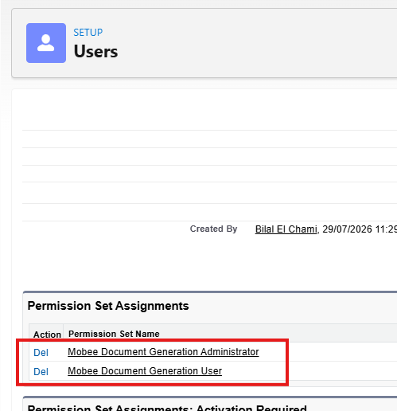
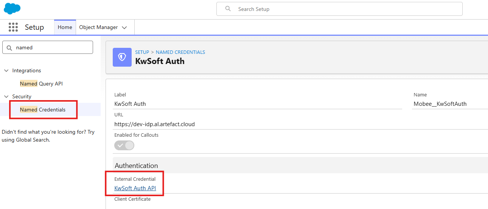

# Configuración del Conector KwSoft

Esta página explica la configuración inicial que se realiza una sola vez después de la instalación.

## 1. Configuración del paquete

Antes de configurar los Flows, valida el acceso al paquete y la autenticación.

1. Confirma que el paquete está instalado en tu org.
2. Abre la página de detalle del usuario y asigna una licencia de Mobee.
3. Asigna los dos permission sets requeridos: `Mobee Document Generation Administrator` y `Mobee Document Generation User`.

4. En Setup, usa Quick Find para abrir Named Credentials y entra en **KwSoft Auth**.
5. Desde la named credential, abre la External Credential relacionada.

6. En la sección Principals, edita los parámetros de autenticación.

7. Añade los siguientes valores en Authentication Parameters:

- `clientId`: client ID proporcionado por KwSoft
- `username`: username proporcionado por KwSoft
- `password`: password proporcionado por KwSoft
8. Guarda los parámetros de autenticación.

Mantén estas credenciales de forma confidencial y limita su acceso solo a administradores autorizados.

## 2. Crear un objeto de registro de documentos

Los documentos interactivos se editan fuera de Salesforce antes de finalizarse. Por eso, debes guardar en Salesforce una referencia a estos borradores.

Crea un objeto personalizado (nombre de ejemplo: KwSoft Document Log) con al menos estos campos:

1. Document Name (Texto)
2. Document URL (URL)
3. Related Record (Lookup al objeto de negocio, por ejemplo Case)
4. Status (Lista de selección, valores recomendados: Draft, Finalized)

Este objeto ayuda a los usuarios a encontrar y continuar documentos no terminados.

## 3. Añadir la lista relacionada en los registros de negocio

Añade el objeto personalizado como lista relacionada en el diseño de página del objeto principal (por ejemplo, Case).

Así los usuarios podrán ver claramente:

1. Qué documentos interactivos existen
2. Qué documentos siguen en borrador
3. A qué registro pertenece cada documento

## 4. Confirmar permisos de usuario

Para usuarios de negocio:

1. Permisos de lectura/creación sobre archivos y adjuntos
2. Acceso al Flow utilizado para la generación
3. Acceso al objeto de registro personalizado

Para administradores:

1. Gestionar Flows
2. Actualizar diseños de página
3. Mantener plantillas y metadatos de KwSoft

## 5. Definir el modelo operativo

Elige uno de estos enfoques:

1. Modo simple: solo PDF automático
2. Modo avanzado: PDF automático + documentos interactivos

La mayoría de equipos empieza por el modo simple y activa el modo avanzado cuando los usuarios ya están cómodos.

## 6. Validar con un usuario piloto

Antes de pasar a producción, ejecuta una prueba de extremo a extremo:

1. Abrir un registro de ejemplo
2. Iniciar el Flow de generación
3. Generar un documento automático
4. Generar un documento interactivo
5. Confirmar el comportamiento del adjunto PDF y del registro de documentos

Si esta prueba funciona, puedes desplegar al resto de usuarios.
