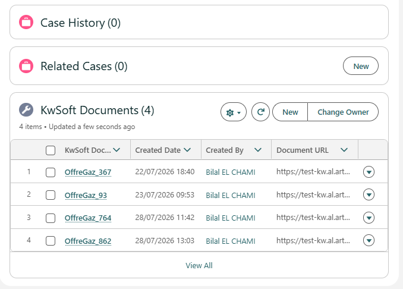

# Documentos interactivos y exportación final

## Plantilla de Flow: Mobee - Export KwSoft Document

Usa este Flow cuando un documento se creó en modo interactivo y debe finalizarse como PDF.

## Por qué existe este Flow

Los documentos interactivos son versiones en borrador. Se pueden editar y todavía no son el archivo final para archivo o envío.

Este segundo Flow recupera el documento editado desde KwSoft y adjunta el PDF final en Salesforce.

## Información necesaria

La acción de exportación necesita:

1. **Document Name** - Origen: tu objeto de registro personalizado

2. **Record Id** - Origen: el lookup del registro relacionado dentro del objeto de registro

En la práctica, los usuarios no deberían escribir estos valores manualmente. El Flow debe leerlos del registro de log seleccionado.

## Proceso recomendado para el usuario

1. El usuario abre un registro y ve los borradores relacionados
2. El usuario abre el borrador seleccionado en KwSoft y completa la edición
3. El usuario ejecuta el Flow de exportación desde Salesforce
4. El PDF final se adjunta al registro relacionado en Salesforce
5. El estado del registro se actualiza de Draft a Finalized

## Comportamiento de redirección

Después de exportar, puedes redirigir al usuario a:

1. El archivo generado
2. El registro de negocio original (recomendado para la mayoría de equipos)

Elige la opción que mejor encaje con tu proceso de soporte.

## Recomendación de gobierno

Para mantener los registros ordenados:

1. Mantén una entrada de log por cada documento interactivo
2. Controla el estado claramente (Draft, Finalized)
3. Oculta borradores antiguos a usuarios finales cuando ya estén finalizados
4. Crea un reporte simple para que los administradores controlen el backlog de borradores
