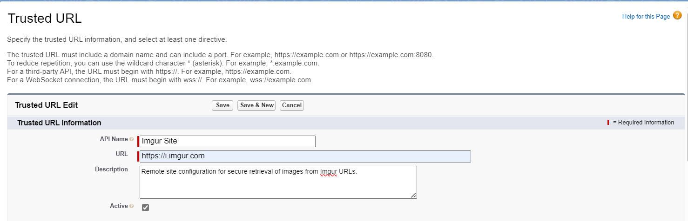

# Tipos de plantillas y sintaxis

## Tipos de plantillas

Mobee admite dos tipos de plantillas:

### Plantilla de documento simple

Cuando la casilla **Documento Combinado** no está marcada, la plantilla está diseñada para una generación unitaria. Esto significa que la plantilla incluye información de un único registro. Por ejemplo, si creas una plantilla simple para el objeto "Contacto", incorporará la información de un solo contacto y sus datos relacionados.

### Plantilla de documento combinado

Cuando la casilla **Documento Combinado** está marcada, indica que la plantilla se generará para múltiples registros simultáneamente. Esta plantilla utiliza una sintaxis especial para recorrer una lista de registros. Para acceder a los campos de cada registro en un documento combinado, tu plantilla debe comenzar recorriendo la lista de elementos utilizando la etiqueta `{#items}{/}`. Consulta la [sección de bucles](#Loops) para más detalles.

## Sintaxis

La sintaxis de las etiquetas utilizadas en las plantillas de Mobee se inspira en la especificación [Mustache](https://mustache.github.io/), que no depende de un lenguaje específico.

- Las etiquetas normales comienzan con un carácter alfabético.
- Otros tipos de etiquetas comienzan con prefijos especiales.

**Por ejemplo:**

- Acceder a campos de combinación en el objeto: `{Salutation} {firstName} {lastName}`
- Acceder a datos de listas relacionadas: `{#cases}` y `{/}` para abrir y cerrar una etiqueta. Consulta la sección **bucles** para más detalles.
- Insertar imágenes dinámicas: `{%ImageUrl__c}` agregará la imagen del campo "ImageUrl\_\_c". Consulta la sección **Imágenes dinámicas** para más detalles.

Por ejemplo, para acceder a los datos del objeto "Contacto" usando la sintaxis proporcionada en tu plantilla:

```markdown
Hola {Salutation} {FirstName} {LastName}!
```

**Salida:**

```markdown
Hola Sr. John Doe!
```

## Condiciones

Las condiciones comienzan con el carácter `#` y terminan con una barra. Por ejemplo, `{#Salutation == "Mr."}` inicia una condición y `{/}` la cierra.

**Nota:** Para verificar campos de casillas de verificación (`true` o `false`), utiliza la siguiente sintaxis:

```markdown
El contacto {Name} {#HasOptedOutOfEmail == 1}ha{/}{#HasOptedOutOfEmail == 0}no ha{/} optado por no recibir correos electrónicos.
```

**Salida:**

```markdown
El contacto Sr. John Doe ha optado por no recibir correos electrónicos.
```

### Expresiones lógicas

Puedes utilizar los siguientes operadores para expresiones lógicas más complejas:

- AND `a && b`
- OR `a || b`
- SUMA `a + b`
- RESTA `a - b`
- MULTIPLICACIÓN `a * b`
- MÓDULO `a % b`
- DIVISIÓN `a / b`
- TERNARIO `a ? b : c`
- ASIGNACIÓN `a = 1`
- IGUALDAD/DESIGUALDAD `a == 1, a != 1`
- RELACIONAL `a > 1, a < 1, a >= 1, a <= 1`
- PRECEDENCIA DE OPERADORES con paréntesis `(a && b) || c`
- NOTACIÓN EXPONENCIAL: `12e3` => retorna `12000`

Ejemplo:

```markdown
{#products.length > 1}Hay varios productos{/}
{#firstName == "John"}Hola John{/}
```

La primera condición mostrará la sección solo si hay 2 o más productos.

La segunda condición mostrará la sección solo si el nombre del usuario es la cadena "John".

**Salida:**

```markdown
Hay varios productos
Hola John
```

## Bucles

Como se mencionó anteriormente, los bucles comienzan con el símbolo "#". Ejemplo:

```markdown
{#Cases}
{CaseNumber}: {Description}.
{/}
```

**Salida:**

```markdown
00001299: Necesita permiso de acceso para visitar la ubicación.
00001624: Soporte al cliente.
00001836: Falta el cable del cargador de batería.
```

**Nota:** Cada campo de combinación utilizado en la sección de bucle se refiere a los campos del objeto relacionado actual. Si el campo no se encuentra en el objeto relacionado, el motor lo referencia desde el objeto principal.

## Imágenes dinámicas

Las imágenes dinámicas pueden integrarse fácilmente en tus documentos generados mediante el uso de marcadores dinámicos. Por ejemplo, si posees un campo llamado `ProfilePicture__c` que contiene la URL de una imagen o la imagen codificada como una cadena Base64, puedes incorporarla en tu documento usando la etiqueta designada: `{%ProfilePicture__c}` (comenzando con el símbolo `%`).

### Imágenes Base64

Para incluir una imagen usando datos en formato Base64, simplemente codifica la imagen en Base64 y almacénala directamente en el campo de Salesforce.

### Imágenes por URL

Para incorporar una imagen usando una URL, sigue estos pasos:

1. Ve a "Configuración" dentro de Salesforce.
2. En el cuadro de búsqueda rápida, ubica y selecciona "Configuraciones de sitios remotos."
3. Haz clic en el botón "Nuevo Sitio Remoto."
4. Asigna un nombre al sitio (por ejemplo, "Sitio Imgur").
5. En el campo "URL del Sitio Remoto," introduce la URL base de la ubicación de la imagen, como "https://i.imgur.com."
6. Habilita la casilla "Deshabilitar Seguridad de Protocolo" para permitir la recuperación mediante HTTP.
7. Selecciona "Guardar" para guardar los cambios.
8. Realiza los siguientes pasos para incorporar la URL en los sitios de confianza con todas las directivas de Política de Seguridad de Contenidos (CSP) habilitadas:

   1. En la página de configuración, ubica "URLs de confianza" utilizando el cuadro de búsqueda rápida.
   2. Selecciona el botón "Nuevo Sitio de Confianza."
   3. Asigna un nombre al sitio de confianza (por ejemplo, "Imgur Confiable").
   4. En el campo "URL del Sitio," introduce la misma URL base que antes, es decir, "https://i.imgur.com."
   5. Habilita todas las directivas CSP: "Connect," "Font," "Img," "Media," "Object," "Script," "Style."
   6. Confirma los cambios haciendo clic en "Guardar."




Ahora has configurado las configuraciones de sitio remoto y URLs confiables para recuperar la imagen de manera segura mediante HTTP. Luego, puedes usar la etiqueta `{%ProfilePicture__c}` para incluir dinámicamente la imagen en los documentos generados.

## Funcionalidades adicionales

Mobee proporciona varias etiquetas y filtros para ayudar a los usuarios a personalizar sus documentos.

### Fechas

La etiqueta `{docUtils.today}` es un elemento predefinido que permite incluir la fecha actual en una plantilla de documento durante el proceso de generación. Además de los filtros descritos a continuación, los usuarios tienen la flexibilidad de manipular esta fecha según sus necesidades específicas.

### Filtros

Los filtros son funciones predefinidas diseñadas para la manipulación de cadenas, fechas y números dentro de las plantillas de documentos. Pueden aplicarse a cualquier etiqueta añadiendo el carácter de tubería `|` seguido del filtro deseado.

Ejemplo ilustrativo de la sintaxis:

```markdown
Hola {Salutation} {FirstName} {LastName | upper}!
```

**Salida:**

```markdown
Hola Sr. JOHN DOE!
```

Los siguientes filtros están soportados:

**Filtros de cadenas:**

- `lower`: Convierte el texto a minúsculas.
- `upper`: Convierte el texto a mayúsculas.

**Filtros de fechas:**

- `shortDate`: Convierte la fecha en un formato corto y conciso.
- `followingMonth`: Retorna el mes siguiente basado en una fecha dada.
- `followingYear`: Retorna el año siguiente basado en una fecha dada.
- `lastWorkingDayOfMonth`: Retorna el último día laborable del mes basado en una fecha dada.
- `formatDate`: Un filtro versátil para formatear valores de fechas.

Ejemplo de uso:

```markdown
La fecha de creación es {StartDate | shortDate}
El siguiente mes es {StartDate | followingMonth: '[["year": "numeric", "month": "long"]]' }
El siguiente año es {StartDate | followingYear: '[["year": "numeric"]]' }
El último día laborable del mes es {StartDate | lastWorkingDayOfMonth}
```

**Salida:**

```markdown
La fecha de creación es 21/01/2022
El siguiente mes es febrero 2022
El siguiente año es 2023
El último día laborable del mes es 31/01/2022
```

Las funciones `followingMonth`, `followingYear`, `lastWorkingDayOfMonth` y `formatDate` aceptan las siguientes opciones de formato:

```json
[[ 
  weekday: 'narrow' | 'short' | 'long',
  era: 'narrow' | 'short' | 'long',
  year: 'numeric' | '2-digit',
  month: 'numeric' | '2-digit' | 'narrow' | 'short' | 'long',
  day: 'numeric' | '2-digit',
  hour: 'numeric' | '2-digit',
  minute: 'numeric' | '2-digit',
  second: 'numeric' | '2-digit',
  timeZoneName: 'short' | 'long',

  // Zona horaria a expresar
  timeZone: 'Asia/Shanghai',
  // Forzar formato de 12 o 24 horas
  hour12: true | false,

  // Opciones raramente usadas
  hourCycle: 'h11' | 'h12' | 'h23' | 'h24',
  formatMatcher: 'basic' | 'best fit'
]]
```

**Filtros de listas:**

- **`groupBy`**: Crea un objeto compuesto de claves generadas a partir de los resultados de agrupar cada elemento de la colección según las claves dadas. Se pueden realizar múltiples agrupaciones proporcionando las claves separadas por punto y coma. El orden de los valores agrupados está determinado por el orden de las claves dadas.

   - **Retorna**: Un objeto con dos propiedades:
     - `$groupedKey#`: La clave para cada nivel de agrupación, donde `#` se incrementa con cada nivel de agrupación (comenzando en 1).
     - `$groupedItems#`: Los elementos asociados con cada clave agrupada. Si se realizan múltiples agrupaciones, cada nivel de elementos agrupados contendrá otra `$groupedKey#` y `$groupedItems#`, incrementando el índice en cada nivel adicional.

Ejemplo de uso:

Agrupando los datos según las propiedades `Project`, `PricebookEntry.Product2.Type` y `PricebookEntry.Product2.Family`.

```markdown
Nombre de cotización: {Name}

Número de contrato: {Contract.ContractNumber}

{#QuoteLineItems | groupBy: 'Project;PricebookEntry.Product2.Type;PricebookEntry.Product2.Family'}
{$groupedKey1}
{#$groupedItems1}
    {$groupedKey2}
    {#$groupedItems2}
          {$groupedKey3}
          {#$groupedItems3}
                {Quantity} 
                {PricebookEntry.Product2.Name}
                {PricebookEntry.Product2.Description}
                {Mobee__TotalPrice__c | currency: 'EUR'}{/}{/}{/}{/}
``` 
