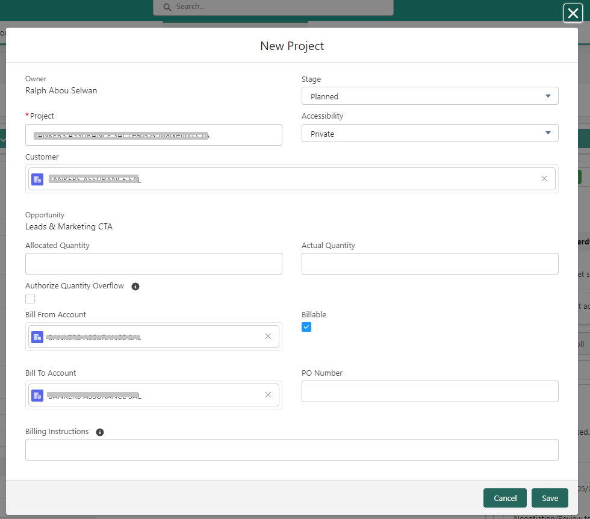
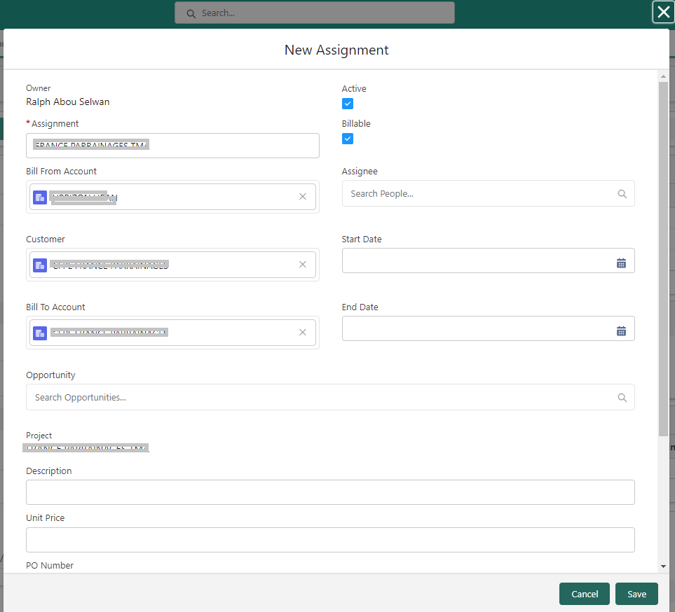

## Guía de administración

Esta guía del usuario le ayudará a comprender y utilizar las funcionalidades de gestión de Time Entries en nuestro sistema.

Encontrará instrucciones paso a paso para agregar nuevos proyectos y asignaciones, así como para consultar las Time Entries de sus colegas.

## Agregar un Nuevo Proyecto desde una Oportunidad

### Navegar hacia la Oportunidad
Paso 1: Acceder al módulo "Oportunidades"

1. Inicie sesión en su cuenta de Salesforce.
2. Vaya a la página de inicio de Salesforce.
3. En la barra de navegación superior, haga clic en la pestaña "Oportunidades" para abrir la lista de oportunidades.
4. Seleccione la oportunidad relevante.

Paso 2: Haga clic en el botón "Nuevo Proyecto" en la barra de herramientas para crear un proyecto a partir de la oportunidad.

El sistema abrirá un cuadro de diálogo con variables inicializadas a partir de la oportunidad, como se muestra a continuación: (complete los campos requeridos según sus necesidades)

El formulario "Nuevo Proyecto" se presenta al usuario, con muchos campos prellenados a partir de la oportunidad. Esto facilita la entrada de datos y reduce errores.

## Agregar una Nueva "Asignación" desde el Proyecto

### Navegar hacia el Proyecto Relevante

Paso 1: Acceder a la página del proyecto

1. Acceda a la lista de proyectos haciendo clic en la pestaña "Proyectos" en la barra de navegación superior.
2. Seleccione el proyecto al que desea agregar una nueva "Asignación".

Paso 2: Agregar una Nueva "Asignación"
* En la página del proyecto relevante,
* Haga clic en el botón "Nueva Asignación" para crear una nueva asignación.
* Complete los detalles de la asignación, como el nombre del asignado, el precio, la cantidad, la descripción del trabajo, las fechas de inicio y finalización, etc.
* Guarde la asignación recién creada.

El formulario "Nueva Asignación" se presenta al usuario, con muchos campos prellenados a partir del proyecto. Esto facilita la entrada de datos y reduce errores.

## Consultar las Time Entries de Usuarios de la Comunidad de Salesforce

### Navegar hacia el Contacto Relevante

Cada usuario de la Comunidad de Salesforce se crea como un Contacto en Salesforce.

Paso 1: Acceder a los "Contactos"

* Acceda a la lista de contactos haciendo clic en la pestaña "Contactos" en la barra de navegación superior.
* Seleccione el contacto (colega) del cual desea consultar las Time Entries.
* Utilice el filtro disponible en la página de contactos.
* La página de Contacto se muestra con los detalles.

Paso 2: Acceder a las "Time Entries".

* Las Time Entries se muestran en la pestaña:

## Consultar las Time Entries de Usuarios Estándar de Salesforce

### Usar la Barra de Búsqueda Global.

* Ingrese el nombre del colega en la barra de búsqueda. Se mostrará una lista de usuarios que coinciden con los criterios y la naturaleza del objeto encontrado (Cuenta, Contacto, Usuario, etc.).
* Elija "Usuario" y el sistema lo dirigirá al usuario relevante.
* La hoja de tiempo se mostrará en la parte superior de la página de la siguiente manera:

