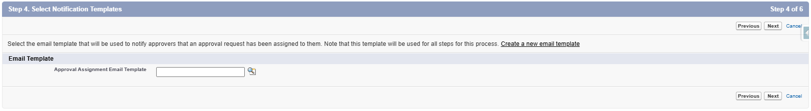
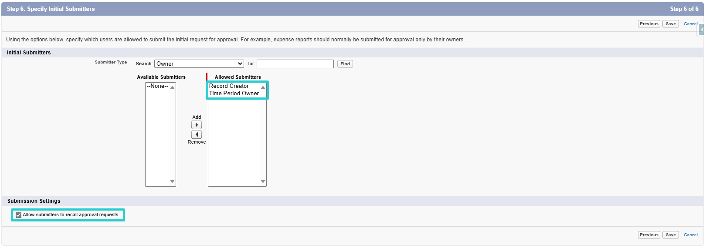
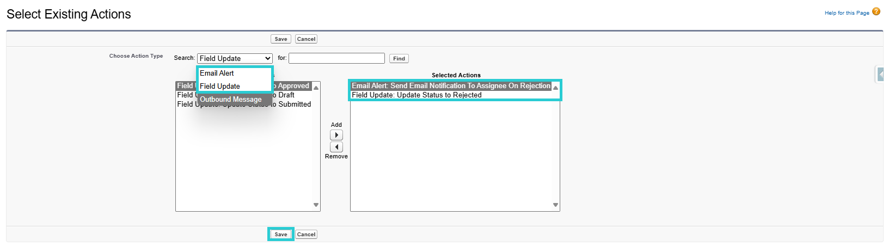
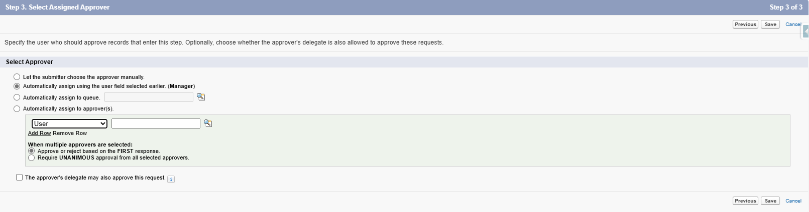
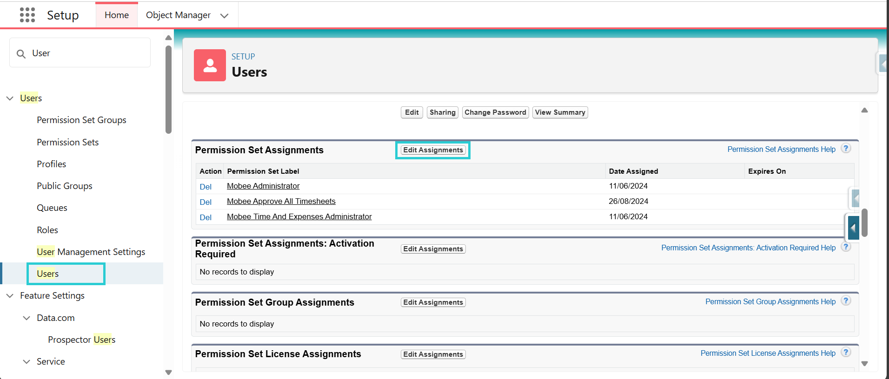
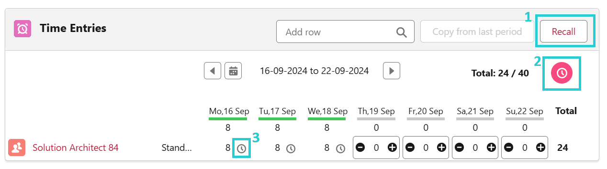
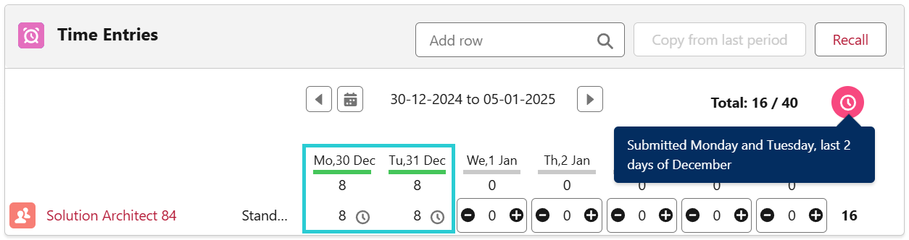

# Proceso de aprobación de la hoja de tiempo

## Introducción

Puedes agregar un proceso de aprobación para que tu gerente o un aprobador designado revise y apruebe o rechace el registro de tiempo enviado.

  
*Vista previa del envío del proceso de aprobación*

---

## Activación del proceso de aprobación

### 1. Crear el proceso de aprobación

La siguiente sección es una guía paso a paso para crear un proceso de aprobación estándar, donde algunas acciones son obligatorias y otras son opcionales. **(Los pasos obligatorios están resaltados en negrita)**

- Ve a la página de configuración
- Accede a los procesos de aprobación
- Gestiona los procesos de aprobación para: período de tiempo
- Crea un nuevo proceso de aprobación: utiliza el asistente de configuración estándar

#### Paso 1: Introducir nombre y descripción

#### Paso 2: Especificar criterios de entrada

*No hay acción a realizar*  

#### Paso 3: Especificar campo de aprobador y propiedades de editabilidad del registro

1. Especificar campo de aprobador (para la asignación automática de aprobaciones)  
   Selecciona: *Gerente (Manager)*

2. Editabilidad del registro  
   Selecciona: *Los administradores o el aprobador asignado pueden editar los registros durante el proceso de aprobación.*

#### Paso 4: Seleccionar plantillas de notificación

*No hay acción a realizar*  

#### Paso 5: Seleccionar campos para mostrar en el diseño de la página de aprobación

*No hay acción a realizar*  

#### Paso 6: Especificar remitentes iniciales

1. Remitentes iniciales  
   *Selecciona: propietario del período de tiempo, creador del registro*

2. **Configuraciones de envío**  
   **Selecciona: Permitir que los remitentes retiren solicitudes de aprobación**

---

### 2. Gestionar el proceso de aprobación

Después de completar la creación del proceso de aprobación, podrás gestionar las acciones (envío inicial, aprobación final, rechazo final y retiro).

Estas acciones deben incluirse para que el proceso de aprobación funcione como se espera.

  
*Vista previa de acciones y pasos de aprobación*

#### 2.1. Acciones de envío inicial

1. Agregar existentes  
2. Agregar: *Actualización de campo: actualizar estado a enviado*

#### 2.2. Acciones de aprobación final

1. Editar bloqueo de registro y seleccionar: *Desbloquear registro para edición*  
2. Agregar existentes y agregar: *Actualización de campo: actualizar estado a aprobado*

#### 2.3. Acciones de rechazo final

1. Agregar existentes  
2. Agregar:  
   a. *Actualización de campo: actualizar estado a rechazado*  
   b. *Alerta de correo electrónico: enviar notificación por correo al asignado en caso de rechazo* (esta es una alerta por correo enviada al remitente de la hoja de tiempo si su hoja es rechazada por el aprobador. si no es necesario, esta alerta no debe añadirse)

#### 2.4. Acciones de retiro

1. Agregar existentes  
2. Agregar: *Actualización de campo: actualizar estado a borrador*

---

### 3. Elegir el aprobador

#### 3.1. Asignar el aprobador en el proceso de aprobación

El aprobador puede ser el gerente del remitente o un usuario específico responsable de todos los remitentes, como el gerente de recursos humanos, asegurando que todas las hojas de tiempo se dirijan a una sola persona para su aprobación. Esto también se controla a nivel del proceso de aprobación tras su creación.

#### 3.2. Asignación de conjuntos de permisos

En configuración > usuarios, asigna el conjunto de permisos *Mobee approve all timesheets* en el usuario aprobador.

---

## Uso del proceso de aprobación

#### 1. Remitente

El usuario envía su hoja de tiempo para aprobación  
*Esta acción es recuperable (1)*  
*Comentario de envío (2)*  
*Indicador de registro de tiempo enviado (3)*

#### 2. Aprobador

El aprobador asignado puede aprobar/rechazar en el contacto del remitente  
*el aprobador asignado revisa la hoja de tiempo (registro de tiempo enviado) y tiene la opción de aprobar o rechazar la solicitud.*

---

## Comportamiento y consideraciones del proceso de aprobación

- Aprobación parcial es posible

Ejemplo A:  
*el usuario envía una solicitud de días libres, que es aprobada. luego, envían su carga de trabajo asignada para los días restantes*

  

Ejemplo B:  
*el usuario envía los últimos días del mes para su aprobación. en el mes siguiente, para la misma tarea, envían los días laborables restantes para aprobación*

  

- Cuando se aprueba una hoja de tiempo, se envía una notificación al remitente.

- Cuando se rechaza una hoja de tiempo, se envían tanto una notificación como un correo electrónico al remitente (el correo se envía si se agregó según 2.3. acciones de rechazo final).

- Cuando se rechazan registros de tiempo pendientes en una hoja de tiempo, toda la hoja de tiempo se vuelve editable.

- Al pasar el cursor sobre los siguientes íconos ,  y  se muestran comentarios del remitente o del aprobador relacionados con la presentación, aprobación o rechazo, respectivamente.

Los siguientes íconos  y  sirven como indicadores que muestran el estado del registro de tiempo.