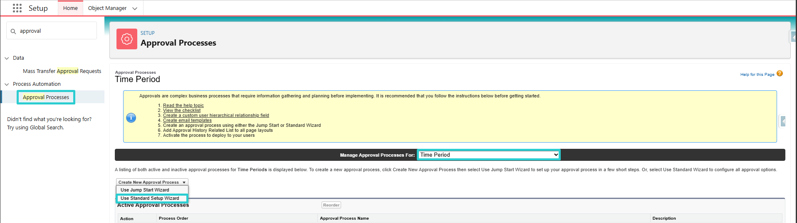
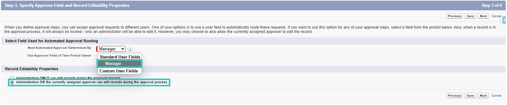
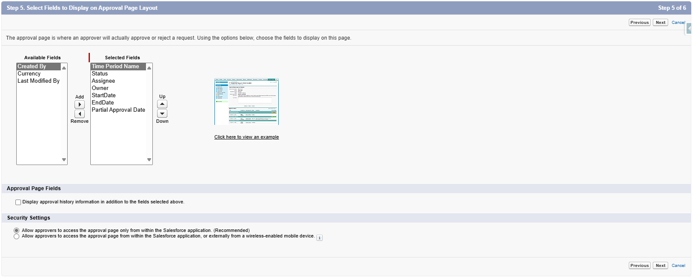
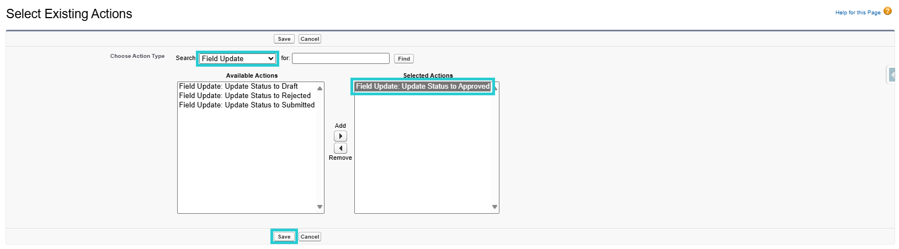

# Proceso de Aprobación de Hojas de Tiempo

## Introducción

Puedes agregar un proceso de aprobación para que tu gerente, o un aprobador designado, revise y apruebe o rechace las entradas de tiempo que hayas enviado.

  
*Vista previa de envío del proceso de aprobación*

---

## Activación del Proceso de Aprobación

### 1. Crear el Proceso de Aprobación

- Ir a la página de configuración
- Acceder a los Procesos de Aprobación
- Gestionar Procesos de Aprobación Para: Período de Tiempo
- Crear un Nuevo Proceso de Aprobación: Usar el Asistente de Configuración Estándar

#### Paso 1: Introducir Nombre y Descripción

#### Paso 2: Especificar Criterios de Entrada

**No hay acción que realizar**  

#### Paso 3: Especificar Campo del Aprobador y Propiedades de Editabilidad del Registro

1. **Especificar Campo del Aprobador (Para Enrutamiento de Aprobación Automatizado)**  
   Seleccionar: *Gerente (Manager)*

2. **Editabilidad del Registro**  
   Seleccionar: *Los administradores O el aprobador actualmente asignado pueden editar registros durante el proceso de aprobación (Administrators OR the currently assigned approver can edit records during the approval process)*  

#### Paso 4: Seleccionar Plantillas de Notificación

**No hay acción que realizar**  

#### Paso 5: Seleccionar Campos a Mostrar en el Diseño de la Página de Aprobación

**No hay acción que realizar**  

#### Paso 6: Especificar Presentadores Iniciales

1. **Presentadores Iniciales**  
   Seleccionar: *Propietario del Período de Tiempo, Creador del Registro (Time Period Owner, Record Creator)*

2. **Configuraciones de Presentación**  
   Seleccionar: *Permitir que los presentadores retiren solicitudes de aprobación (Allow submitters to recall approval requests)*  

---

### 2. Gestionar el Proceso de Aprobación

Después de completar la creación del proceso de aprobación, podrás gestionar acciones (Presentación Inicial, Aprobación Final, Rechazo Final y Retiro).

  
*Vista previa de acciones y pasos de aprobación*

#### 2.1. Acciones de Presentación Inicial (Initial Submission Actions)

1. Agregar Existente (Add Existing)
2. Agregar: *Actualización de Campo: Update Status to Submitted*

#### 2.2. Acciones de Aprobación Final (Final Approval Actions)

1. Editar Bloqueo de Registro y Seleccionar: *Desbloquear registro para edición (Unlock record for editing)*
2. Agregar Existente (Add Existing) y Agregar: *Actualización de Campo: Update Status to Approved*

#### 2.3. Acciones de Rechazo Final (Final Rejection Actions)

1. Agregar Existente (Add Existing)
2. Agregar: 
    a. *Actualización de Campo: Update Status to Rejected*
    b. *Alerta de Correo Electrónico: Send Email Notification To Assignee On Rejection* (Esta es una alerta de correo electrónico enviada al presentador de la hoja de tiempo si su hoja de tiempo es rechazada por el aprobador. Si no se necesita, esta alerta de correo electrónico no debe agregarse)

#### 2.4. Acciones de Retiro (Recall Actions)

1. Agregar Existente (Add Existing)
2. Agregar: *Actualización de Campo: Update Status to Draft*

---

### 3. Elegir al Aprobador

#### 3.1. Asignar al Aprobador en el Proceso de Aprobación

El aprobador puede ser el gerente del presentador o un usuario específico responsable de todos los presentadores, como el Gerente de Recursos Humanos, asegurando que todas las hojas de tiempo sean dirigidas a una persona para su aprobación. Esto también se controla a nivel del Proceso de Aprobación después de su creación.

#### 3.2. Asignación del Conjunto de Permisos (Permission Set)

En Configuración > Usuarios, establece el conjunto de permisos *Mobee Approve All TimeSheets* en el usuario aprobador.

---

### 4. Uso del Proceso de Aprobación

#### 4.1. Presentador
El usuario envía su hoja de tiempo para aprobación  
*Esta acción es retirable (1)*  
*Comentario de presentación (2)*  
*Indicador de entradas de tiempo enviadas (3)*  

#### 4.2. Aprobador
El aprobador asignado puede aprobar/rechazar en el contacto del presentador  
*El aprobador asignado revisa la hoja de tiempo (entradas de tiempo enviadas) y tiene la opción de aprobar o rechazar la presentación.*  

### 5. Comportamiento y Consideraciones del Proceso de Aprobación

- La aprobación parcial es posible

Ejemplo A:  
*El usuario envía una solicitud de días libres, que es aprobada. Luego, envía su carga de trabajo asignada para los días restantes*  
  

Ejemplo B:  
*El usuario envía los últimos días del mes para aprobación. En el mes siguiente, para la misma asignación, envía los días de semana restantes para aprobación*  
  

- Cuando se aprueba una hoja de tiempo, se envía una notificación al remitente

- Cuando se rechaza una hoja de tiempo, se envían tanto una notificación como un correo electrónico al remitente (el correo electrónico se envía si se agrega según la sección 2.3. Acciones de Rechazo Final)

- Cuando se rechazan las entradas de tiempo pendientes en una hoja de tiempo, toda la hoja de tiempo se vuelve editable

- Al pasar el cursor sobre los siguientes íconos ,  y  se muestran comentarios del remitente o del aprobador relacionados con la presentación, aprobación o rechazo, respectivamente

- Los siguientes íconos  y  sirven como indicadores que muestran el estado de la entrada de tiempo