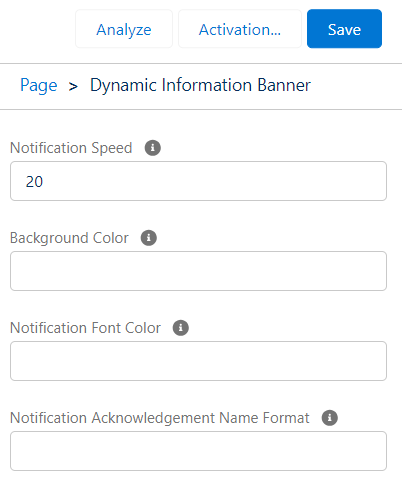

# Componente LWC 'Dynamic Information Banner'

## Resumen

El componente Lightning Web 'Dynamic Information Banner' proporciona una funcionalidad de visualización de notificaciones personalizables dentro de las páginas de registro. Obtiene información de dos objetos personalizados: 'Notification' y 'Notification Acknowledgement'. Los usuarios pueden crear notificaciones con atributos específicos y verlas deslizarse en el componente en la página de registro. Además, existen opciones de personalización para la velocidad, el color de fondo, el color de fuente y el formato de notificación de reconocimiento.

### Objetos Personalizados

1. **Notification**:
   - Campos: Nombre (obligatorio), Descripción, Fecha de Inicio, Fecha de Fin, Activa (casilla de verificación)
2. **Notification Acknowledgement**:
   - Campos: Fecha/Hora de acuse de recibo

## Funcionalidad

- Creación de Notificaciones:

  - Los usuarios pueden crear notificaciones con un nombre, descripción, fecha de inicio, fecha de fin y una casilla de verificación 'activa'.
    
  - La fecha de inicio, fecha de fin, descripción y estado activo no son campos obligatorios.

- Integración en la Página de Registro:
  - Inserta el componente 'Dynamic Information Banner' en una página de registro para mostrar las notificaciones creadas deslizándose dentro del componente.
     
    
     
  - Haz clic en la notificación y reconócela.
   
- Opciones de Personalización:
  - **Velocidad**: Configura la velocidad del desplazamiento de las notificaciones en segundos.
  - **Color de Fondo**: Personaliza el color de fondo de la barra de notificaciones usando formato hexadecimal (por ejemplo, '#FFFFFF').
  - **Color de Fuente**: Establece el color de la fuente para las notificaciones mostradas usando formato hexadecimal.
    
- Formato de Reconocimiento de Notificación:
  - Personaliza el formato utilizando marcadores de posición encapsulados entre llaves ({}) para los nombres de campo de 'Notification Acknowledgement\_\_c'. Los delimitadores pueden ser cualquier carácter o ninguno.

## Uso

1. **Inserción del Componente en la Página de Registro**:
   - Agrega el componente 'Dynamic Information Banner' a una disposición de la página de registro.

2. **Personalización**:
   - Accede a la página de edición del componente para personalizar:
     - Velocidad (en segundos)
     - Color de fondo (formato hexadecimal, por ejemplo, '#FFFFFF')
     - Color de fuente (formato hexadecimal)

## Ejemplo de Formato de acuse de recibo

Un ejemplo del formato de acuse de recibo: '{Mobee\_\_Notification\_\_c}{SystemModstamp}' o '{Mobee\_\_Notification\_\_c}--{SystemModstamp}'.

- Reemplaza 'Mobee\_\_Notification\_\_c' y 'SystemModstamp' con los nombres de campo apropiados de 'Notification Acknowledgement\_\_c'.
- Los delimitadores se pueden modificar u omitir según el formato deseado.

## Notas

- Asegúrate de tener los permisos de acceso necesarios para los objetos personalizados 'Notification' y 'Notification Acknowledgement'.
- Valida los permisos de seguridad a nivel de campo y de usuario para las operaciones CRUD en ambos objetos.
- Es posible que los ajustes de personalización requieran una documentación adecuada para los usuarios/administradores.
