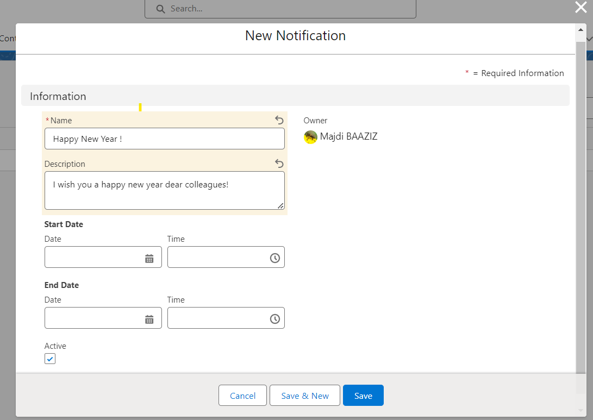

# Componente de Banner de Notificaciones

## Descripción

El componente Lightning Web ('Notifications Banner') proporciona una funcionalidad de visualización de notificaciones personalizable dentro de las páginas de registros. Recupera información de dos objetos personalizados: 'Notification' y 'Notification Acknowledgement'. Los usuarios pueden crear notificaciones con atributos específicos y verlas deslizarse en el componente ubicado en la página Lightning deseada. Además, hay opciones de personalización para la velocidad, color de fondo, color de fuente y formato de notificación de acuse de recibo.

### Objetos Personalizados

1. **Notification**:
   - Campos: Nombre (obligatorio), Descripción, Fecha de Inicio, Fecha de Fin, Activo (casilla de verificación)
2. **Notification Acknowledgement**:
   - Campos: Fecha/Hora del Acuse de Recibo, Acusado por

## Funcionalidad

### Creación de Notificaciones:

Los usuarios pueden crear nuevas notificaciones proporcionando un nombre que se mostrará como título, descripción, fecha de inicio, fecha de fin e indicando si está activa o no.

**Nota**: La fecha de inicio, fecha de fin, descripción y estado activo no son campos obligatorios.

### Integración en la Página de Registro:

Inserta el componente 'Notifications Banner' en una página Lightning para mostrar notificaciones creadas que se deslizan dentro del componente.

Haz clic en la notificación y acúsala de recibo.

### Opciones de Personalización:

- `Velocidad de Notificación`: Este parámetro controla la velocidad a la que los textos de las notificaciones se deslizan por la pantalla. Si ingresas un valor más alto, las notificaciones se moverán más rápido.
- `Color de Fondo`: Personaliza el color de fondo del banner de notificación utilizando el formato hexadecimal (por ejemplo, '#FFFFFF').
- `Color de Fuente de Notificación`: Establece el color de la fuente para las notificaciones mostradas utilizando el formato hexadecimal.

- `Formato de Nombre de Acuse de Recibo de Notificación`: Personaliza el formato utilizando espacios reservados entre corchetes (`{}`) para nombres de campo de `Notification Acknowledgement__c`. Los delimitadores pueden ser cualquier carácter o ninguno.

## Uso

### Inserción del Componente en una Página Lightning:

Añade el componente LWC 'Notifications Banner' a la disposición de una página de registro.

### Personalizaciones:

En el Lightning Page Builder, puedes acceder a sus propiedades haciendo clic en el componente para personalizar lo siguiente:
- Velocidad de desplazamiento
- Color de fondo
- Color de fuente

### Ejemplo de Formato de Acuse de Recibo

Un ejemplo del formato de acuse de recibo: `{Mobee__Notification__c}{SystemModstamp}` o `{Mobee__Notification__c}--{SystemModstamp}`.

- Reemplaza `Mobee__Notification__c` y `SystemModstamp` con nombres de campo apropiados de `Notification Acknowledgement__c`.
- Los delimitadores pueden modificarse u omitirse según el formato deseado.

## Notas

- Asegúrate de tener los permisos de acceso necesarios para los objetos personalizados **Notification** y **Notification Acknowledgement**.
- Valida la seguridad a nivel de campo y los permisos de usuario para las operaciones CRUD en ambos objetos.
- Es posible que las configuraciones de personalización requieran documentación adecuada para usuarios/administradores.