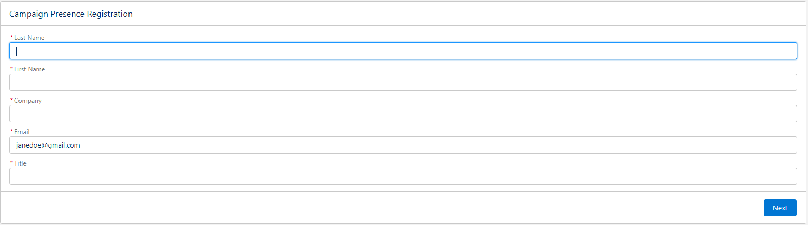

# Registro de Presencia en Campaña

Mejorando la Gestión de Membresías de Campaña a través de Flow

### **Descripción General**

El flujo "Registro de Presencia en Campaña" está diseñado para agilizar el proceso de agregar o actualizar contactos y clientes potenciales en la lista de membresía de una campaña en Salesforce. Con un enfoque en la gestión eficiente de membresías y proporcionando una plataforma personalizable y fácil de usar, este flujo verifica, actualiza y gestiona los contactos o clientes potenciales, garantizando la precisión de los datos y una mejor interacción del usuario.

### **Objetivo**

El objetivo principal del flujo "Registro de Presencia en Campaña" es facilitar la gestión de membresías de campaña utilizando la dirección de correo electrónico como el dato clave. Este flujo mejora la experiencia del usuario en la gestión de campañas ofreciendo opciones para verificar, actualizar o crear registros, asegurando que cada interacción se aproveche de manera efectiva para la gestión de membresía.

### **Personalización Completa Adaptada a las Necesidades del Usuario**

Este flujo permite una personalización completa, adaptándose a los requisitos específicos de los usuarios y negocios. No solo cubre los casos básicos de agregar y actualizar miembros en una campaña, sino que también ofrece una plataforma flexible para:
- Introducir campos adicionales para actualizar.
- Implementar lógicas personalizadas para actualizar el estado de los miembros de la campaña.
- Personalizar las pantallas de interacción con el usuario para una mejor experiencia.
- Integrar controles o procesos adicionales según el flujo de trabajo del negocio.

### **Funcionalidad del Flujo**

1. **Ingreso de Dirección de Correo Electrónico**
   - El flujo comienza solicitando una dirección de correo electrónico como entrada.
   - La dirección de correo electrónico sirve como punto clave para obtener datos relevantes y realizar acciones posteriores.

    

2. **Identificación de Contacto o Cliente Potencial**
   - El flujo identifica si la dirección de correo electrónico está asociada a un Cliente Potencial o Contacto en Salesforce.

3. **Interacción para Actualizar Datos**
   - Si el correo corresponde a un Cliente Potencial o Contacto conocido, se solicita al usuario que actualice ciertos campos:
     - Para Clientes Potenciales: Apellido, Nombre, Correo Electrónico, Empresa y Cargo.

     
     - Para Contactos: Apellido, Nombre y Correo Electrónico.

     

   - Nota: La actualización del campo 'Empresa' para Contactos se omite intencionalmente debido a su relación con el objeto Cuenta y debe modificarse directamente en Salesforce si es necesario.

4. **Creación de Cliente Potencial para Correos Electrónicos Desconocidos**
   - Si la dirección de correo electrónico no corresponde a un Cliente Potencial o Contacto existente, se proporciona la opción de crear un nuevo Cliente Potencial.
   - El usuario puede ingresar la información relevante: Apellido, Nombre, Correo Electrónico, Empresa y Cargo para crear un nuevo registro.

   

5. **Gestión de Membresía en la Campaña**
   - Después de actualizar los datos o crear un Cliente Potencial, el flujo verifica si el Contacto o Cliente Potencial ya es miembro de la campaña especificada por `recordId`.
   - Si no es miembro, se le agrega a la campaña y su estado de membresía se inicializa (por ejemplo, 'Respondido').
   - Si ya es miembro, el estado se actualiza según corresponda.

   

El "Registro de Presencia en Campaña" permite a los usuarios asegurar un método estructurado y eficiente para gestionar las membresías de campaña, manteniendo la flexibilidad para adaptar el flujo a las necesidades dinámicas del negocio y asegurando que ningún cliente potencial se pierda en el proceso.
