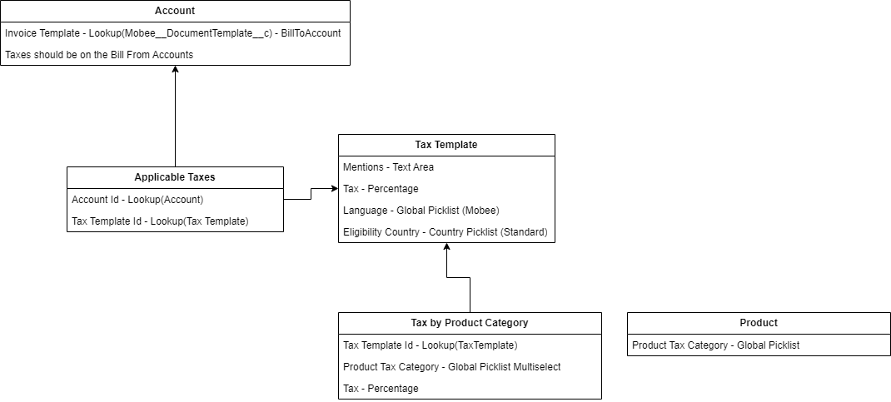

# Introducción

El **Módulo Mobee de Facturación y Gestión de Facturas** utiliza varios objetos personalizados para gestionar de manera eficaz las facturas, las líneas de factura y los impuestos. Esto garantiza una facturación precisa, un cálculo correcto de impuestos y flexibilidad en los informes en diversos escenarios empresariales. Los objetos personalizados se dividen en dos categorías:

- **Objetos Principales**: Representan los componentes principales de la facturación, como **Factura** y **Elemento de Línea de Factura**.
- **Objetos Relacionados con los Impuestos**: Manejan las reglas fiscales y los cálculos, incluyendo **Modelo de Impuesto**, **Impuesto por Categoría de Producto** e **Impuestos Aplicables**.

---

# Objetos Principales

## Factura

El objeto **Factura** es el registro principal para la facturación. Almacena detalles como el cliente, el monto adeudado y el estado de la factura. También se vincula a registros relacionados como Oportunidades, Pedidos o Proyectos.

### Información Clave:
- **Cuenta a Facturar (Lookup - Cuenta):** La cuenta a la que se factura la factura.
- **Contacto a Facturar (Lookup - Contacto):** El contacto responsable de recibir la factura.
- **Cliente (Lookup - Cuenta):** La cuenta vinculada a esta factura.
- **Cuenta de Cobro (Lookup - Cuenta):** La cuenta a la que se debe realizar el pago de la factura.
- **Divisa (Picklist):** Especifica la divisa utilizada para la factura.
- **Fecha de Vencimiento (Date):** La fecha en la que se espera el pago de la factura.
- **Monto Total (Fórmula - Divisa):** El monto total adeudado, calculado como un resumen de todos los **Elementos de Línea de Factura** asociados.
- **Monto de Impuestos (Resumen - Divisa):** El monto total de impuestos para la factura, calculado a partir de los **Elementos de Línea de Factura** asociados.
- **Fecha de Emisión (Date):** La fecha en la que se genera la factura.
- **Número de Factura (Texto):** Un identificador único para la factura.
- **Oportunidad (Lookup - Oportunidad):** Vincula la factura a una oportunidad relacionada (si aplica).
- **Proyecto (Lookup - Proyecto):** Vincula la factura a un proyecto relacionado (si aplica).
- **Modelo de Impuesto (Lookup - Modelo de Impuesto):** Vincula al **Modelo de Impuesto** adecuado utilizado para aplicar las tasas fiscales a la factura.

### Uso:
El registro de **Factura** se utiliza para rastrear la facturación y los pagos. Extrae información de los **Elementos de Línea de Factura** para calcular el monto total y los impuestos. Las facturas pueden crearse a partir de Oportunidades, Pedidos, Proyectos o Asignaciones.

---

## Elemento de Línea de Factura

El objeto **Elemento de Línea de Factura** representa cada producto o servicio facturado en una factura. Incluye información sobre precios, cantidades e impuestos.

### Información Clave:
- **Producto (Lookup - Producto):** El producto o servicio facturado en este elemento.
- **Cantidad (Número):** La cantidad del producto o servicio facturado.
- **Precio Unitario (Divisa):** El precio por unidad del producto o servicio.
- **Porcentaje de Descuento (Porcentaje):** Cualquier descuento aplicado al elemento, expresado como un porcentaje.
- **Monto Total (Fórmula - Divisa):** El monto total para este elemento, calculado como **Cantidad × Precio Unitario** menos los descuentos.
- **Tasa de Impuesto (Porcentaje):** La tasa de impuesto aplicada a este elemento.
- **Monto de Impuesto (Fórmula - Divisa):** El monto total de impuestos para este elemento, calculado como **Monto Total × Tasa de Impuesto**.
- **Monto Antes de Impuestos (Fórmula - Divisa):** El total antes de impuestos, calculado como **Cantidad × Precio Unitario** menos los descuentos.
- **Divisa (Picklist):** La divisa utilizada para este elemento.
- **Fecha de Inicio (Date):** La fecha de inicio del servicio o producto facturado.
- **Fecha de Fin (Date):** La fecha de fin del servicio o producto facturado.
- **Factura (Relación Maestra - Factura):** La factura principal a la que pertenece este elemento.

### Uso:
Cada **Elemento de Línea de Factura** detalla lo que se está facturando y calcula el total para ese elemento, incluidos los impuestos y descuentos. Estos elementos se combinan para formar el monto total adeudado en la factura.

---

# Objetos Relacionados con los Impuestos

Estos objetos definen las reglas fiscales basadas en categorías de productos, cuentas y regiones.

## Modelo de Impuesto

El objeto **Modelo de Impuesto** define cómo se aplican los impuestos a las facturas, incluyendo la tasa fiscal y la región.

### Información Clave:
- **Tasa de Impuesto:** El porcentaje de impuesto que se aplicará.
- **Idioma y País:** Especifica el idioma y el país al que se aplica el impuesto.
- **Menciones Legales:** Cualquier texto legal o relacionado con los impuestos que debe aparecer en la factura.

### Uso:
1. **Recuperar Modelos de Impuesto para la Cuenta de Cobro (Bill From Account):**
   - Comience por recuperar todos los **Modelos de Impuesto** asociados con la **Cuenta de Cobro**.

2. **Identificar el Modelo de Impuesto Correcto:**
   - **Coincidencia de Idioma:** Relacione el **Idioma** de la **Cuenta a Facturar** -> **Plantilla de Documento Mobee** -> **Idioma**.
   - **Coincidencia de País:** Relacione el **País** de la **Cuenta a Facturar** -> **País de Facturación**.

3. **Aplicar el Modelo de Impuesto:**
   - Una vez identificado el **Modelo de Impuesto** correcto, aplíquelo a la factura para garantizar que se sigan las reglas fiscales adecuadas.

---

## Impuesto por Categoría de Producto

El objeto **Impuesto por Categoría de Producto** asegura que los productos sean gravados correctamente según su categoría.

### Información Clave:
- **Categoría de Producto:** El tipo de producto facturado.
- **Tasa de Impuesto:** La tasa fiscal para esta categoría.

### Uso:
Al facturar **productos** desde una **Oportunidad** o un **Pedido**, el proceso es el siguiente:

1. **Recuperar el Modelo de Impuesto Correcto:**
   - Utilice el mismo proceso para recuperar el **Modelo de Impuesto** correcto basado en la **Cuenta de Cobro** y asociando el **Idioma** y el **País** de la **Cuenta a Facturar**.

2. **Verificar el Impuesto por Categoría de Producto:**
   - Para cada **Producto de la Oportunidad** o **Producto del Pedido**, verifique el campo personalizado **Categoría de Impuesto** (Picklist).
   - Compare este valor con el campo **Categoría de Producto Fiscal** en el objeto **Impuesto por Categoría de Producto**.
   - Asegúrese de que el **Impuesto por Categoría de Producto** esté relacionado con el mismo **Modelo de Impuesto** identificado previamente.

3. **Aplicar el Impuesto:**
   - **Si se encuentra una coincidencia:**
     - Utilice la **Tasa de Impuesto** correspondiente.
   - **Si no se encuentra una coincidencia:**
     - Aplique la tasa de impuesto definida en el **Modelo de Impuesto**.

4. **Repetir para cada producto:**
   - Repita este proceso para cada producto para garantizar una fiscalización adecuada.

---

## Impuestos Aplicables

El objeto **Impuestos Aplicables** vincula las reglas fiscales a cuentas específicas, asegurando que se aplique el impuesto correcto según la ubicación de la cuenta.

### Información Clave:
- **Cuenta:** La cuenta a la que se aplican las reglas fiscales.
- **Modelo de Impuesto:** El modelo utilizado para calcular los impuestos para esa cuenta.

### Uso:
El sistema identifica el modelo de impuesto correcto basado en el país de la cuenta y lo aplica a las facturas.

---
