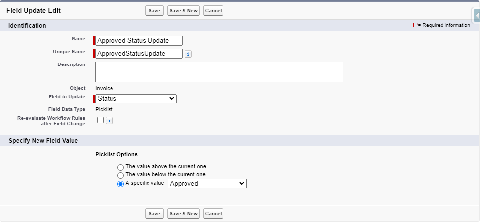
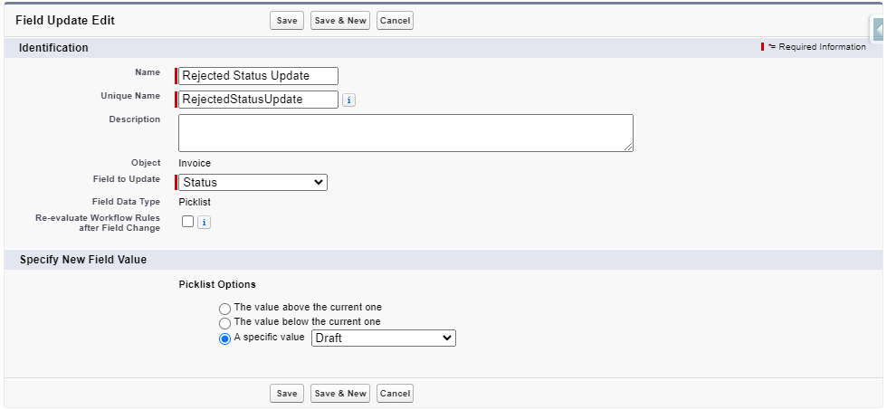

# Configuración y Parámetros para la Facturación

Esta sección le guiará en la configuración de las funcionalidades clave como el proceso de aprobación, la adición del botón "Generar Factura", la configuración de la asignación de páginas Lightning, la gestión de permisos para usuarios y administradores, así como la asignación de tipos de registro a perfiles.

## Gestión de Conjuntos de Permisos Personalizados

Se incluyen dos conjuntos de permisos personalizados en el paquete para controlar el acceso a las funcionalidades de facturación:

1. **Administrador Mobee Facturación**
2. **Usuario Mobee Facturación**

Estos conjuntos de permisos definen los niveles de acceso para diferentes tipos de usuarios, asegurando que los administradores puedan gestionar completamente las operaciones de facturación, mientras que los usuarios estándar tienen acceso restringido de solo lectura con la posibilidad de generar facturas a través de un Flow.

### **Administrador Mobee Facturación**

El conjunto de permisos **Administrador Mobee Facturación** está destinado a administradores responsables de la gestión del proceso de facturación, modelos y configuración. Los administradores tienen control total sobre todos los objetos y flows relacionados con la facturación.

#### Permisos:
- **Lectura/Escritura** en todos los objetos personalizados relacionados con la facturación, incluyendo:
  - **Factura**
  - **Elemento de Línea de Factura**
  - **Modelo de Impuesto**
  - **Impuesto por Categoría de Producto**
  - **Impuestos Aplicables**
- **Control total** sobre los flows relacionados con la facturación:
  - Los administradores pueden crear, modificar y eliminar los **Flows Modelos** utilizados para generar facturas.

#### Uso:
- El conjunto de permisos **Administrador Mobee Facturación** se asigna a los usuarios que deben gestionar todos los aspectos de la facturación, incluyendo la personalización de los flows para generar facturas y la gestión de los parámetros fiscales. Este rol es adecuado para equipos financieros y operativos responsables de supervisar el proceso de facturación.

---

### **Usuario Mobee Facturación**

El conjunto de permisos **Usuario Mobee Facturación** está destinado a usuarios estándar que interactúan con el proceso de facturación pero no necesitan acceso administrativo completo. Los usuarios con este permiso pueden generar facturas a través de un Flow, pero no pueden modificar los modelos o configuraciones de la facturación.

#### Permisos:
- **Acceso de solo lectura** en todos los objetos personalizados relacionados con la facturación, incluyendo:
  - **Factura**
  - **Elemento de Línea de Factura**
  - **Modelo de Impuesto**
  - **Impuesto por Categoría de Producto**
  - **Impuestos Aplicables**
- **Acceso a Flow**: Los usuarios pueden acceder al Flow y usarlo para crear y enviar facturas, pero no pueden modificar la configuración o los modelos del Flow.

#### Uso:
- El conjunto de permisos **Usuario Mobee Facturación** está diseñado para miembros de los equipos de ventas, servicio o proyecto que necesitan generar facturas pero no gestionan el sistema de facturación. Este rol permite a los usuarios interactuar con el Flow de facturación mientras mantienen un control estricto sobre los datos y configuraciones relacionadas con la facturación.

---

## Asignación de Conjuntos de Permisos a Usuarios

Los conjuntos de permisos personalizados ya están incluidos en el paquete **Mobee Facturación**. Siga estos pasos para asignarlos a los usuarios:

### Asignar el Conjunto de Permisos Administrador Mobee Facturación:

1. **Acceda a Configuración** > **Conjuntos de Permisos**.
2. Busque el conjunto de permisos: `Administrador Mobee Facturación`.
3. Haga clic en el conjunto de permisos y seleccione **Gestionar Asignaciones**.
4. Haga clic en **Agregar Asignaciones**.
5. Seleccione los usuarios que necesitan acceso de **administrador** al sistema de facturación.
6. Haga clic en **Asignar**.

### Asignar el Conjunto de Permisos Usuario Mobee Facturación:

1. **Acceda a Configuración** > **Conjuntos de Permisos**.
2. Busque el conjunto de permisos: `Usuario Mobee Facturación`.
3. Haga clic en el conjunto de permisos y seleccione **Gestionar Asignaciones**.
4. Haga clic en **Agregar Asignaciones**.
5. Seleccione los usuarios que necesitan acceso de **usuario** para interactuar con el Flow de facturación.
6. Haga clic en **Asignar**.

---

## Asignación de Tipos de Registro a Perfiles

Para garantizar un acceso adecuado a tipos de registro específicos, siga estos pasos para configurar el acceso a los tipos de registro para los perfiles de usuario:

1. **Acceda a Configuración** > **Perfiles**.
2. Seleccione el perfil al que desea asignar permisos de Tipo de Registro.
3. En la sección **Configuración de Tipos de Registro**, busque el objeto **Factura**.
4. Haga clic en **Editar** junto al objeto **Factura**.
5. Seleccione los Tipos de Registro correspondientes (por ejemplo, **Factura Aprobada**, **Factura Borrador**) que deben estar disponibles para el perfil.
6. Defina un **Tipo de Registro Predeterminado** para este perfil.
7. Haga clic en **Guardar**.

Esta configuración garantiza que los usuarios con perfiles específicos puedan acceder y trabajar con los tipos de registro pertinentes para el objeto **Factura**.

---

## Asignación de Páginas Lightning para las Facturas

El **Módulo Mobee Facturación** incluye dos **Páginas Lightning** para las facturas, lo que permite tener diseños distintos según el estado de la factura. Sin embargo, debido a las limitaciones del paquete, la asignación de estas páginas a tipos de registro específicos debe realizarse manualmente. Esta sección explica cómo asignar las páginas Lightning correctamente.

---

### Páginas Lightning Disponibles

1. **Mobee Factura Aprobada (Página Lightning)**: Este diseño está pensado para facturas con el tipo de registro **Factura Aprobada**.
2. **Mobee Factura Borrador (Página Lightning)**: Este diseño está pensado para facturas con el tipo de registro **Factura Borrador**.

#### Importante:
Las asignaciones de páginas no se gestionan automáticamente en el paquete, por lo que es necesario realizar una configuración manual para asegurarse de que se apliquen los diseños correctos según el estado de la factura.

---

### Asignación Manual de Páginas Lightning

#### Asignar la **Página Mobee Factura Aprobada** al Tipo de Registro **Factura Aprobada**:

1. **Acceda a Configuración** > **Gestor de Objetos**.
2. Busque y seleccione el objeto **Factura**.
3. En el menú lateral, haga clic en **Páginas Lightning**.
4. Busque la página llamada **Mobee Factura Aprobada**.
5. Haga clic en **Ver Asignaciones** o **Asignar como Predeterminada**.
6. Seleccione **Aplicación, Tipo de Registro y Perfil** en la lista de asignación.
7. Elija **Factura Aprobada** como Tipo de Registro.
8. Haga clic en **Guardar**.

#### Asignar la **Página Mobee Factura Borrador** al Tipo de Registro **Factura Borrador**:

1. **Acceda a Configuración** > **Gestor de Objetos**.
2. Busque y seleccione el objeto **Factura**.
3. En el menú lateral, haga clic en **Páginas Lightning**.
4. Busque la página llamada **Mobee Factura Borrador**.
5. Haga clic en **Ver Asignaciones** o **Asignar como Predeterminada**.
6. Seleccione **Aplicación, Tipo de Registro y Perfil** en la lista de asignación.
7. Elija **Factura Borrador** como Tipo de Registro.
8. Haga clic en **Guardar**.

Siguiendo estos pasos, se asegura que las **Páginas Lightning** correctas estén asignadas a los tipos de registro adecuados para las facturas, proporcionando vistas claras y distintas según los estados de las facturas.

---

## Agregar el botón **Nueva factura** a la página

Para simplificar el proceso de facturación, puedes agregar un botón **Nueva factura** a las disposiciones de página correspondientes, permitiendo a los usuarios crear facturas rápidamente a través de un flujo.

Sigue los pasos a continuación para agregar el botón **Nueva factura**.

---

### Agregar el botón **Nueva factura** a la disposición de la página

1. En el panel izquierdo, selecciona **Disposiciones de página**.
2. Elige la disposición de página donde deseas agregar el botón **Nueva factura** (por ejemplo, la disposición de Oportunidad).
3. En el editor de disposición, desplázate hacia abajo hasta la sección **Acciones para Salesforce Mobile y Lightning Experience**.
4. Arrastra el botón **Nueva factura** desde el panel hasta la sección **Acciones para Salesforce Mobile y Lightning Experience**.
5. Haz clic en **Guardar**.

---

Siguiendo estos pasos, tendrás un botón **Nueva factura** en tu página, ofreciendo a los usuarios una forma sencilla de iniciar el proceso de creación de facturas a través del flujo asociado.

---

## Configuración del proceso de aprobación para el objeto Factura

Un proceso de aprobación para las facturas garantiza que cada factura siga un flujo de trabajo coherente de revisión y aprobación. En esta sección, te guiaremos a través de la configuración del proceso de aprobación utilizando el asistente de procesos de aprobación de Salesforce, con detalles para cada paso.

---

### Paso 1: Crear el proceso de aprobación con el asistente

1. **Ve a Configuración** > **Procesos de aprobación**.
2. En el **Asistente de inicio rápido**, selecciona **Crear un nuevo proceso de aprobación**.
3. Selecciona el objeto **Factura**.
4. **Ingresa el nombre del proceso de aprobación** (por ejemplo, "Proceso de aprobación de facturas") y proporciona una descripción.
5. **Define los criterios de entrada**:
   - Configura las condiciones que determinan cuándo una factura entra en el proceso de aprobación (por ejemplo, utiliza **La fórmula evalúa a verdadero** y define la fórmula para activar el proceso cuando el estado sea **Borrador**: `ISPICKVAL(Status__c, 'Draft')`).

      

6. Haz clic en **Siguiente** para continuar con la configuración del proceso de aprobación.

---

### Paso 2: Definir las acciones de envío inicial

1. En **Acciones de envío inicial**, selecciona **Agregar una nueva acción** > **Actualizar campo** para actualizar el estado de la factura a **Enviada para aprobación**.

2. Selecciona **Actualizar campo** en el menú desplegable de tipos de acciones.

   

3. Crea la **Actualización de campo** para cambiar el campo **Estado** de la factura a **Enviada para aprobación**.

   

4. Guarda tus cambios para completar la configuración de las **Acciones de envío inicial**.

---

Este paso configura el bloqueo del registro y la actualización del estado de la factura durante el envío inicial para aprobación.

---

### Paso 3: Acciones finales de aprobación

Para las **Acciones finales de aprobación**, configurarás los pasos que ocurren cuando una factura es aprobada.

1. Crea una **Actualización de campo** para cambiar el **Tipo de registro de la factura** a **Factura aprobada**.

   

2. Crea una **Actualización de campo** para cambiar el **Estado** de la factura a **Aprobada**.

   

---

Este paso configura el desbloqueo del registro, la actualización del tipo de registro y el marcado de la factura como aprobada durante la aprobación final.

---

### Paso 4: Definir las acciones de rechazo y de retiro

1. En las **Acciones de rechazo**, configura lo que sucede si la factura es rechazada:
   - **Actualizar campo**: Establece el **Estado de la factura** en **Borrador**.
   
   
   
2. De manera similar, configura las **Acciones de retiro** para actualizar el estado de la factura a **Borrador** cuando se realice una acción de retiro.

   

---

### Paso final: Activar el proceso de aprobación

1. Después de configurar las acciones de envío inicial, aprobación, rechazo y retiro, revisa la configuración de tu proceso de aprobación.
2. Haz clic en **Activar** para hacer activo el proceso de aprobación para el objeto **Factura**.

---

Siguiendo estos pasos, tendrás un proceso de aprobación completamente funcional para las facturas, asegurando que estas pasen por revisiones apropiadas y cambios de estado según los resultados de la aprobación.
