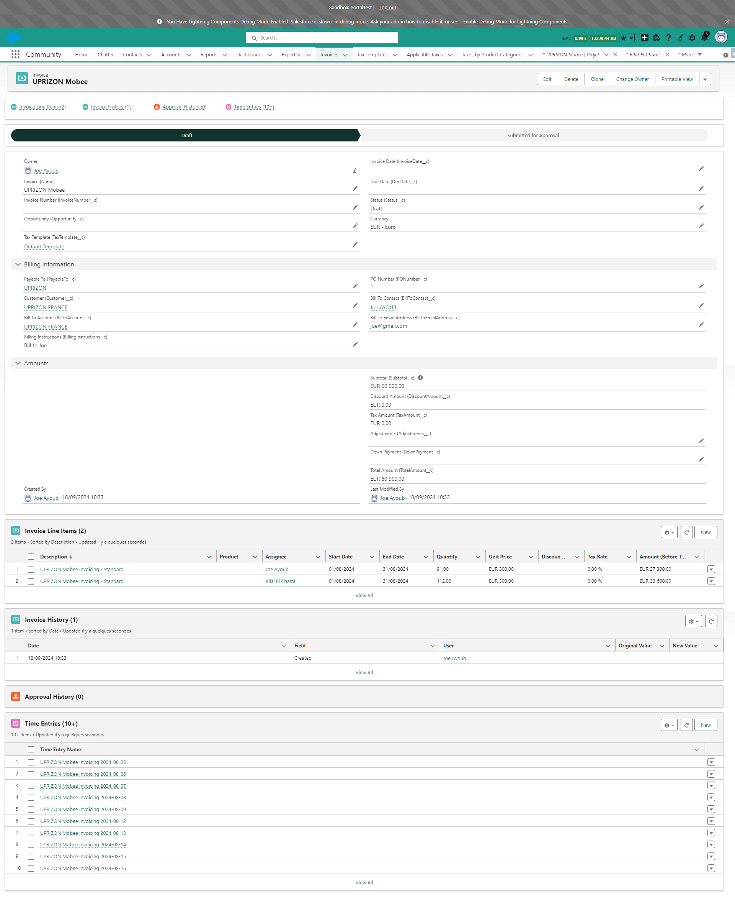

# Uso del Módulo Mobee de Facturación y Gestión de Facturas

Esta guía le explica cómo generar una factura a partir de un **Proyecto** utilizando el módulo Mobee de Facturación y Gestión de Facturas. Podrá crear una factura basada en las **Entradas de Tiempo** de las asignaciones del proyecto y enviarla para su aprobación.

---

### Paso 1: Acceder al Proyecto

1. Acceda al **Proyecto** desde el cual desea generar una factura.
2. Las **Asignaciones** relacionadas con este proyecto se usarán para calcular el monto de la factura.

   

---

### Paso 2: Ver las Asignaciones Relacionadas con el Proyecto

1. En la pestaña **Relacionado**, visualice las **Asignaciones** vinculadas al proyecto.
2. **Solo las asignaciones facturables y activas** se incluirán en el cálculo de la factura.
3. Estas asignaciones representan el trabajo que se facturará en la factura.

   

---

### Paso 3: Ver Entradas de Tiempo de una Asignación

1. Abra una de las **Asignaciones** para ver las **Entradas de Tiempo** registradas para ella.
2. **Las Entradas de Tiempo dentro del rango de fechas seleccionado** se sumarán para calcular el tiempo total de la asignación en la factura.
3. Estas **Entradas de Tiempo** se agregarán a la factura como **Elementos de Línea de Factura**.

   

---

### Paso 4: Generar la Factura

1. Regrese al **Proyecto** y haga clic en el botón **Generar Factura**.
2. Aparecerá una ventana emergente donde podrá seleccionar la **Fecha de Inicio** y la **Fecha de Fin** para el período que desea facturar.

   

---

### Paso 5: Seleccionar un Rango de Fechas

1. En la ventana emergente, seleccione la **Fecha de Inicio** y la **Fecha de Fin** para la factura. Por defecto, estas fechas estarán preestablecidas desde el inicio del mes anterior hasta el final del mes anterior.
2. **El rango de fechas seleccionado determinará qué Entradas de Tiempo se tomarán en cuenta para el cálculo de la factura.**
3. Haga clic en **Siguiente** para continuar.

   

---

### Paso 6: Factura Generada

1. Después de hacer clic en **Siguiente**, se creará la factura y se vinculará al proyecto.
2. Puede ver la factura recién generada en la lista **Relacionado** del **Proyecto**.

   

---

### Paso 7: Ver el Registro de la Factura

1. Abra la factura para ver sus detalles. La factura se crea con el estado **Borrador**, y las asignaciones del proyecto se enumeran como **Elementos de Línea de Factura**.
2. Revise la factura para asegurarse de que todos los detalles sean correctos.

   

---

### Paso 8: Enviar la Factura para Aprobación

1. Una vez revisada la factura, haga clic en el botón **Enviar para Aprobación** para enviarla al proceso de aprobación.
2. Después del envío, el estado de la factura cambiará a **Enviada para Aprobación**.

   

---

### Paso 9: Factura Aprobada

1. Una vez que la factura sea aprobada, su estado se actualizará a **Aprobada**, y se le asignará un **Número de Factura**.
2. El número de factura es generado por un Flow, que toma el último número de factura de la **Cuenta de Facturación** y lo incrementa para la nueva factura.
3. Si la factura es **rechazada** o **revocada**, su estado volverá a **Borrador**.

   

---

Al seguir estos pasos, podrá generar una factura, enviarla para su aprobación y obtener la factura final aprobada con un número único.

### Nota Importante:

Los cambios de estado descritos anteriormente (**Enviada para Aprobación**, **Aprobada** o **Borrador** en caso de rechazo/revocación) están determinados por el **Proceso de Aprobación** configurado en la sección anterior **Configuración y Parámetros**. Estos comportamientos pueden variar si el cliente ha modificado el proceso de aprobación.

---

## Funciones Adicionales para Facturas Aprobadas

Las siguientes funciones están disponibles para las facturas aprobadas, lo que optimiza la gestión de documentos y la comunicación por correo electrónico.

---

### Generación Automática de Documentos de Factura

1. Una vez que una factura sea aprobada, se generará automáticamente un documento basado en el modelo definido en la **Plantilla de Documento Mobee**.
2. Este documento se adjunta a la factura y puede encontrarse en la sección **Notas y Archivos Adjuntos** del registro de la factura.

   

---

### Generar un Documento de Factura

1. El botón **Generar un Documento de Factura** permite a los usuarios actualizar la versión del documento generado previamente.
2. Si se realizan cambios en la factura, al hacer clic en este botón se regenerará el documento de factura con los datos actualizados.

   

---

### Enviar la Factura por Correo Electrónico

1. El botón **Enviar la Factura por Correo Electrónico** abre un componente personalizado para enviar la factura por correo.
2. Las siguientes reglas se aplican para completar automáticamente los campos **Para** y **CC**:
   - **Para** se llena con la dirección de correo en el campo **Correo Electrónico del Destinatario**.
   - **CC** se llena con la dirección de correo del campo **Contacto del Destinatario**.
   - Si el campo **Correo Electrónico del Destinatario** está vacío:
     - **Para** se llena con la dirección de correo del **Contacto del Destinatario**.
     - **CC** queda vacío.
   - Si tanto **Correo Electrónico del Destinatario** como **Contacto del Destinatario** están vacíos:
     - Los campos **Para** y **CC** quedan vacíos.

3. Los archivos de la sección **Notas y Archivos Adjuntos** de la factura se agregan automáticamente como adjuntos al correo.
   - El usuario puede eliminar estos archivos o agregar otros archivos al correo si es necesario.

4. El usuario selecciona una **Plantilla de Correo Electrónico**, y se completan los siguientes campos:
   - **Asunto**: Completado automáticamente según la plantilla seleccionada, pero modificable por el usuario.
   - **Cuerpo**: Completado automáticamente según la plantilla seleccionada, pero modificable y personalizable por el usuario.

5. Una vez finalizados los detalles, el usuario puede enviar el correo directamente.

