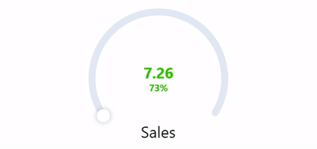

# Gauge Chart



## Descripción General

El componente Lightning Web Component (LWC) 'Gauge Chart' ofrece una herramienta de visualización dinámica e interactiva para mostrar indicadores de rendimiento dentro de Salesforce. Este componente está diseñado para representar datos en forma de gráfico circular, proporcionando a los usuarios una manera clara e intuitiva de evaluar el progreso hacia un objetivo o umbral. Al utilizar el Gauge Chart, los usuarios pueden monitorear eficazmente los indicadores clave de rendimiento (KPI) y tomar decisiones informadas basadas en insights visuales.

## ¿Cómo Funciona?

El Gauge Chart muestra los datos en un gráfico circular, con segmentos que representan diferentes métricas. El gráfico incluye:
- **Valor Actual**: El valor actual de la métrica.
- **Valor Objetivo**: El valor objetivo o umbral que se debe alcanzar para completar el 100% del gráfico.
- **Título** (Opcional): Un título específico para el gráfico, que proporciona contexto a los datos mostrados.
- **Subtítulo** (Opcional): Contexto o detalles adicionales sobre los datos mostrados.
- **Format Pipe** (Opcional): Una función para personalizar el formato de los valores mostrados (por ejemplo, formato de porcentaje).

## Uso

### Configuración del Flujo

Para usar el Gauge Chart, debe configurar un flujo en Salesforce que recupere los datos necesarios y los pase al LWC. Aquí le mostramos cómo hacerlo:

1. **Definir la Variable `ResultCollection`**:
   - En el Flow Builder, cree una nueva variable llamada `ResultCollection`.
   - Establezca el Tipo de Datos en `Texto`.
   - Asegúrese de que "Permitir múltiples valores (colección)" esté marcado.
   - Marcarla como "Disponible para salida" para que pueda ser accedida por el componente.

2. **Crear un Recurso de Fórmula**:
   - Cree un nuevo recurso de tipo `Fórmula`.
   - Establezca el Nombre de API en algo como `LaFormula`.
   - Establezca el Tipo de Datos en `Texto`.
   - Use el editor de fórmulas para construir su cadena JSON. Por ejemplo:
     ```plaintext
     '{"actualValue": "' + TEXT(5) + '", "targetValue": "' + TEXT(10) + '", "title": "Test"}'
     ```
   - Esta fórmula construye una cadena JSON con los valores especificados.

3. **Asignar la Fórmula a `ResultCollection`**:
   - Añada un elemento `Asignación` a su Flujo.
   - Establezca la variable `ResultCollection` en el valor del recurso de fórmula (`LaFormula`).
   - Asegúrese de que el operador esté configurado en `Agregar`.

4. **Guardar y Activar el Flujo**:
   - Guarde su Flujo.
   - Active el Flujo si no está ya activo.

---

### Uso de Consultas de Entrada

Alternativamente, puede usar consultas de entrada para proporcionar datos al Gauge Chart. Aquí le mostramos cómo:

1. **Definir las Consultas de Entrada**:
   - Cree una lista de consultas de entrada en forma de cadena JSON. Cada consulta debe incluir una clave (ID de referencia) y un valor (consulta SOQL).
   - Ejemplo:
     ```json
     [
       {"referenceId": "wonOpportunities", "query": "SELECT SUM(Amount) totalAmount FROM Opportunity WHERE IsWon = true"}
     ]
     ```

2. **Pasar las Consultas de Entrada al Componente**:
   - Use el atributo `inputQueries` del componente Gauge Chart para pasar la cadena JSON de las consultas de entrada.
   - El componente ejecutará esta consulta y usará los resultados para llenar el gráfico.

3. **Crear una Función de Transformación**:
   - Defina una función de transformación JavaScript en un archivo y súbala como un Recurso Estático en Salesforce. Esta función procesará los resultados de las consultas y los formateará para el Gauge Chart.
   - Ejemplo:
     ```javascript
     /* Todas las funciones deben definirse dentro del ámbito window.MobeeDynamicFunctions para funcionar con la aplicación móvil Mobee */

     window.MobeeDynamicFunctions = {
       calculateTotalWonAmount: (inputData) => {
         // Representa los datos de entrada recuperados por la referencia definida
         let wonOpportunities = inputData['wonOpportunities'];
         if (wonOpportunities && wonOpportunities.length) {
           const totalAmount = wonOpportunities[0].totalAmount;
           let gaugeDataItem = {
             actualValue: totalAmount,
             targetValue: 1000000, // Valor objetivo fijo para la comparación (por ejemplo, 1.000.000 $)
             title: "Monto Total Ganado",
             subtitle: "Contra el Objetivo de Venta",
           };
           return [gaugeDataItem];
         }
         return [];
       }
     }
     ```

4. **Subir el Archivo JavaScript como un Recurso Estático**:
   - En Salesforce, vaya a **Configuración**.
   - En el cuadro de búsqueda rápida, escriba **Recursos Estáticos** y seleccione **Recursos Estáticos**.
   - Haga clic en **Nuevo** para subir su archivo JavaScript que contiene la función de transformación.
   - Proporcione un nombre para el Recurso Estático (por ejemplo, `MyMobeeFunctions`) y suba el archivo.

5. **Definir la Función de Transformación**:
   - En la configuración de Mobee, establezca `Mobee Dynamic Function File Name` en el nombre del Recurso Estático que creó (por ejemplo, `MyMobeeFunctions`).
   - En el campo etiquetado **Nombre de la Función de Transformación JavaScript**, ingrese el nombre de la función que definió (por ejemplo, `calculateTotalWonAmount`).