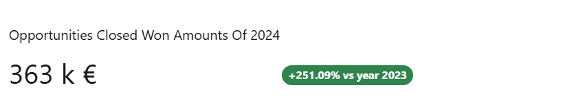

# Value Fluctuation Chart



## Descripción General

El componente Lightning Web Component (LWC) 'Value Fluctuation Chart' proporciona una herramienta de visualización clara y efectiva para mostrar datos comparativos dentro de Salesforce. Este componente está diseñado para representar datos en un formato que permite a los usuarios comparar fácilmente métricas a lo largo de diferentes períodos de tiempo. Al utilizar el Value Fluctuation Chart, los usuarios pueden evaluar rápidamente las fluctuaciones de rendimiento, identificar tendencias y tomar decisiones basadas en datos.

## ¿Cómo Funciona?

El Value Fluctuation Chart muestra datos en un formato comparativo, resaltando las fluctuaciones entre diferentes períodos de tiempo. El gráfico incluye:
- **Valor Actual**: El valor actual de la métrica para el período especificado.
- **Valor Anterior**: El valor de la métrica de un período anterior, utilizado para la comparación.
- **Título** (Opcional): Un título específico para el gráfico, que proporciona contexto a los datos mostrados.
- **Detalles de Fluctuación** (Opcional): Contexto adicional o detalles sobre la fluctuación que se muestra.
- **Format Pipe** (Opcional): Una función para personalizar el formato de los valores mostrados (por ejemplo, formato de moneda).

## Uso

### Configuración del Flujo

Para usar el Value Fluctuation Chart, debe configurar un flujo en Salesforce que recupere los datos necesarios y los pase al LWC. Aquí le mostramos cómo hacerlo:

1. **Definir la Variable `ResultCollection`**:
   - En el Flow Builder, cree una nueva variable llamada `ResultCollection`.
   - Establezca el Tipo de Datos en `Texto`.
   - Asegúrese de que "Permitir múltiples valores (colección)" esté marcado.
   - Marcarla como "Disponible para salida" para que pueda ser accedida por el componente.

2. **Crear un Recurso de Fórmula**:
   - Cree un nuevo recurso de tipo `Fórmula`.
   - Establezca el Nombre de API en algo como `LaFormula`.
   - Establezca el Tipo de Datos en `Texto`.
   - Use el editor de fórmulas para construir su cadena JSON. Por ejemplo:
     ```plaintext
     '{"actualValue": "' + TEXT(5) + '", "previousValue": "' + TEXT(10) + '", "title": "Test"}'
     ```
   - Esta fórmula construye una cadena JSON con los valores especificados.

3. **Asignar la Fórmula a `ResultCollection`**:
   - Añada un elemento `Asignación` a su Flujo.
   - Establezca la variable `ResultCollection` en el valor del recurso de fórmula (`LaFormula`).
   - Asegúrese de que el operador esté configurado en `Agregar`.

4. **Guardar y Activar el Flujo**:
   - Guarde su Flujo.
   - Active el Flujo si no está ya activo.

### Uso de Consultas de Entrada

Alternativamente, puede usar consultas de entrada para proporcionar datos al Value Fluctuation Chart. Aquí le mostramos cómo:

1. **Definir las Consultas de Entrada**:
   - Cree una lista de consultas de entrada en forma de cadena JSON. Cada consulta debe incluir una clave (ID de referencia) y un valor (consulta SOQL).
   - Ejemplo:
     ```json
     [
       {"referenceId": "opportunities", "query": "SELECT Id, Amount, CloseDate FROM Opportunity WHERE IsWon = true AND CloseDate != null"}
     ]
     ```

2. **Pasar las Consultas de Entrada al Componente**:
   - Use el atributo `inputQueries` del componente Value Fluctuation Chart para pasar la cadena JSON de las consultas de entrada.
   - El componente ejecutará esta consulta y usará los resultados para llenar el gráfico.

3. **Crear una Función de Transformación**:
   - Defina una función de transformación JavaScript en un archivo y súbala como un Recurso Estático en Salesforce. Esta función procesará los resultados de las consultas y los formateará para el Value Fluctuation Chart.
   - Ejemplo:
     ```javascript
     /* Todas las funciones deben definirse dentro del ámbito window.MobeeDynamicFunctions para funcionar con la aplicación móvil Mobee */

     window.MobeeDynamicFunctions = {
       opportunityFluctuation: (inputData) => {
         let opportunities = inputData['opportunities'];
         const result = [];
         let opportunitiesWithYear = opportunities.map((item) => {
           let dateYear = '';
           if (item.CloseDate) {
             dateYear = new Date(item.CloseDate).getFullYear();
           }
           let resultItem = { ...item };
           resultItem.CloseDateYear = dateYear;
           return resultItem;
         });

         const groupBy = (xs, key) => {
           return xs.reduce(function (rv, x) {
             (rv[x[key]] = rv[x[key]] || []).push(x);
             return rv;
           }, {});
         };
         let groupedData = groupBy(opportunitiesWithYear, 'CloseDateYear');
         let sumPreviousYear = 0;
         let currentYear = new Date().getFullYear() - 1;
         let previousYear = currentYear - 1;
         if (groupedData[currentYear]) {
           sumPreviousYear = groupedData[previousYear]
             .map((item) => item.Amount || 0)
             .reduce((previousValue, currentValue) => previousValue + currentValue, 0);
         }

         let sumCurrentYear = 0;
         if (groupedData[currentYear]) {
           sumCurrentYear = groupedData[currentYear]
             .map((item) => item.Amount || 0)
             .reduce((previousValue, currentValue) => previousValue + currentValue, 0);
         }

         // Calcular detalles de fluctuación
         let fluctuation = sumCurrentYear - sumPreviousYear;
         let fluctuationPercentage = (fluctuation / sumPreviousYear) * 100;

         result.push({
           actualValue: sumCurrentYear,
           previousValue: sumPreviousYear,
           title: 'Montos de Oportunidades Ganadas Cerradas de ' + currentYear,
           fluctuationDetails: `Diferencia: ${fluctuation.toFixed(2)} (${fluctuationPercentage.toFixed(2)}%) vs año ${previousYear}`,
           formatPipe: (actualValue) => {
             return new Intl.NumberFormat('fr-FR', {
               style: 'currency',
               currency: 'EUR',
               notation: 'compact',
             }).format(actualValue);
           },
         });
         return result;
       }
     }
     ```

4. **Subir el Archivo JavaScript como un Recurso Estático**:
   - En Salesforce, vaya a **Configuración**.
   - En el cuadro de búsqueda rápida, escriba **Recursos Estáticos** y seleccione **Recursos Estáticos**.
   - Haga clic en **Nuevo** para subir su archivo JavaScript que contiene la función de transformación.
   - Proporcione un nombre para el Recurso Estático (por ejemplo, `MyMobeeFunctions`) y suba el archivo.

5. **Definir la Función de Transformación**:
   - En la configuración de Mobee, establezca `Mobee Dynamic Function File Name` en el nombre del Recurso Estático que creó (por ejemplo, `MyMobeeFunctions`).
   - En el campo etiquetado **Nombre de la Función de Transformación JavaScript**, ingrese el nombre de la función que definió (por ejemplo, `opportunityFluctuation`).