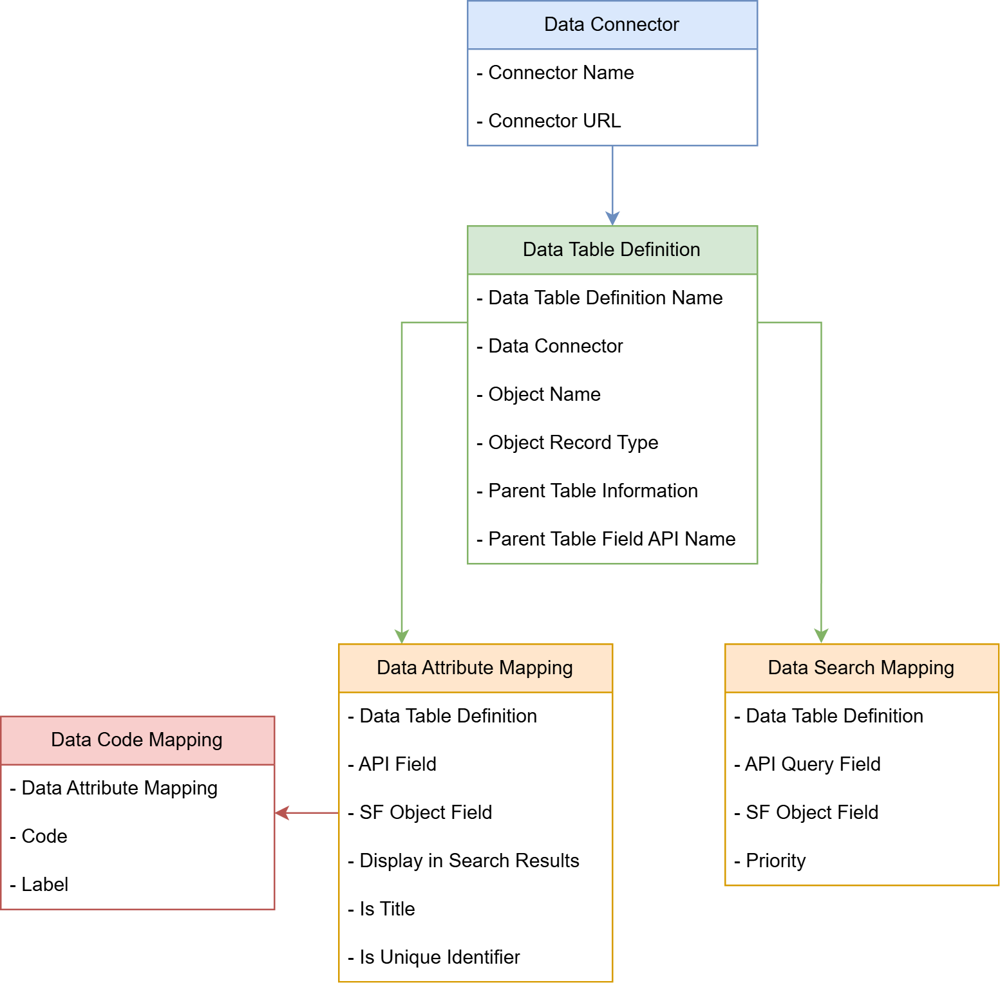
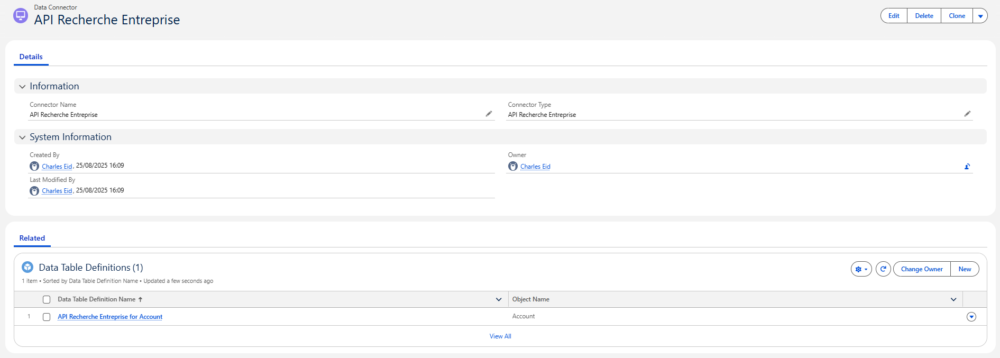
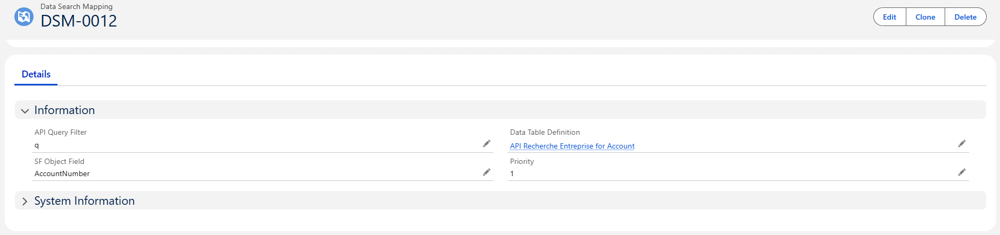

# Objetos Salesforce (Configuración de datos)

Para configurar y personalizar su Data Connector, utilizamos cuatro objetos. Estos le permiten definir cómo se comporta su conector, qué datos extrae y cómo se mapean a sus registros de Salesforce.

 

---

## 1. Data Connector

Este registro representa una API externa a la que desea conectarse.

| Etiqueta del campo | Nombre API | Tipo | Descripción |
|-----------------|--------------|----------|-----------------|
| **Connector Name** | `Name` | Texto | Un nombre descriptivo para el Data Connector |
| **Connector Type** | `Mobee__ConnectorType__c` | Lista de selección | Especifica el tipo de conector de la lista disponible (Ejemplo: "API Recherche Entreprise", "iRaiser Connector") |

📌 Cada Data Connector puede contener una o más "Data Table Definitions".

---

## 2. Data Table Definition

Este registro vincula el conector a un objeto Salesforce específico (como Cuentas, Contactos, etc.) y define cómo mostrar e interactuar con los datos.

| Etiqueta del campo | Nombre API | Tipo | Descripción |
|-----------------|--------------|----------|-----------------|
| **Data Table Definition Name** | `Name` | Texto | Una etiqueta descriptiva para esta configuración de tabla de datos |
| **Data Connector** | `Mobee__DataConnector__c` | Lookup | Referencia la configuración del Data Connector padre al que pertenece esta tabla |
| **Object Name** | `Mobee__ObjectName__c` | Texto | Nombre API del objeto Salesforce que estos datos rellenarán (Ejemplo: `Account`, `Contact`) |
| **Object Record Type** | `Mobee__ObjectRecordType__c` | Texto | Especifica el/los tipo(s) de registro a utilizar al manejar registros (opcional) |
| **Parent Table Definition** | `Mobee__ParentTableDefinition__c` | Lookup (Data Table Definition) | Vincula esta tabla a otra Data Table Definition para sincronización jerárquica padre-hijo (Ejemplo: Contact bajo Account) (opcional) |
| **Parent Table Field API Name** | `Mobee__ParentTableFieldAPIName__c` | Texto | Nombre API del campo de búsqueda utilizado para relacionar registros con el padre (Ejemplo: `AccountId`) (opcional) |

📌 Cada Data Table Definition puede incluir múltiples mapeos de atributos y búsqueda.

---

## 3. Data Attribute Mapping

Estos registros mapean campos de la API externa a campos de Salesforce, definen lo que se muestra en los resultados de búsqueda y permiten que los valores se prerrellenen al crear nuevos registros de Salesforce.

| Etiqueta del campo | Nombre API | Tipo | Descripción |
|-----------------|--------------|----------|-----------------|
| **Data Table Definition** | `Mobee__DataTableDefinition__c` | Lookup | La tabla relacionada a la que pertenece este mapeo |
| **SF Object Field** | `Mobee__SFObjectField__c` | Texto | El nombre API del campo Salesforce al que mapear el valor entrante |
| **API Field** | `Mobee__APIField__c` | Texto | El nombre del campo del sistema externo que se mapea |
| **Display in Search Results** | `Mobee__DisplayInSearchResults__c` | Casilla de verificación | Cuando está marcada, este campo aparece en la lista de resultados en la interfaz |
| **Is Title** | `Mobee__IsTitle__c` | Casilla de verificación | Cuando está marcada, este campo se utiliza como título principal en los resultados de búsqueda |
| **Is Unique Identifier** | `Mobee__IsUniqueIdentifier__c` | Casilla de verificación | Indica que este campo identifica de forma única el registro para la lógica de coincidencia/upsert |

📌 Use esto para controlar los resultados que ven los usuarios y qué valores se pasan a Salesforce.

---

## 4. Data Search Mapping

Estos registros definen los parámetros que los usuarios pueden aplicar para filtrar datos tanto en Salesforce como en la API al iniciar una búsqueda. Cada parámetro corresponde a un campo Salesforce y está vinculado a un parámetro de consulta API específico.

| Etiqueta del campo | Nombre API | Tipo | Descripción |
|-----------------|--------------|----------|-----------------|
| **Data Table Definition** | `Mobee__DataTableDefinition__c` | Lookup | La tabla relacionada a la que pertenece este parámetro de búsqueda |
| **SF Object Field** | `Mobee__SFObjectField__c` | Texto | El campo Salesforce mostrado en la barra de filtros |
| **API Query Filter** | `Mobee__APIQueryFilter__c` | Texto | El parámetro de consulta enviado a la API externa |
| **Priority** | `Mobee__Priority__c` | Número | Determina el orden para probar filtros si múltiples campos SF se mapean al mismo parámetro API |

📌 Use esto para definir qué opciones de filtrado aparecen en la parte superior de la pantalla de búsqueda.

---

## 5. Data Code Mapping

Los registros **Data Code Mapping** establecen la capa de traducción entre los códigos sin procesar devueltos por la API externa y los valores estandarizados mostrados a los usuarios. Cada mapeo está vinculado a un **Data Attribute Mapping** (la definición del campo) y juntos forman un diccionario de Código → Etiqueta. Esto garantiza que los usuarios vean etiquetas claras y legibles en lugar de códigos técnicos, manteniendo la consistencia interna en campos como clasificaciones, estados u otros datos codificados.

| Etiqueta del campo | Nombre API | Tipo | Descripción |
|-----------------|--------------|----------|-----------------|
| **Data Attribute Mapping** | `Mobee__DataAttributeMapping__c` | Lookup | El atributo al que pertenece este mapeo de código (clave de agrupación) |
| **Code** | `Mobee__Code__c` | Texto | El código sin procesar recibido de la API externa |
| **Label** | `Mobee__Label__c` | Texto | El valor legible mostrado en Salesforce |

📌 Use este objeto para traducir códigos de la API externa en etiquetas legibles y mantener valores consistentes en la interfaz y lógica del Data Connector.

---
