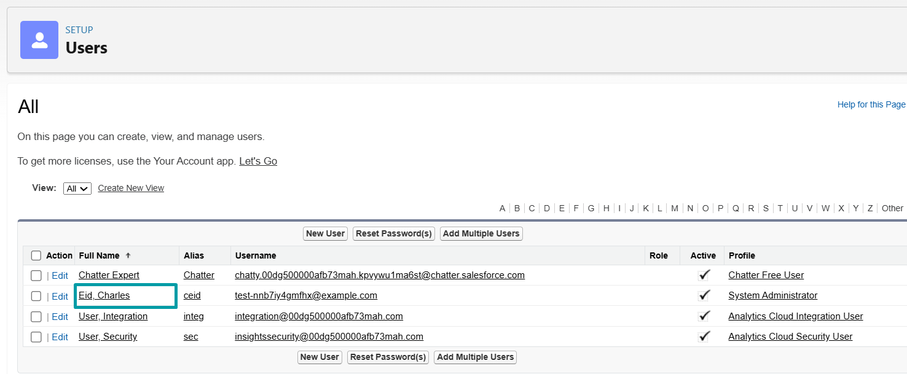
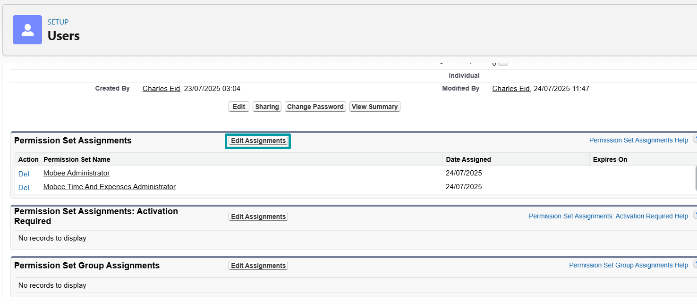
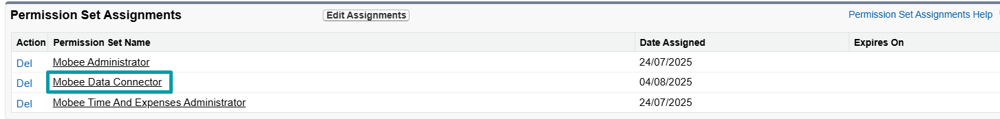
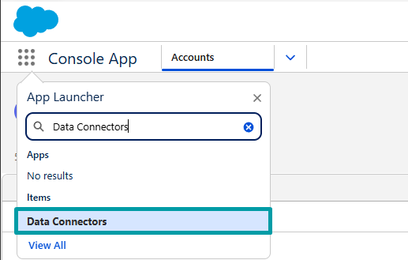

# Configuración del Data Connector

## Descripción general

Esta guía cubre cómo configurar los Data Connectors en Salesforce. Hay dos niveles de configuración:

1. [**Configuración general**](3-data-connector-module-configuration.md#configuración-general-1) – Se aplica a todos los data connectors

2. [**Configuración específica del conector**](3-data-connector-module-configuration.md#configuración-específica-del-conector) – Se aplica a conectores individuales como `Recherche Entreprise`, `iRaiser Connector`, etc.

---

## Configuración general

Estos pasos deben completarse para cada data connector:

1. **Asignar Permission Sets** – Dar acceso a los usuarios.
2. **Crear un Data Connector** – Definir el conector y su tipo.

---

## Acceso y permisos

Para garantizar que el módulo funcione correcta y seguramente, se debe otorgar a los usuarios acceso a los componentes clave:

### Permission Set: `Mobee Data Connector`

Asigne este permission set a todos los usuarios que utilizarán el Data Connector. Incluye:

- Acceso a las clases Apex utilizadas por el conector
- Acceso a los Lightning Web Components (LWC)
- Acceso a las external credentials utilizadas por las named credentials que dependen de ellas
- Permisos de objetos y campos (lectura/creación en los objetos del conector)

> ❗ Sin este permission set, los usuarios encontrarán errores de autorización al intentar usar el conector.

#### Pasos para asignar el Permission Set

1. **Vaya a Setup → Users**
   
 

2. **Vaya al usuario deseado**
   
 

3. **En la página de detalle del usuario, desplácese hasta Permission Set Assignments → Haga clic en "Edit Assignments"**
   
 

4. **Seleccione `Mobee Data Connector` de la lista a la izquierda → Haga clic en "Add" → Guarde**
   
 

5. **Verifique que el permission set ahora aparece en las asignaciones del usuario**
   
 

---

## Crear un [Data Connector](2-data-connector-module-custom-objects.md#1-data-connector)

1. **Abra la pestaña Data Connector**
   - En el Salesforce App Launcher, busque **Data Connectors**.

   

2. **Cree un nuevo Data Connector**
   - Haga clic en **New**.

   

3. **Complete los detalles del conector**
   - Ingrese un **Connector Name**
   - Seleccione el **Connector Type** apropiado

   

📌 Después de guardar, su conector está listo para ser vinculado a definiciones de tablas y mapeos.

---

## Configuración específica del conector

Una vez completados los pasos anteriores, continúe con la guía de configuración de su conector específico:

| Data Connector | Documentación |
|----------------|--------------|
| **Recherche Entreprise** | [Ver guía](./5-dcm-recherche-entreprise-configuration.md) |
| **iRaiser** | *(Próximamente)* |

📌 Cada conector puede requerir pasos de configuración adicionales dependiendo de su estructura API y caso de uso empresarial.

---
