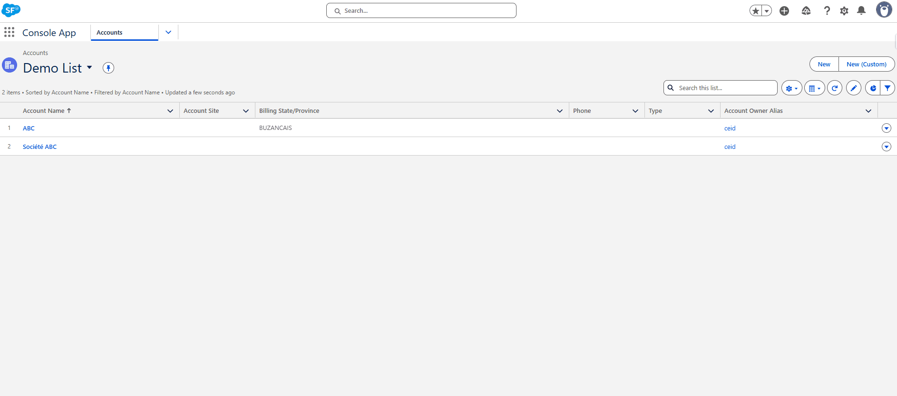

# Recherche Entreprise

## Introducción

El conector **Recherche Entreprise** permite a los usuarios de Salesforce buscar empresas francesas en tiempo real, recuperar información comercial verificada de bases de datos nacionales oficiales (incluido el registro SIRENE operado por el INSEE y otras fuentes gubernamentales), y luego poblar registros de Salesforce de manera eficiente. Utiliza reglas de mapeo configurables para determinar cómo aparecen los resultados y dónde se almacenan los datos en Salesforce.

🌐 Documentación de la API: https://recherche-entreprises.api.gouv.fr/docs/

> ✅ Caso de uso típico: Crear o enriquecer rápidamente registros de **Cuenta** (Account) con información oficial de empresas.

**Demo** — Cómo funciona el conector

La siguiente demo ilustra cómo un usuario puede buscar una empresa, verificar registros existentes en Salesforce y crear un nuevo registro de empresa con información recuperada desde la API.

---

## ¿Cómo funciona?

### Autenticación

El conector Recherche Entreprise utiliza autenticación segura para acceder a la API externa.

La autenticación se gestiona automáticamente mediante una configuración de **Named Credential + External Credential** entregada con la solución.
Esto garantiza un acceso seguro a la fuente de datos empresariales sin que el administrador necesite configurar manualmente la seguridad de la API.

> ℹ️ *No se requiere configuración de autenticación del lado del cliente — las credenciales están empaquetadas y mantenidas por el implementador.*

### Cinco objetos personalizados

Para permitir que la API Recherche Entreprise interactúe con Salesforce, necesita configurar el conector utilizando cuatro objetos personalizados principales. Estos objetos definen el conector, el destino en Salesforce, los campos a mapear y los filtros de búsqueda:

- **[Data Connector](3-data-connector-module-configuration.md#create-a-data-connector)** – Representa la conexión a la API externa definiendo el tipo de conector.
- **[Data Table Definition](5-dcm-recherche-entreprise-configuration.md#data-table-definition)** – Vincula el conector a un objeto Salesforce específico (Ejemplo: Account) y opcionalmente a tipos de registro específicos. Esto determina dónde se aplicarán los datos de la API.
- **[Data Attribute Mapping](5-dcm-recherche-entreprise-configuration.md#search-results-display)** – Mapea campos de la respuesta de la API externa a campos de Salesforce, definiendo cómo se importan los datos a los registros de Salesforce.
- **[Data Search Mapping](5-dcm-recherche-entreprise-configuration.md#filters--search-inputs)** – Define los parámetros de búsqueda y filtros utilizados para consultar la API externa, controlando cómo y qué datos se recuperan.
- **[Data Code Mapping](5-dcm-recherche-entreprise-configuration.md#data-code-mapping)** – Define la capa de traducción entre los códigos sin procesar de la API externa y los valores estandarizados internos. Cada mapeo vincula un código a una etiqueta legible, asegurando una normalización consistente para listas de selección, menús desplegables, campos de estado, etc.

### Lightning Web Component [(LWC)](5-dcm-recherche-entreprise-configuration.md#lightning-web-component-data-connector)

En el núcleo del conector hay un **Lightning Web Component** reutilizable que proporciona la interfaz de búsqueda y la experiencia de previsualización de datos.

El componente se adapta dinámicamente a la configuración:

- **Data Connector Type** — determina qué API externa llamar, en este caso la `API Recherche Entreprise`
- **Salesforce Object Name** — define dónde se almacenarán los datos (Ejemplo: `Account`)
- **Mapeos de campos y filtros de búsqueda** — controlan los campos de búsqueda, la visualización de resultados y el poblamiento de registros

> 💡 El componente puede utilizarse en vistas de lista, páginas de registro, o abrirse mediante botones o pestañas personalizadas, según su configuración.

---
