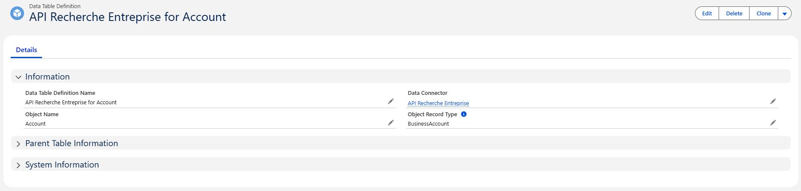
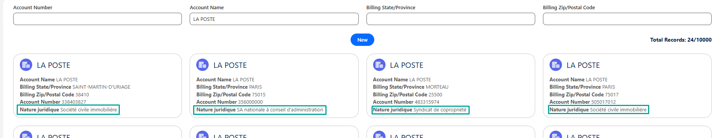

# Configuración de Recherche Entreprise

## Descripción general

> ⚠️ **Prerrequisito:** Antes de configurar este conector, asegúrese de que la **Configuración general** esté completada.
> Consulte [Configuración general](3-data-connector-module-configuration.md) para los pasos de asignación de permission sets y creación de un Data Connector.

1. [**Crear la Data Table Definition**](5-dcm-recherche-entreprise-configuration.md#data-table-definition) – Vincular el conector a un objeto Salesforce.
2. [**Configurar los filtros y entradas de búsqueda**](5-dcm-recherche-entreprise-configuration.md#filtros-y-entradas-de-búsqueda) – Definir filtros para buscar datos externos creando Data Search Mappings.
3. [**Configurar la visualización de resultados**](5-dcm-recherche-entreprise-configuration.md#visualización-de-resultados-de-búsqueda) – Definir cómo los datos de respuesta se mapean a campos de Salesforce creando Data Attribute Mappings.
4. [**Configurar los mapeos de códigos (si es necesario)**](5-dcm-recherche-entreprise-configuration.md#data-code-mapping) – Traducir códigos sin procesar de la API en etiquetas legibles para que los usuarios vean valores significativos en lugar de códigos, creando Data Code Mappings.
5. [**Agregar el Lightning Web Component**](5-dcm-recherche-entreprise-configuration.md#lightning-web-component-data-connector) – Integrar la interfaz donde los usuarios la necesiten.

En la siguiente sección, examinaremos más de cerca cada uno de estos pasos de configuración y cómo los diferentes componentes funcionan juntos para alimentar el data connector `Recherche Entreprise`.

---

## Data Table Definition

Como se describe en la sección [Data Table Definition](2-data-connector-module-custom-objects.md#2-data-table-definition), esta configuración vincula un Data Connector a un objeto Salesforce.

##### Ejemplo



### Crear la Data Table Definition

La Data Table Definition determina qué objeto Salesforce el conector buscará y enriquecerá.
Para el conector **Recherche Entreprise**, lo configuraremos en el objeto **Account** — sin embargo, tenga en cuenta que el conector está diseñado para admitir otros objetos también si es necesario.

#### Campos requeridos a completar

| Campo | Significado | Valor a definir |
|-------|--------|--------------------------|
| **Data Connector** | Vincula esta definición de tabla al conector que creó anteriormente | Seleccione su conector *Recherche Entreprise* |
| **Object Name** | El objeto Salesforce donde la API creará o actualizará registros | Escriba el nombre API del objeto. *Ejemplo:* `Account` o `Company__c` |
| **Object Record Type** *(opcional)* | Limita las llamadas API externas a los tipos de registro especificados. Otros tipos de registro aún pueden abrir el componente pero solo buscarán en Salesforce (sin llamada API). | Solo si su objeto tiene tipos de registro. **Developer Names** separados por comas. |

> 💡 Si su org **no** utiliza tipos de registro en el objeto designado, deje **Object Record Type** vacío.
> 🛑 Al completar **Object Record Type**, ingrese el **Developer Name**, no la etiqueta.
> Ejemplo: `Business_Account, NGO_Account`

#### Ejemplo de configuración

| Campo | Valor de ejemplo |
|-------|---------------|
| Data Connector | *Recherche Entreprise* |
| Object Name | `Account` |
| Object Record Type | `Business_Account, PersonAccount` |

#### Pasos

1. Vaya a **Data Table Definitions**
2. Haga clic en **New**
3. Complete los campos como se describe arriba
4. Guarde el registro


---

## Filtros y entradas de búsqueda

### Vista previa

La barra de filtros mostrada en la parte superior del componente se genera a partir de los registros **Data Search Mapping**.


Cada filtro está vinculado a un campo Salesforce y a un parámetro de consulta API, ofreciendo a los usuarios una forma dinámica y guiada de buscar.

### Cómo configurar filtros (Guía técnica 🛠️)

Cada filtro se define en un registro **Data Search Mapping** y requiere dos valores clave:

| Campo | Significado | Valor a definir |
|----------|-------------|------------------|
| **Data Table Definition** | Vincula este filtro de búsqueda a la definición de tabla de datos correspondiente | Seleccione el registro *Data Table Definition* relacionado |
| **SF Object Field** | Campo Salesforce cuyo valor se utilizará como entrada de búsqueda | Developer Name del campo (Ejemplo: `Name`, `AccountNumber`) |
| **API Query Filter** | Parámetro de consulta que la API externa espera para la búsqueda | Nombre del parámetro API (Ejemplo: `q`, `code_postal`) |
| **Priority** | Determina el orden en que se evalúan múltiples mapeos de búsqueda para el mismo parámetro de consulta API. Los números más bajos se prueban primero, asegurando que el mapeo más importante o específico se aplique antes que los demás. Esta prioridad solo afecta a los mapeos que comparten el mismo parámetro; todos los demás parámetros siempre se incluyen en la solicitud. | `1`, `2`, `3`, etc. |

> 💡 **Caso de uso de la prioridad:**
> Si dos mapeos comparten el mismo parámetro de consulta (Ejemplo: `q`), uno mapeado al **Número de cuenta** (prioridad 1) y el otro al **Nombre de cuenta** (prioridad 2), el conector primero intentará la búsqueda usando el Número de cuenta. Si no se encuentran resultados, reintentará automáticamente usando el Nombre de cuenta.

#### 1. Configurar el SF Object Field en el Data Search Mapping

- Este es el nombre API interno del campo Salesforce que desea que el usuario complete.
- Debe existir en el objeto asociado a su Data Table Definition.
- Puede encontrarlo en **Object Manager → [Su Objeto] → Fields & Relationships**.

📌 <u>*Ejemplo:*</u>

Para permitir a los usuarios buscar cuentas usando su `Nombre de cuenta`, configure el **SF Object Field** como `Name`:


#### 2. Configurar el API Query Filter en el Data Search Mapping

- Este valor proviene de la **documentación de la API externa**.
- Le indica qué parámetros de cadena de consulta admite la API para filtrar.
- Estos parámetros **no se encuentran en la respuesta**, sino en la **solicitud** — generalmente documentados bajo "search", "filter" o "GET parameters".

📌 <u>*Ejemplo:*</u>

Si la API permite búsqueda general usando un parámetro `q`, y desea permitir a los usuarios buscar por Nombre de cuenta, configure el **API Query Filter** como `q`


> La solicitud final se verá algo así:
> `https://external-api.com/search?q=ABC`

#### 3. Ejemplo de registros Data Search Mapping


---

## Visualización de resultados de búsqueda

### Vista previa

Las columnas mostradas en la lista de resultados de búsqueda se definen mediante registros **Data Attribute Mapping**.


> 💡 Solo los campos con **Display in Search Results** marcado aparecerán aquí. Cuando un usuario selecciona un resultado, los campos mapeados se utilizan para poblar el registro de Salesforce.

### Cómo configurar atributos de resultado (Guía técnica 🛠️)

Cada atributo de resultado se define en un registro **Data Attribute Mapping** con los campos clave:

| Campo | Significado | Valor a definir |
|-------|--------|-------------|
| **Data Table Definition** | Vincula este mapeo a la definición de tabla de datos correspondiente | Seleccione el registro *Data Table Definition* relacionado |
| **SF Object Field** | Campo Salesforce donde se almacenará el valor | Developer Name del campo (Ejemplo: `Name`, `AccountNumber`) |
| **API Field** | Ruta del campo desde la respuesta de la API externa | Ruta del campo JSON de la API (Ejemplo: `siren`, `siege.code_postal`) |
| **Display in Search Results** | Indica si este campo debe ser visible en las listas de resultados de búsqueda | Marcado o desmarcado |
| **Is Title** | Marca este campo como título principal en los resultados de búsqueda | Marcado o desmarcado |

#### 1. Configurar el SF Object Field en el Data Attribute Mapping

- Este es el nombre API interno del campo Salesforce que desea que el usuario complete.
- Debe existir en el objeto asociado a su Data Table Definition.
- Puede encontrarlo en **Object Manager → [Su Objeto] → Fields & Relationships**.

📌 <u>*Ejemplo:*</u>

Para mapear el campo `Número de cuenta`, configure el **SF Object Field** como `AccountNumber`:


#### 2. Configurar el API Field en el Data Attribute Mapping

Este es el nombre exacto del campo (o ruta) tal como lo devuelve la API externa.

- Use **notación de puntos** para acceder a objetos anidados.
- Asegúrese de que el campo exista en el objeto del array `results`.

📌 <u>*Ejemplo:*</u>

<details>
<summary>Ver respuesta JSON de la API</summary>

```json
Ejemplo de respuesta API:

{
  "results": [
    {
      "siren": "123456789",
      "nom_complet": "Dummy Company",
      "nom_raison_sociale": "DUMMY COMPANY SARL",
      "sigle": null,
      "nombre_etablissements": 10,
      "nombre_etablissements_ouverts": 8,
      "siege": {
        "activite_principale": "00.00X",
        "activite_principale_registre_metier": null,
        "annee_tranche_effectif_salarie": "2023",
        "adresse": "1 RUE EXEMPLE 75001 PARIS",
        "caractere_employeur": "O",
        "cedex": null,
        "code_pays_etranger": null,
        "code_postal": "75001",
        "commune": "75001",
        "complement_adresse": "DIRECTION GENERALE",
        "date_creation": "2020-01-01",
        "date_fermeture": null,
        "date_debut_activite": "2020-02-01",
        "date_mise_a_jour": "2025-01-01T00:00:00",
        "departement": "75",
        "distribution_speciale": null,
        "est_siege": true,
        "etat_administratif": "A",
        "geo_id": "75001_0001",
        "indice_repetition": null,
        "latitude": "48.8566",
        "libelle_cedex": null,
        "libelle_commune": "PARIS 1",
        "libelle_commune_etranger": null,
        "libelle_pays_etranger": null,
        "libelle_voie": "RUE EXEMPLE",
        "liste_enseignes": ["DUMMY COMPANY"],
        "liste_finess": ["000000001"],
        "liste_idcc": ["0001"],
        "liste_id_bio": ["0001"],
        "liste_rge": ["RGE001"],
        "liste_uai": ["UAI001"],
        "longitude": "2.3522",
        "nom_commercial": null,
        "numero_voie": "1",
        "region": "11",
        "epci": "000000001",
        "siret": "12345678900001",
        "statut_diffusion_etablissement": "O",
        "tranche_effectif_salarie": "5",
        "type_voie": "RUE"
      },
      "date_creation": "2020-01-01",
      "date_fermeture": null,
      "tranche_effectif_salarie": "5",
      "annee_tranche_effectif_salarie": "2023",
      "date_mise_a_jour": "2025-01-01",
      "categorie_entreprise": "SME",
      "caractere_employeur": "O",
      "annee_categorie_entreprise": "2023",
      "etat_administratif": "A",
      "nature_juridique": "1234",
      "activite_principale": "00.00X",
      "section_activite_principale": "A",
      "statut_diffusion": "O",
      "matching_etablissements": [
        {
          "activite_principale": "00.00X",
          "adresse": "2 RUE TEST 75001 PARIS",
          "annee_tranche_effectif_salarie": "2023",
          "ancien_siege": false,
          "caractere_employeur": "O",
          "code_postal": "75001",
          "commune": "75001",
          "date_creation": "2020-02-01",
          "date_debut_activite": "2020-02-01",
          "date_fermeture": null,
          "epci": "000000001",
          "est_siege": false,
          "etat_administratif": "A",
          "geo_id": "75001_0002",
          "latitude": "48.8566",
          "libelle_commune": "PARIS 1",
          "liste_enseignes": ["DUMMY COMPANY"],
          "liste_finess": ["000000002"],
          "liste_idcc": ["0002"],
          "liste_id_organisme_formation": ["OF001"],
          "liste_id_bio": ["0002"],
          "liste_rge": ["RGE002"],
          "liste_uai": ["UAI002"],
          "longitude": "2.3522",
          "nom_commercial": null,
          "region": "11",
          "siret": "12345678900002",
          "statut_diffusion_etablissement": "O",
          "tranche_effectif_salarie": "3"
        }
      ],
      "dirigeants": [
        {
          "nom": "Doe",
          "prenoms": "Jane",
          "annee_de_naissance": "1980",
          "date_de_naissance": "1980-06",
          "qualite": "Directeur général",
          "nationalite": "Française",
          "type_dirigeant": "personne physique"
        }
      ],
      "finances": {
        "2023": {
          "ca": 1000000,
          "resultat_net": 100000
        }
      },
      "complements": {
        "collectivite_territoriale": {
          "code_insee": "01",
          "code": "01",
          "niveau": "département",
          "elus": [
            {
              "nom": "Smith",
              "prenoms": "Alice",
              "annee_de_naissance": "1975",
              "fonction": "Maire",
              "sexe": "F"
            }
          ]
        },
        "convention_collective_renseignee": true,
        "liste_idcc": ["0001"],
        "egapro_renseignee": true,
        "est_achats_responsables": true,
        "est_alim_confiance": true,
        "est_association": false,
        "est_bio": true,
        "est_entrepreneur_individuel": false,
        "est_entrepreneur_spectacle": false,
        "est_ess": false,
        "est_finess": false,
        "est_organisme_formation": true,
        "est_patrimoine_vivant": true,
        "est_qualiopi": true,
        "liste_id_organisme_formation": ["OF001"],
        "est_rge": false,
        "est_siae": false,
        "est_service_public": false,
        "est_l100_3": false,
        "est_societe_mission": false,
        "est_uai": false,
        "bilan_ges_renseigne": false,
        "identifiant_association": null,
        "statut_bio": true,
        "statut_entrepreneur_spectacle": "string",
        "type_siae": "string"
      }
    }
  ],
  "total_results": 0,
  "page": 1,
  "per_page": 10,
  "total_pages": 1000
}
```

</details>

| SF Object Field | API Field |
|-----------|-------------------|
| AccountNumber | `siren` |
| Name | `nom_raison_sociale` |
| BillingPostalCode | `siege.code_postal` |
| MainActivityCode__c | `siege.activite_principale` |

##### Comprender la diferencia entre `nom_complet` y `nom_raison_sociale`

Al mapear el nombre de una empresa o establecimiento, la API Recherche Entreprise proporciona dos campos diferentes. Seleccionar el correcto depende del tipo de entidad con la que está tratando.

**`nom_complet`**
- El nombre de visualización por defecto devuelto por la API.
- Siempre rellenado tanto para **entidades individuales** (autónomos) como para **entidades jurídicas** (empresas).

**`nom_raison_sociale`**
- El nombre legal oficial de la empresa (también llamado *razón social* o *denominación social*).
- Solo rellenado para **entidades jurídicas** (SAS, SARL, SA, asociaciones, etc.).

En la mayoría de los casos, `nom_complet` es el campo más seguro para mapear cuando desea un comportamiento consistente en todos los tipos de entidad. Use `nom_raison_sociale` solo si necesita específicamente el nombre legal corporativo en contextos exclusivos de empresas.

#### 3. Ejemplo de registros Data Attribute Mapping


---

## Data Code Mapping

### Propósito

Los registros Data Code Mapping definen la capa de traducción entre los códigos sin procesar devueltos por la API **Recherche Entreprise** (como la *Nature Juridique*, o la *Activité Principale*) y sus etiquetas. Esto garantiza que los usuarios vean valores significativos en lugar de códigos crípticos.

### Vista previa

Los resultados de búsqueda muestran etiquetas legibles para el campo `Nature Juridique` en lugar de los códigos sin procesar devueltos por la API.



### Cómo configurar el Data Code Mapping (Guía técnica 🛠️)

Cada registro **Data Code Mapping** está conectado mediante un lookup a un registro **Data Attribute Mapping**. Cuando varios registros **Data Code Mapping** están vinculados al mismo **Data Attribute Mapping**, crean colectivamente un diccionario de **Código → Etiqueta** que se utiliza para mostrar valores significativos a los usuarios y poblar campos de Salesforce con las etiquetas.

Cada registro **Data Code Mapping** incluye los siguientes campos clave:

| Campo | Significado | Valor a definir |
|-------|---------|--------------|
| **Data Attribute Mapping** | Vincula este mapeo de código al campo Salesforce donde se utilizará la etiqueta | Seleccione el registro *Data Attribute Mapping* relacionado |
| **Code** | El código exacto recibido de la API Recherche Entreprise | Ejemplo: `A`, `I`, `4711D`, `GE` |
| **Label** | Significado legible del código | Ejemplo: `Actif`, `Inactif`, `Société commerciale`, `Entrepreneur individuel` |

#### 1. Identificar el código en la respuesta API

La API Recherche Entreprise contiene varios campos codificados como:

- `activite_principale`
- `etat_administratif`
- `nature_juridique`
- `tranche_effectif_salarie`
- `categorie_entreprise`

**Ejemplo de fragmento de respuesta API:**

```json
{
  "activite_principale": "4711D",
  "etat_administratif": "A",
  "nature_juridique": "5499",
  "tranche_effectif_salarie": "3",
  "categorie_entreprise": "SME"
}
```

#### 2. Crear los registros Data Code Mapping correspondientes

##### <u>Fuente</u>

La API **Recherche Entreprise** proporciona nomenclaturas oficiales para muchos de sus campos codificados, como *Nature Juridique* o *Activité Principale – NAF*. Estas nomenclaturas son publicadas por el **INSEE** y están disponibles en formato Excel, conteniendo las tablas completas de pares **Código → Etiqueta**:

🌐 https://www.insee.fr/fr/information/2016811

Puede usar estos archivos oficiales para poblar sus registros Data Code Mapping. Esto garantiza que:

- Todos los códigos posibles estén cubiertos
- Las etiquetas sean precisas y estandarizadas
- Los usuarios siempre vean la terminología correcta definida por el INSEE

> 💡 Se recomienda encarecidamente usar las nomenclaturas oficiales al configurar mapeos para campos como `nature_juridique`, `activite_principale`, o cualquier otro atributo codificado devuelto por la API Recherche Entreprise.

##### <u>Método de importación</u>

El método más eficiente es preparar sus mapeos en una hoja de cálculo en formato CSV e importarlos a Salesforce usando una de las herramientas de importación masiva disponibles.

Este es el proceso recomendado:

1. **Descargue el archivo Excel de nomenclatura del INSEE** para el campo codificado que desea configurar.
<br/>

2. **Abra el archivo Excel** y manipúlelo para prepararlo para la importación:
   - Limpie las filas que no constituyan un par **Código → Etiqueta**
   - Agregue una nueva columna que represente el **Data Attribute Mapping**
   - Complete esta columna con el **Name** (o Id) del **Data Attribute Mapping** al que pertenecen estos códigos.
  **N.B:** Los títulos de las columnas no son importantes ya que se mapearán con campos de Salesforce durante la importación.
<br/>

3. **Guarde el archivo como CSV**
<br/>

4. **Abra el Salesforce Data Import Wizard** y seleccione su objeto **Data Code Mapping**.
<br/>

5. **Cargue su CSV**, y durante el mapeo de campos:
   - Mapee la columna INSEE *Code* → `Code__c`
   - Mapee la columna INSEE *Libellé* → `Label__c`
   - Mapee su nueva columna → `DataAttributeMapping__c`
<br/>

6. **Ejecute la importación** y verifique los registros en Salesforce.

#### 3. Ejemplo de registros Data Code Mapping


---

## Lightning Web Component: `Data Connector`

- Interfaz personalizada donde los usuarios:
  - Ingresan términos de búsqueda (usando los filtros mapeados)
  - Visualizan datos externos (basados en los atributos mapeados)
  - Seleccionan e importan registros a Salesforce

> 💡 Este componente está controlado por configuración — utiliza los datos y mapeos definidos en el **Data Connector**, la **Data Table Definition**, los **Data Attribute Mappings** y los **Data Search Mappings** para funcionar.

### Agregar el componente como botón de vista de lista

El Data Connector puede lanzarse directamente desde un botón de vista de lista, dando a los usuarios acceso rápido al componente sin navegar por otros menús.

En esta guía, ilustraremos cómo habilitar el Data Connector para cualquier objeto creando la Lightning Page, la pestaña Lightning y el botón de vista de lista requeridos.

#### 1. Creación de la Lightning Page

1. Vaya a **Setup** → **Lightning App Builder** y haga clic en **New**
   

2. Elija **App Page** como tipo
   

3. Cree y configure la página

4. Agregue el componente **Data Connector** a la página y configure sus parámetros, luego guarde y active
   

#### 2. Crear / Verificar la pestaña Lightning

1. Desde **Setup**, busque **Tabs**
2. Desplácese hasta **Lightning Page Tabs**
3. Verifique si ya se creó una pestaña para su Lightning Page *(3a)*
4. Si no, cree una nueva pestaña y vincúlela a la página *(3b)*
   

#### 3. Crear un botón de vista de lista

1. Vaya a **Object Manager** y abra el objeto donde desea exponer el Data Connector (Ejemplo: **Account**, **Contact**)
   

2. Vaya a **Buttons, Links, and Actions** → **New Button or Link**
   

3. Elija **List Button** como tipo de visualización

4. En la URL, referencie la pestaña Lightning que creó
   _Ejemplo:_ `/lightning/n/Mobee__TestingNewLightningPage`

   > **Nota:** Marcar **Display Checkboxes (for Multi-Record Selection)** puede causar problemas dentro de una **Console App**. Deje esta opción desmarcada a menos que la selección de múltiples registros sea específicamente requerida fuera de un contexto de Console App.

   

5. Guarde el botón

#### 4. Agregar el botón a la vista de lista

1. Edite el **diseño de botones de vista de lista** (List View Button Layout).


2. En la lista **Available Buttons**, localice **New** y muévalo a la sección **Selected Buttons**.


3. El botón **New** ahora aparecerá en la vista de lista de cuentas, lanzando la página de creación de cuentas alimentada por el **Data Connector**.

Ahora, cuando los usuarios abran la vista de lista de ese objeto, verán su botón personalizado. Al hacer clic, se abrirá el Data Connector en la Lightning Page que asignó.

👉 Siguiendo este enfoque, puede replicar el ejemplo de **Account** para cualquier otro objeto que necesite el Data Connector. La configuración de Account sirve como plantilla, pero es libre de extenderla en toda su org.

---
