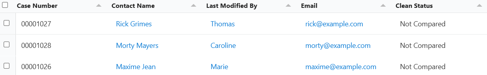

# Configuración del módulo Data Table

## Descripción

El componente Lightning Web "Mobee Data Table" (LWC) proporciona una tabla robusta, configurable y de alto rendimiento para mostrar registros de Salesforce. Admite columnas dinámicas, campos de relación, multi-moneda, selección de filas e integración fluida con Flows de Salesforce.

## ¿Cómo funciona?
Mobee Data Table construye dinámicamente sus columnas y consultas según la configuración y los metadatos. Admite:

- **Columnas dinámicas:** Especifique cualquier campo de Salesforce, incluidos los campos de relación (ej.: `Account.Name`).
- **Multi-moneda:** Incluye automáticamente los campos de moneda cuando está habilitado.
- **Modos de selección:** Selección de fila única, múltiple o solo visualización.
- **Compatible con todos los tipos de datos de Salesforce:** La tabla formatea automáticamente los campos de moneda, porcentaje, correo electrónico y referencia.
- **Integración con Flow:** Variables de entrada/salida para filas seleccionadas, configuración y validación.

## Requisitos

Asegúrese de que Lightning Web Security (LWS) esté activado en su organización. Para más información, consulte la [documentación de Salesforce sobre cómo habilitar LWS](https://developer.salesforce.com/docs/platform/lightning-components-security/guide/lws-enable.html).

La asignación del conjunto de permisos **Mobee User** es obligatoria para que los usuarios puedan acceder y utilizar el componente Data Table.

## Uso

### Configuración en un Flow

Para utilizar Mobee Data Table en un Flow, siga estos pasos:

1. **Definir la variable de colección**
   - En Flow Builder, cree una variable (ej.: `RecordCollection`) de tipo "Registro" (que coincida con su objeto).
   - Asegúrese de que "Permitir múltiples valores (colección)" esté marcado.

2. **Configurar el componente Data Table**
   - Agregue el componente Mobee Data Table a la pantalla de su Flow.
   - Configure las siguientes propiedades:
     - **Colección fuente:** La variable de Flow que contiene sus registros.
     - **Columnas:** Nombres de API de los campos a mostrar, separados por comas (ej.: `Name,Account.Name,Amount`).
     - **Modo de selección de filas:** Elija "Único", "Múltiple" o "Solo visualización".
     - **Usar etiqueta como título:** Opcionalmente, muestre una etiqueta personalizada como título de la tabla.
     - **Selección requerida:** Opcionalmente, requiera que el usuario seleccione al menos una fila antes de continuar.

3. **Gestionar las variables de salida**
   - Asocie las variables de salida del componente (ej.: `selectedRows`, `firstSelectedRow`) a las variables de Flow para usarlas en la lógica posterior.

4. **Guarde y active el Flow**
   - Guarde su Flow y actívelo.