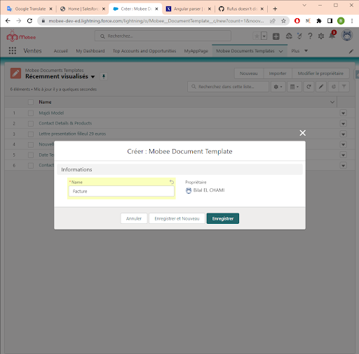

# Módulo de Generación de Documentos de Mobee

## Requisitos y Permisos del Perfil de Usuario
- El usuario debe cumplir con tres de los siguientes requisitos para utilizar el módulo:
  - Una licencia de Mobee.
  - Conjunto de permisos "Usuario de Mobee" o "Administrador de Mobee".
  - Opción "Usuario de Flujo" activa.

## Agregar el Botón de Acción de Generación de Documentos a una Página
1. Ve al objeto donde deseas que el botón de generación esté disponible, luego navega a la sección "Botones, Enlaces y Acciones" para agregar una nueva acción.
2. Elige la opción "Componente Web Lightning" para el "Tipo de Acción", luego selecciona la opción "Mobee:documentGeneratorAction" para el "Componente Web Lightning."
   
   <br />
3. Una vez que se crea el botón de acción, deberás agregarlo a un "Diseño de Página" deseado.
   
   <br />
## Preparación de la Plantilla de Word o PowerPoint
1. Creación de una plantilla de documento en Salesforce:
   - Ve a la página "Plantillas de Documentos Mobee" para crear una nueva plantilla.
   - Haz clic en el botón "Nuevo" y proporciona un nombre para la plantilla.
     
     <br />
   - Una vez que se crea la plantilla, deberás asociarla con un objeto de Salesforce haciendo clic en el botón "Elegir Objeto Principal".
   - El objeto se puede seleccionar usando el campo de búsqueda.
     
     <br />
   - El primer paso debería estar completado ahora, y puedes proceder a descargar tu plantilla de documento de Word en el segundo paso.
<br />
     
     <br />
     ## Generar Documentos a partir de la Plantilla Creada
2. Navega a un registro del mismo tipo de objeto que la plantilla de documento creada.
3. Haz clic en el botón de acción Generar Documento.
4. Selecciona la plantilla deseada de la lista de selección.
5. El documento debería generarse y descargarse automáticamente.
   
   <br />
## Reglas de Uso
### Tipos de Etiquetas
- El módulo de generación de documentos acepta cualquier documento de Word.
- La sintaxis de las etiquetas está inspirada en la anotación Mustache. Las etiquetas normales comienzan con un carácter alfabético, mientras que otros tipos de etiquetas comienzan con prefijos especiales. Por ejemplo:
  - {#bucle} y {/} para comenzar y finalizar un bucle para recorrer listas de datos.

- Las expresiones lógicas también comienzan con el carácter "#" y admiten los siguientes operadores:
````md
- Y a && b
- O a || b
- SUMA a + b
- RESTA a - b
- MULTIPLICACIÓN a * b
- MÓDULO a % b
- DIVISIÓN a / b
- TERNARIO a ? b : c
- ASIGNACIÓN a = 1
- IGUALDAD/DESIGUALDAD a == 1, a != 1
- RELACIONAL a > 1, a < 1, a >= 1, a <= 1
- PRECEDENCIA DE OPERADOR con paréntesis (a && b) || c
- NOTACIÓN EXPONENCIAL: 12e3 => devuelve 12000
- Ejemplo:
  - {#productos.length > 1}
    - Hay varios productos
  - {/}
  - {#nombre == "John"}
    - Hola John
  - {/}
  - La primera condición mostrará la sección solo si hay 2 o más productos.
  - La segunda condición mostrará la sección solo si el nombre de usuario es la cadena "John".
````
### Filtros y Utilidades
Mobee ofrece varias funciones para ayudar a los usuarios a personalizar sus documentos.
- Para obtener la fecha actual, puedes usar el valor "docUtils.today".
````md
  - Hoy es {docUtils.today}
- Aquí están los filtros admitidos:
  - lower: Una función que convierte el texto a minúsculas.
  - upper: Una función que convierte el texto a mayúsculas.
  - shortDate: Una función que devuelve la fecha en un formato corto.
  - followingMonth: Una función que devuelve el próximo mes a partir de una fecha dada.
  - followingYear: Una función que devuelve el próximo año a partir de una fecha dada.
  - lastWorkingDayOfMonth: Una función que devuelve el último día hábil del mes a partir de una fecha dada.
  - formatDate: Una función general para calcular valores de fecha.
  
- Ejemplo de uso:
  - La fecha de creación es {CreatedDate | shortDate}
  - El siguiente mes es {CreatedDate | followingMonth: '[[ "year": "numeric", "month": "long" ]]'}
  - El próximo año es {CreatedDate | followingYear: '[[ "year": "numeric"]]'}
  - El último día hábil del mes es {CreatedDate | lastWorkingDayOfMonth}

- Las funciones followingMonth, followingYear, lastWorkingDayOfMonth y formatDate aceptan las siguientes opciones de formato:
  - [[  weekday: 'narrow' | 'short' | 'long',  era: 'narrow' | 'short' | 'long',  year: 'numeric' | '2-digit',  month: 'numeric' | '2-digit' | 'narrow' | 'short' | 'long',  day: 'numeric' | '2-digit',  hour: 'numeric' | '2-digit',  minute: 'numeric' | '2-digit',  second: 'numeric' | '2-digit',  timeZoneName: 'short' | 'long',  // Zona horaria para expresarla  timeZone: 'Asia/Shanghai',  // Forzar formato de 12 horas o 24 horas  hour12: true | false,  // Opciones raramente utilizadas  hourCycle: 'h11' | 'h12' | 'h23' | 'h24',  formatMatcher: 'basic' | 'best fit']]
````
