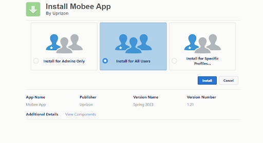

# Mobee Installation Guide

## Salesforce AppExchange Package

To install the Mobee App Package From the AppExchange:

1. Open your web browser and go to the Mobee App page on AppExchange at [https://appexchange.salesforce.com/appxListingDetail?listingId=a0N3u00000ONmC7EAL&tab=e](https://appexchange.salesforce.com/appxListingDetail?listingId=a0N3u00000ONmC7EAL&tab=e).

 
1. Click on the "Get It Now" button and then select the Salesforce org where you want to install the package.
2. Go to the user management page in Salesforce and select a user to assign the required permission according to your needs (Mobee Administrator/Mobee User/Mobee Community Administrator/Mobee Community User/Mobee Time And Expenses Administrator/Mobee Time And Expenses User).

 
1. From the Setup Page, open the “Installed Packages” page and click on the “Manage Licenses” link next to the Mobee Package. Here you can assign licenses to your users.

 

As a Mobee Administrator user, follow these steps to set up the Mobee Object Sync:

1. Go to the “Mobee Object Setup” tab.
2. Define the objects that need to be synchronized with the mobile app.
3. Fill the Object API Name and desired settings for each object.

 

Once you have completed setting up the objects to be synchronized, users with the appropriate permissions will be able to download and use the mobile application on iOS and Android.

## Mobee Mobile App

To use the Mobee Mobile App, follow these steps:

1. Install the mobile app on iOS or Android.
2. After installing the mobile application on your device, open the app and you will be prompted to log in.
3. Log in using your Salesforce credentials and modify the connection server (Production/Sandbox/Custom Domain) if necessary.
4. After logging in and filling the received confirmation code, the user should allow the required access to the connected App.
5. The splash screen will list the synchronization steps. This step can take some time depending on the data that needs to be synchronized.
6. To reduce the synchronization time, try to minimize the number of objects to synchronize and use the “List View Filter” and the “File Sync Down” options in Mobee Object Setup. Note that disabling the “File Sync Down” will only disable downloading the files on your device but will keep uploading every attachment made by the users.
7. After finishing the data syncing process, the user will have access to the Home Pages, App Pages, Listviews & Record Pages totally offline.

That's it! You have successfully installed and used the Mobee App tool on your Salesforce org and mobile device.
