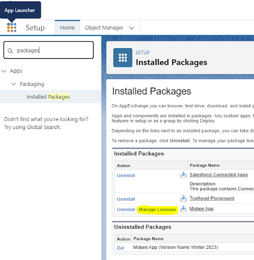
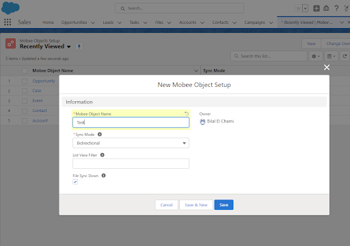

# Mobee AppExchange Installation Guide

## Salesforce AppExchange Package

To install the Mobee App Package from the AppExchange, follow the steps below:

## 1. **Navigate to Mobee App Page:**
   - Launch your web browser.
   - Access the Mobee App page on AppExchange using the following link: [Mobee App on AppExchange](https://appexchange.salesforce.com/appxListingDetail?listingId=a0N3u00000ONmC7EAL&tab=e).
   
   

## 2. **Install the Package:**
   - Click on the "Get It Now" button.
   - Choose the Salesforce org where you'd like to install the package.

## 3. **User Management & Permission Assignment:**
   - Navigate to the user management page in Salesforce.
   - Select a user.
   - Assign the required permissions based on your operational requirements (options include: Mobee Administrator, Mobee User, Mobee Community Administrator, Mobee Community User, Mobee Time And Expenses Administrator, Mobee Time And Expenses User).

   

## 4. **License Management:**
   - Go to the Setup Page.
   - Access the “Installed Packages” section.
   - Click on the “Manage Licenses” link adjacent to the Mobee Package. This is where you can allocate licenses to specific users.

   

## 5. **Mobee Object Setup:**
   - If you're a Mobee Administrator user, head over to the “Mobee Object Setup” tab.
   - This tab is crucial for determining the objects that will synchronize with the mobile app.

## 6. **Define Synchronization Settings:**
   - Input the Object API Name.
   - Adjust the settings as per your requirements.

   

## 7. **Finalizing the Setup:**
   - Upon finalizing your synchronization objects, users granted the correct permissions can now download and utilize the mobile application on both iOS and Android platforms.
