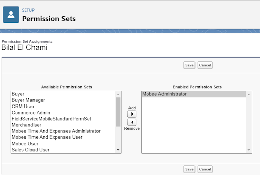
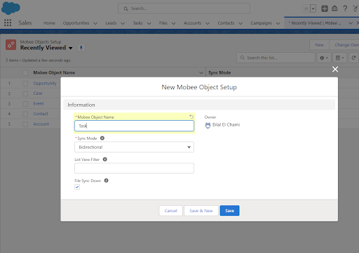

# Guide d'installation de Mobee AppExchange

## Package Salesforce AppExchange

Pour installer le package Mobee App depuis AppExchange, suivez les étapes ci-dessous :

## 1. **Accédez à la page de l'application Mobee :**
   - Lancez votre navigateur web.
   - Accédez à la page de l'application Mobee sur AppExchange en utilisant le lien suivant : [Mobee App sur AppExchange](https://appexchange.salesforce.com/appxListingDetail?listingId=a0N3u00000ONmC7EAL&tab=e).
   
   

## 2. **Installez le package :**
   - Cliquez sur le bouton "Obtenir maintenant" (Get It Now).
   - Choisissez l'organisation Salesforce où vous souhaitez installer le package.

## 3. **Gestion des utilisateurs et attribution des autorisations :**
   - Accédez à la page de gestion des utilisateurs dans Salesforce.
   - Sélectionnez un utilisateur.
   - Attribuez les autorisations requises en fonction de vos besoins opérationnels, les options incluent : Administrateur Mobee (Mobee Administrator), Utilisateur Mobee (Mobee User), Administrateur de la communauté Mobee (Mobee Community Administrator), Utilisateur de la communauté Mobee (Mobee Community User), Administrateur des temps et dépenses Mobee (Mobee Time And Expenses Administrator), Utilisateur des temps et dépenses Mobee (Mobee Time And Expenses User).

   

## 4. **Gestion des licences :**
   - Accédez à la page de configuration (Setup).
   - Accédez à la section "Packages installés" (Installed Packages).
   - Cliquez sur le lien "Gérer les licences" (Manage Licenses) à côté du package Mobee. C'est là que vous pouvez attribuer des licences à des utilisateurs spécifiques.

   

## 5. **Configuration des objets Mobee :**
   - Si vous êtes un utilisateur administrateur Mobee, accédez à l'onglet "Configuration des objets Mobee" (Mobee Objects Setup).
   - Cet onglet est essentiel pour déterminer les objets qui se synchroniseront avec l'application mobile.

## 6. **Définir les paramètres de synchronisation :**
   - Saisissez le nom de l'API de l'objet.
   - Ajustez les paramètres selon vos besoins.

   

## 7. **Finalisation de la configuration :**
   - Une fois que vous avez finalisé la configuration de vos objets de synchronisation, les utilisateurs disposant des autorisations appropriées peuvent désormais télécharger et utiliser l'application mobile sur les plates-formes iOS et Android.