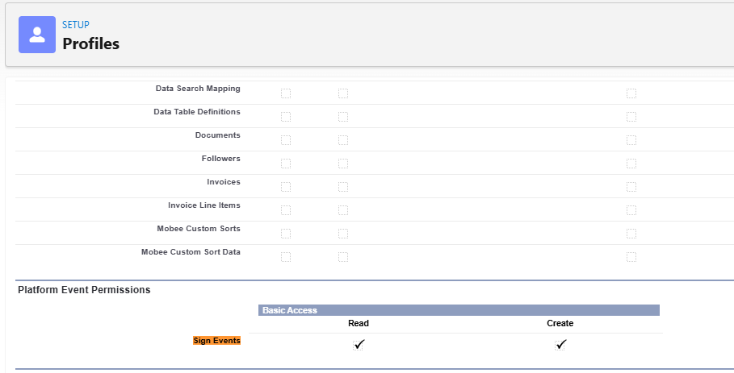
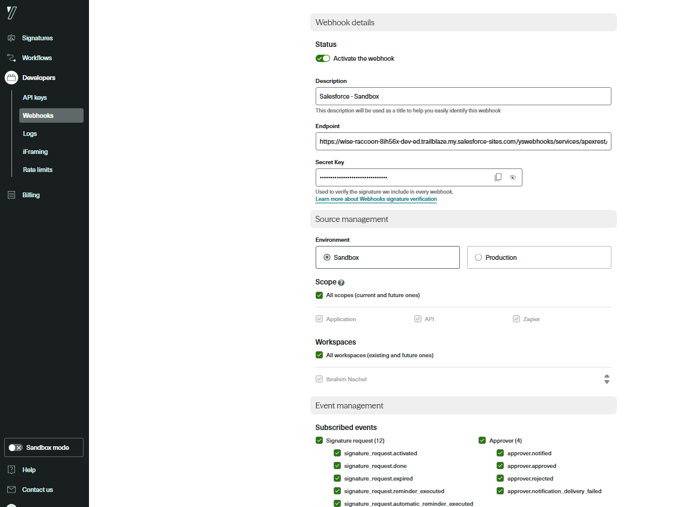
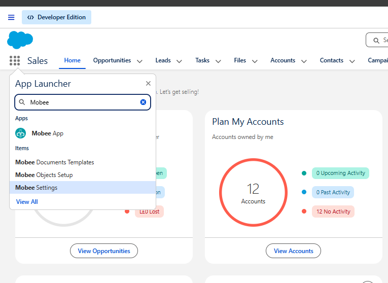

# Mobee E-Signature - Guide de configuration

> **Module :** E-Signature (Intégration Yousign API V3)
> **Package :** Mobee by Uprizon
> **Prérequis :** Package Mobee installé dans votre org Salesforce

---

## Présentation

Le module Mobee E-Signature offre un cycle de vie complet de signature électronique directement dans Salesforce, alimenté par l'**API Yousign V3**. L'intégration comprend un assistant guidé basé sur des Screen Flows, des composants Lightning Web personnalisés, des automatisations déclenchées par enregistrement et des services backend Apex.

Ce guide couvre toutes les étapes de configuration nécessaires pour activer la fonctionnalité E-Signature après l'installation du package Mobee.

---

## Prérequis

Avant de commencer, assurez-vous de disposer de :

- Le **package Mobee** installé dans votre org Salesforce
- Un **compte Yousign** (Sandbox pour le développement, Production pour la mise en production)
- Un accès **Administrateur système** Salesforce

> ⚠️ **Important — Sandbox vs Production :**
> Yousign utilise des **environnements distincts** pour le Sandbox et la Production. Vous devez créer **deux clés API distinctes** et **deux webhooks séparés** — un pour chaque environnement. Ils ne sont pas interchangeables. N'utilisez jamais une clé Sandbox en Production, ni l'inverse.

---

## Étapes de Configuration

### Étape 1 — Créer la clé API dans Yousign

La première étape consiste à générer une clé API dans votre compte Yousign. Cette clé permettra à Salesforce de s'authentifier auprès de l'API Yousign.

1. Connectez-vous à votre **application web Yousign**
2. Naviguez vers **Intégrations > API**
   - Si vous êtes sur une version d'essai, commencez d'abord votre **essai API**
3. Cliquez sur **Créer une clé API** et renseignez les informations suivantes :

   | Champ | Valeur |
   |---|---|
   | Description | `Salesforce - Sandbox Full Access` |
   | Environnement | `Sandbox` *(utiliser Production pour la mise en ligne)* |
   | Permissions | `Full-Access` |

4. Cliquez sur **Créer une clé API**
5. **Copiez la valeur de la clé API générée** — vous en aurez besoin à l'Étape 3


> ⚠️ **Rappel :** Répétez cette étape pour créer une seconde clé API pour votre environnement de **Production** lors de la mise en ligne. Conservez les deux clés en lieu sûr.

---

### Étape 2 — Créer l'ensemble de permissions dans Salesforce

Un ensemble de permissions dédié doit être créé dans Salesforce pour accorder aux utilisateurs l'accès aux informations d'identification externes utilisées par l'intégration Yousign.

1. Allez dans **Configuration > Ensembles de permissions**
2. Cliquez sur **Nouveau** et créez l'ensemble de permissions avec :

   | Champ | Valeur |
   |---|---|
   | Libellé | `Mobee External Credential Access` |
   | Nom API | `MobeeExternalCredentialAccess` |

3. Une fois créé, ouvrez-le et configurez les éléments suivants :

#### Paramètres des objets — Informations d'identification externes utilisateur

- Allez dans **Paramètres des objets > Informations d'identification externes utilisateur**
- Activez l'accès **Lecture**


#### Accès aux principaux des informations d'identification externes

- Allez dans **Accès aux principaux des informations d'identification externes**
- Cliquez sur **Modifier** et ajoutez le principal approprié :
  - `SignatureSandboxApi - Authorization Token` → pour le **Sandbox**
  - `SignatureProductionApi - Authorization Token` → pour la **Production**


---

### Étape 3 — Configurer les informations d'identification externes dans Salesforce

Le package Mobee inclut des informations d'identification externes préconfigurées pour le Sandbox et la Production. Vous devez injecter la clé API Yousign obtenue à l'Étape 1 dans les informations d'identification appropriées.

1. Allez dans **Configuration** → recherchez **Named Credentials** dans la barre de recherche rapide
2. Cliquez sur l'onglet **External Credentials**
3. Vous trouverez deux enregistrements précréés par le package Mobee :
   - `Signature Sandbox API` → pour le Sandbox
   - `Signature Production API` → pour la Production
4. Cliquez sur l'enregistrement correspondant à votre environnement actuel
5. Trouvez le Principal nommé **Authorization Token** et cliquez sur **Modifier**
6. Sous **Paramètres d'authentification**, ajoutez un nouveau paramètre :

   | Champ | Valeur |
   |---|---|
   | Nom | `API_KEY` |
   | Valeur | *(Collez la clé API copiée depuis Yousign à l'Étape 1)* |

7. Cliquez sur **Enregistrer**


> ⚠️ **Rappel :** Répétez cette étape pour les informations d'identification externes de Production lors de la mise en ligne, en utilisant la clé API de Production.

---

### Étape 4 — Attribuer les ensembles de permissions aux utilisateurs

Chaque utilisateur ayant besoin d'utiliser la fonctionnalité E-Signature doit se voir attribuer les deux ensembles de permissions suivants :

| Ensemble de permissions | Objectif |
|---|---|
| `Mobee Signature User` | Accorde l'accès aux fonctionnalités et objets E-Signature |
| `Mobee External Credential Access` | Accorde l'accès aux informations d'identification externes Yousign *(créées à l'Étape 2)* |

**Comment attribuer :**

1. Allez dans **Configuration > Ensembles de permissions**
2. Sélectionnez l'ensemble de permissions
3. Cliquez sur **Gérer les attributions > Ajouter des attributions**
4. Sélectionnez les utilisateurs et confirmez

> 💡 Les deux ensembles de permissions doivent être attribués — n'en attribuer qu'un seul entraînera un accès incomplet.

---

### Étape 5 — Créer le site public pour la réception des webhooks

Yousign a besoin d'un point de terminaison accessible publiquement dans Salesforce pour envoyer des notifications d'événements (webhooks). Cela se fait en créant un site public Salesforce.

> ⚠️ De légères différences peuvent apparaître selon votre édition Salesforce — le principe reste le même.

1. Allez dans **Configuration > Interface utilisateur > Sites et domaines > Sites**
2. Choisissez un nom de site, vérifiez la disponibilité, acceptez les *Conditions d'utilisation des sites* et enregistrez-le
3. Cliquez sur **Nouveau** et renseignez les informations suivantes :

   | Champ | Valeur |
   |---|---|
   | Libellé du site | `YS Webhooks` |
   | Nom du site | `yswebhooks` |
   | Contact du site | *(Administrateur système)* |
   | Propriétaire d'enregistrement par défaut | *(Administrateur système)* |
   | Suffixe d'adresse web par défaut | `yswebhooks` |
   | Actif | ✅ Coché |
   | Page d'accueil du site actif | `InMaintenance` |

4. Cliquez sur **Enregistrer**


---

### Étape 6 — Configurer les paramètres d'accès du site public

Le profil invité du site public doit se voir accorder la licence **Mobee**, les ensembles de permissions Mobee requis et l'accès à l'événement de plateforme Sign Events.

#### Attribuer la licence Mobee à l'utilisateur invité

1. Allez dans **Configuration > Packages installés**
2. Trouvez le package **Mobee** et cliquez sur **Gérer les licences**
3. Cliquez sur **Ajouter des utilisateurs**
4. Sélectionnez l'utilisateur invité du site **YS Webhooks** et cliquez sur **Ajouter**

#### Ouvrir les paramètres d'accès public

1. Depuis la page de détail du site **YS Webhooks**, cliquez sur **Paramètres d'accès public**
   > *(Si la page a été fermée : Configuration > Interface utilisateur > Sites et domaines > Sites → sélectionnez **YS Webhooks**)*


#### Attribuer les ensembles de permissions à l'utilisateur invité

1. Depuis la page de profil **Paramètres d'accès public**, cliquez sur le bouton **Afficher les utilisateurs**
2. Cliquez sur l'**utilisateur invité** pour ouvrir son enregistrement
3. Faites défiler jusqu'à **Attributions d'ensembles de permissions** et cliquez sur **Modifier les attributions**
4. Ajoutez les deux ensembles de permissions suivants :
   - `Mobee External Credential Access` *(créé à l'Étape 2)*
   - `Mobee Signature Access`
5. Cliquez sur **Enregistrer**


#### Accorder les permissions d'événement de plateforme

1. Depuis le haut de la page de profil, cliquez sur le bouton **Modifier** *(à côté de Afficher les utilisateurs)*
2. Faites défiler jusqu'à **Permissions d'événement de plateforme**
3. Sur l'objet **Sign Events**, activez :
   - **Lecture** ✅
   - **Création** ✅
4. Cliquez sur **Enregistrer**



---

### Étape 7 — Configurer le Webhook Yousign et Connecter aux Paramètres Mobee

Maintenant que Salesforce dispose d'un point de terminaison public, vous devez l'enregistrer dans Yousign pour qu'il sache où envoyer les notifications d'événements. Vous stockerez ensuite la clé secrète du webhook dans les Paramètres Mobee.

#### Partie A — Copier l'URL de votre site Salesforce

1. Allez dans **Configuration > Interface utilisateur > Sites et domaines > Sites**
2. Copiez l'**URL du site** affichée à côté de votre site **YS Webhooks**

#### Partie B — Créer le Webhook dans Yousign

3. Allez dans votre **compte Yousign > Intégrations > Webhooks**
4. Cliquez sur **Créer un Webhook** et renseignez les informations suivantes :

   | Champ | Valeur |
   |---|---|
   | Point de terminaison | *(URL du site ci-dessus)* + `/services/apexrest/Mobee/ys/webhooks` |
   | Description | `Salesforce - Sandbox` *(ou Production)* |
   | Environnement | `Sandbox` ou `Production` |
   | Portée | Toutes les portées (actuelles et futures) |
   | Événements souscrits | Tous les événements |
   | Actif | ✅ Coché |

   L'URL du point de terminaison devrait ressembler à :
   ```
   https://XXXXXXX.my.salesforce-sites.com/yswebhooks/services/apexrest/Mobee/ys/webhooks
   ```

5. Cliquez sur **Créer un Webhook**



#### Partie C — Copier la clé secrète du Webhook

6. Dans la liste des Webhooks, cliquez sur les **⋯ (3 points)** sous **Actions** à côté du webhook nouvellement créé
7. Sélectionnez **Copier la clé secrète**


#### Partie D — Enregistrer la clé secrète dans les Paramètres Mobee

8. Dans Salesforce, ouvrez le **Lanceur d'applications** et recherchez **Mobee Settings**
9. Naviguez vers l'onglet **Signature** et :
   - Collez la clé secrète copiée dans le champ **Signature API Key**
   - **Décochez** la case *Signature is Sandbox* si vous configurez pour la **Production**
10. Cliquez sur **Enregistrer**



> ⚠️ **Rappel :** Répétez entièrement les Étapes 1 à 7 pour l'environnement de **Production** en utilisant la clé API de Production et un nouveau webhook de Production avec sa propre clé secrète.

---

## Besoin d'aide ?

Pour toute assistance supplémentaire, contactez l'équipe de support Mobee.
