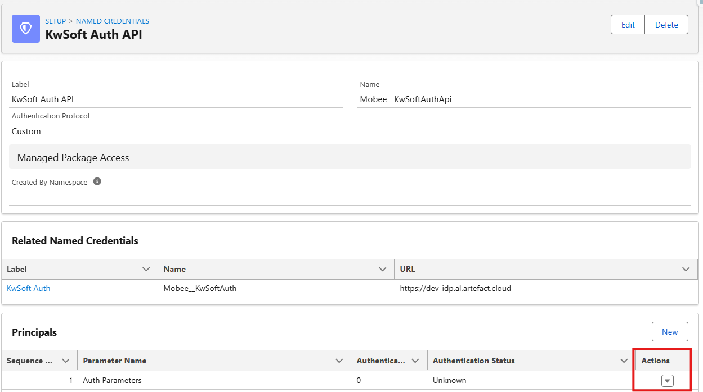
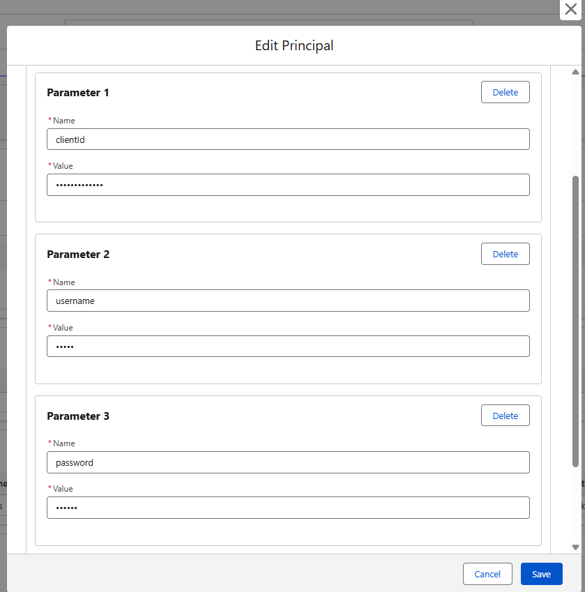

# Configuration du connecteur kwsoft®

Cette page explique la configuration initiale a effectuer une seule fois apres l'installation.

## 1. Configuration du package

Avant de configurer les Flows, validez l'acces au package et l'authentification.

1. Verifiez que le package est installe dans votre org.
2. Ouvrez la page detail utilisateur et assignez une licence Mobee.
3. Assignez les deux permission sets requis : `Mobee Document Generation Administrator` et `Mobee Document Generation User`.

4. Dans Setup, utilisez Quick Find pour ouvrir Named Credentials, puis ouvrez **kwsoft Auth**.
5. Depuis la named credential, ouvrez l'External Credential associee.

6. Dans la section Principals, modifiez les parametres d'authentification.

7. Ajoutez les valeurs suivantes dans Authentication Parameters :

- `clientId` : client ID fourni par kwsoft
- `username` : username fourni par kwsoft
- `password` : password fourni par kwsoft
8. Enregistrez les parametres d'authentification.

Conservez ces identifiants de maniere confidentielle et limitez leur acces aux seuls administrateurs autorises.

## 2. Creer un objet de suivi des documents

Les documents interactifs sont modifies en dehors de Salesforce avant leur finalisation. Vous devez donc conserver dans Salesforce une reference vers ces brouillons.

Creez un objet personnalise (nom d'exemple : kwsoft Document Log) avec au minimum les champs suivants :

1. Document Name (Texte)
2. Document URL (URL)
3. Related Record (Lookup vers votre objet metier, par exemple Case)
4. Status (Liste de selection, valeurs recommandees : Draft, Finalized)

Cet objet aide les utilisateurs a retrouver et reprendre les documents non termines.

## 3. Ajouter la liste associee sur les enregistrements metier

Ajoutez cet objet personnalise comme liste liee dans la mise en page de l'objet principal (par exemple, Case).

Les utilisateurs verront ainsi clairement :

1. Quels documents interactifs existent
2. Quels documents sont encore en brouillon
3. A quel enregistrement chaque document est rattache

## 4. Verifier les permissions utilisateurs

Pour les utilisateurs metier :

1. Droits de lecture/creation sur les fichiers et pieces jointes
2. Acces au Flow de generation
3. Acces a l'objet de suivi personnalise

Pour les administrateurs :

1. Gerer les Flows
2. Mettre a jour les mises en page
3. Maintenir les modeles et metadonnees kwsoft

## 5. Definir votre mode operatoire

Choisissez l'une des approches suivantes :

1. Mode simple : PDF automatique uniquement
2. Mode avance : PDF automatique + documents interactifs

La plupart des equipes commencent par le mode simple, puis activent le mode avance une fois les utilisateurs a l'aise.

## 6. Valider avec un utilisateur pilote

Avant la mise en production, effectuez un test de bout en bout :

1. Ouvrir un enregistrement de test
2. Lancer le Flow de generation
3. Generer un document automatique
4. Generer un document interactif
5. Verifier le comportement de la piece jointe PDF et de l'objet de suivi

Si ce test est concluant, vous pouvez deployer au reste des utilisateurs.
