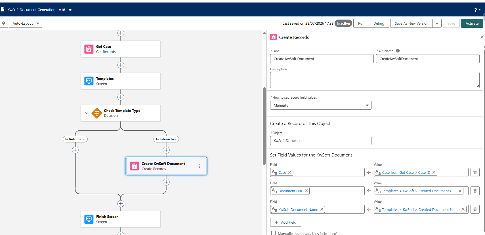
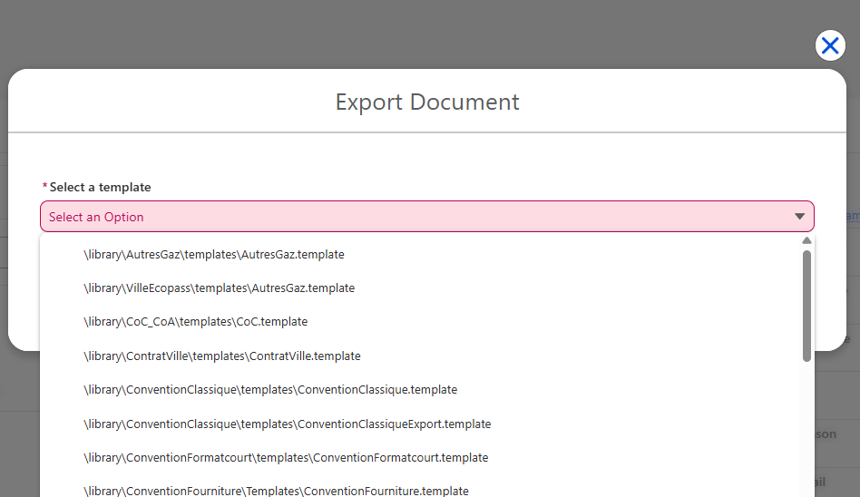
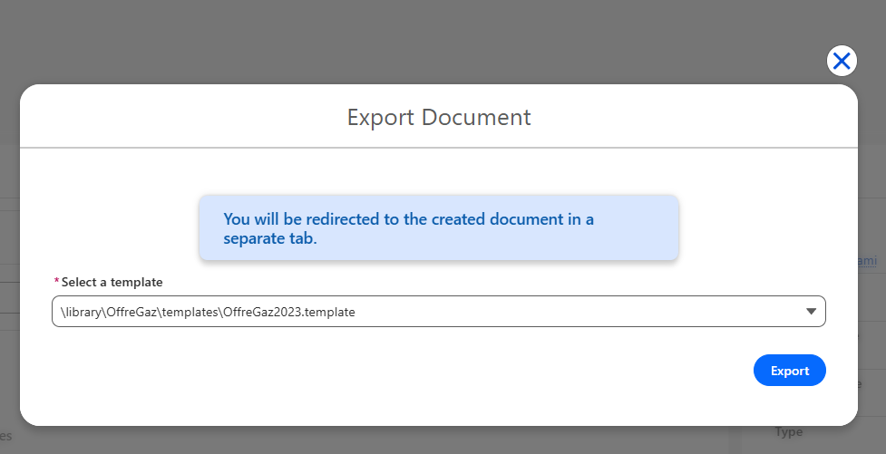

# Flow de generation de documents

## Flow modele : Mobee - kwsoft Document Generation

Ce Flow est le point d'entree principal pour les utilisateurs. Il ouvre les modeles kwsoft et genere des documents a partir d'enregistrements Salesforce.

## Parcours utilisateur

1. L'utilisateur ouvre un enregistrement (exemple : Case)
2. L'utilisateur lance le Flow
3. L'utilisateur selectionne un modele
4. L'utilisateur genere le document
5. Le systeme attache un PDF directement ou ouvre un parcours d'edition interactive

## Entrees du composant (vue administrateur)

Le composant kwsoft dans le Flow utilise les entrees suivantes :

1. **Current Record Id** - Role : identifie l'enregistrement Salesforce utilise pour les donnees et pour l'attachement du document.

2. **Object API Name** - Role : indique quel objet Salesforce est utilise (par exemple Case).

3. **Output Format** - Role : definit le format de sortie. `PDF` est actuellement pris en charge.

4. **Data Query** - Role : recupere les informations de l'enregistrement pour remplir le document.

> Si votre equipe n'est pas a l'aise avec la syntaxe technique des requetes, demandez a votre referent technique Salesforce de le preparer une fois. Les utilisateurs n'ont pas besoin de la modifier au quotidien.

5. **Template Filter (optionnel)** - Role : limite les modeles visibles pour les utilisateurs.

Exemple de cas d'usage : afficher uniquement les modeles pour la France et le Luxembourg.

Exemple de valeur de filtre :
METADATA.COUNTRY="FR" OR METADATA.COUNTRY="LU"

Vous pouvez aussi construire cette valeur dynamiquement a partir des donnees Salesforce.

### Filtre dynamique avec les formules Flow

Par exemple, si l'utilisateur connecte a des pays affectes dans Salesforce, vous pouvez generer le filtre automatiquement au lieu d'ecrire une valeur fixe.

Exemple de scenario : l'utilisateur a deux pays affectes.

1. Creez une ressource Formula dans le Flow (Texte), par exemple `TemplateFilterFormula`.
2. Construisez l'expression a partir des donnees utilisateur.
3. Mappez cette ressource Formula vers l'entree **Template Filter** du composant kwsoft.

Exemple de resultat de formule :
METADATA.COUNTRY="{!UserCountry1}" OR METADATA.COUNTRY="{!UserCountry2}"

Cette approche permet a chaque utilisateur de ne voir que les modeles correspondant a ses pays affectes.

> Astuce : si une valeur de pays peut etre vide, ajoutez des conditions `IF` simples dans la formule afin d'eviter une expression incomplete.

## Ce qui se passe apres la generation

### Document automatique :

1. Le PDF est genere
2. Le PDF est attache a l'enregistrement courant
3. L'utilisateur voit un message de succes

### Document interactif :

1. L'utilisateur est redirige vers l'interface interactive pour l'edition en ligne
2. Le systeme retourne un lien editable et un nom de document
3. Vous devez enregistrer ces informations dans l'**objet de suivi personnalise**

## Bonnes pratiques administrateur

1. Utiliser des noms de modele simples et orientes metier
2. Utiliser les filtres de modele pour reduire les erreurs utilisateur
3. Tester un chemin de Flow par objet (Case, Opportunity, etc.)
4. Eviter d'exposer des parametres techniques aux utilisateurs finaux

## Le Flow en action

Vous pouvez lancer ce Flow depuis un bouton d'Action sur la page d'enregistrement `Case`.

Lorsque la fenetre modale s'ouvre, les utilisateurs voient les modeles disponibles selon le `Template Filter` configure. Si aucun filtre n'est configure, tous les modeles disponibles sont affiches.

Le bouton Export devient disponible apres la selection d'un modele. Si le modele choisi est interactif, un message informe l'utilisateur qu'il sera redirige vers l'interface d'edition interactive.

